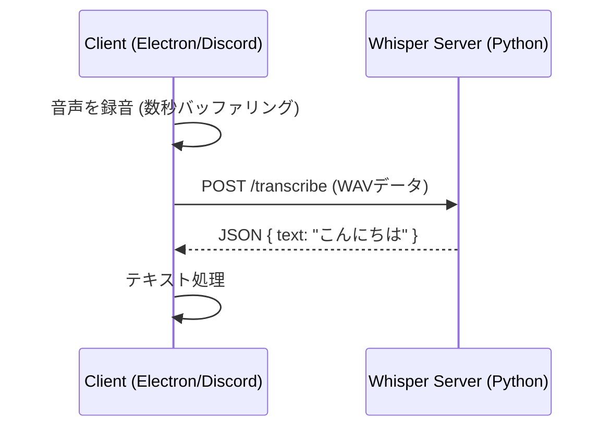
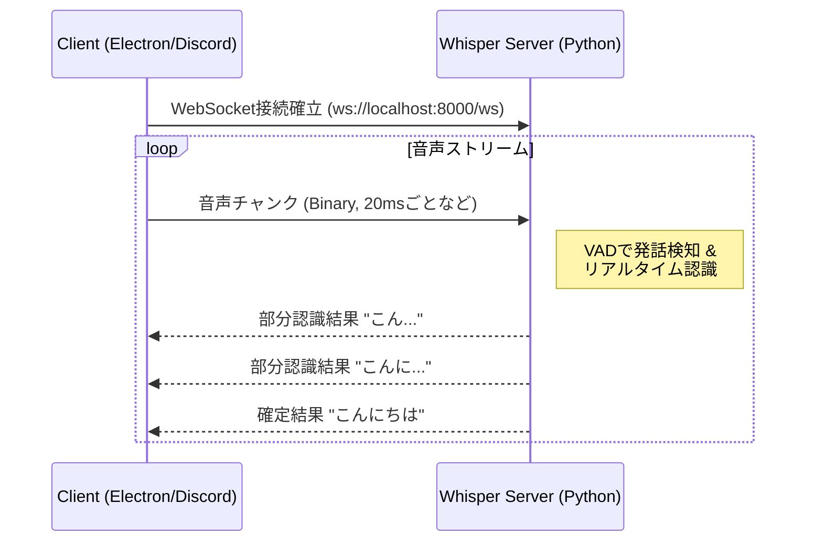

# WebSocket導入によるリアルタイム性向上計画

現在、システムは主にHTTP (REST API) ポーリングや単発のリクエスト/レスポンスモデルで動作しています。これをWebSocketによる双方向リアルタイム通信に置き換えることで、応答速度と効率を大幅に向上させることが可能です。

## 1. WebSocket導入のメリットとデメリット

### メリット
1.  **低遅延 (Low Latency)**
    *   HTTPハンドシェイクが初回の一度のみであるため、リクエストごとのオーバーヘッド（ヘッダー送受信やコネクション確立）がなくなります。音声データのような連続的なストリーム処理では、数ミリ秒～数十ミリ秒の短縮の積み重ねが大きな体感差となります。
2.  **サーバープッシュ (Server Push)**
    *   AIが思考を完了した瞬間や、音声認識が完了した瞬間にサーバーからクライアントへデータを送信できます。クライアントが「終わりましたか？」と問い合わせるポーリング処理が不要になります。
3.  **効率的なストリーミング**
    *   音声データ（バイナリ）をパケットとして連続的に送信し、サーバー側で順次処理（VAD: Voice Activity Detectionなど）を行うパイプラインが構築しやすくなります。

### デメリット
1.  **実装の複雑化**
    *   接続断時の再接続ロジック、心拍監視 (Ping/Pong)、ステート管理が必要になります。
2.  **ステートフルなサーバー設計**
    *   HTTPはステートレスですが、WebSocketは接続状態を維持するため、サーバーのメモリ管理やスケーリング（複数台構成時）に考慮が必要です（現状のローカル動作なら問題になりません）。
3.  **デバッグの難易度**
    *   単発のリクエストではないため、どのタイミングでエラーが起きたかの追跡がHTTPよりやや難しくなります。

---

## 2. 想定されるデータの流れ (Architecture)

### 現状 (HTTP/Polling)

### 改善案 (WebSocket Streaming)

---

## 3. 実装方針

### 推奨ライブラリ
*   **Server (Python)**: `FastAPI` (Websocket標準サポート) または `websockets` ライブラリ。
    *   `faster-whisper` はストリーミング入力には対応していないため、VAD（無音検出）で区切ったチャンクごとに認識を回すか、あるいは `whisper-streaming` のようなアプローチを取る必要があります。
*   **Client (TypeScript/Node.js)**: `ws` (Node.js標準的なライブラリ) または `socket.io-client`。

### 段階的な導入プラン

#### Phase 1: 音声認識サーバーのWebSocket化
現在の `whisper_server.py` を改修し、WebSocketエンドポイントを追加します。

1.  **接続確立**: クライアントが接続。
2.  **音声送信**: クライアントはマイク入力をRAW PCM (またはWAV) でチャンク送信。
3.  **サーバー処理**:
    *   受信した音声をバッファに蓄積。
    *   VAD（Silero VADなど）で「発話区間」を切り出し。
    *   区間が確定したら `faster-whisper` に投げる。
4.  **結果送信**: 認識結果を即座にJSONで返送。

#### Phase 2: LLMとの統合 (Advanced)
認識結果をそのままLLMストリームに直結し、AIが「ユーザーが話し終わる前」に思考を開始する（投機的実行）などの高度な最適化が可能になります。

---

## まとめ
リアルタイム対話Botを目指すのであれば、**音声認識部分のWebSocket化は非常に効果的**です。まずは現在のHTTPサーバー (`whisper_server.py`) にWebSocketエンドポイントを追加し、Electron側からストリーム送信する実験から始めることをお勧めします。
