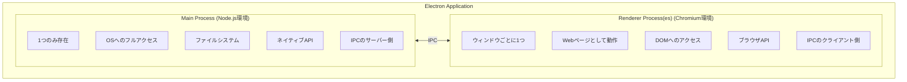
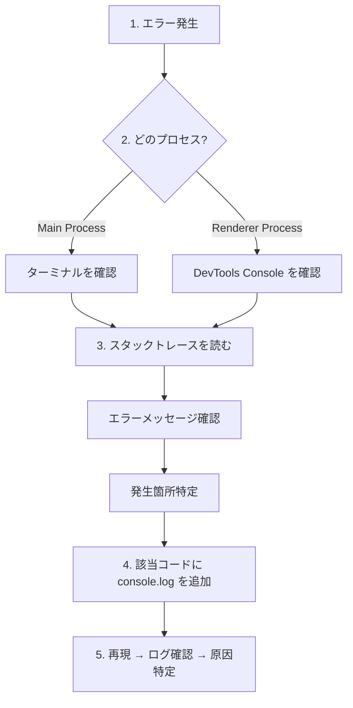

# Electron デバッグの基礎

## 1. 幹：Electron のプロセスモデルを理解する

### 1.1 Electron の二重プロセス構造

Electron アプリケーションは **2種類のプロセス** で構成される。これがデバッグ時の最重要概念である。



### 1.2 本プロジェクトでの対応

| プロセス | 対応ファイル | デバッグ方法 |
|---------|-------------|-------------|
| Main | `src/main/index.ts` | ターミナル + `console.log` |
| Renderer | `src/renderer/*.ts` | DevTools (F12) |
| Preload | `src/preload/index.ts` | 両方で確認可能 |

### 1.3 なぜこれが重要か

**問題発生時、最初に確認すべきこと**：
1. エラーはどのプロセスで発生しているか？
2. Main Process のエラー → ターミナルを見る
3. Renderer Process のエラー → DevTools Console を見る

---

## 2. 枝葉：実践的なデバッグ手法

### 2.1 Main Process のデバッグ

#### 基本：console.log の活用

```typescript
// src/main/index.ts での例
console.log('[Main] アプリケーション起動');
console.log('[Main] 設定読み込み:', JSON.stringify(config, null, 2));
console.error('[Main] エラー発生:', error);
```

**出力確認場所**：アプリを起動したターミナル

#### 高度：Node.js Inspector

```bash
# Inspector を有効にして起動
npx electron --inspect=5858 .

# または package.json に追加
"dev:debug": "electron --inspect=5858 ."
```

Chrome で `chrome://inspect` を開いて接続。

### 2.2 Renderer Process のデバッグ

#### DevTools を開く方法

```typescript
// src/main/index.ts 内
mainWindow.webContents.openDevTools();

// または、実行時に手動で
// Ctrl+Shift+I または F12
```

#### 本プロジェクトでの設定場所

```typescript
// src/main/index.ts:93 付近
mainWindow = new BrowserWindow({
  // ... 設定
});
mainWindow.webContents.openDevTools(); // 開発時に追加
```

### 2.3 IPC通信のデバッグ

IPC（Inter-Process Communication）は Electron の核心。問題の多くはここで発生する。

#### Main側（送信元/受信先）

```typescript
// src/main/index.ts での IPC ハンドラ例
ipcMain.handle('conversation-list', async () => {
  console.log('[IPC] conversation-list が呼ばれた');
  try {
    const result = await conversationStorage.list();
    console.log('[IPC] 結果:', result.length, '件');
    return result;
  } catch (error) {
    console.error('[IPC] エラー:', error);
    throw error;
  }
});
```

#### Preload側（ブリッジ）

```typescript
// src/preload/index.ts
conversationList: async () => {
  console.log('[Preload] conversationList 呼び出し');
  return await ipcRenderer.invoke('conversation-list');
}
```

#### Renderer側（呼び出し元）

```typescript
// src/renderer/renderer.ts
const conversations = await window.electronAPI.conversationList();
console.log('[Renderer] 会話一覧取得:', conversations);
```

### 2.4 エラートレースの読み方

#### Main Process のエラー例

```
Error: ENOENT: no such file or directory, open '/path/to/file'
    at Object.openSync (node:fs:603:3)
    at Object.readFileSync (node:fs:471:35)
    at loadConfig (/home/.../src/main/config/configLoader.ts:45:20)
    at initConfig (/home/.../src/main/config/index.ts:12:10)
```

**読み方**：
1. 最初の行 = エラーメッセージ（ファイルが見つからない）
2. スタックトレースを下から上に読む
3. `at loadConfig` = エラー発生箇所

#### Renderer Process のエラー例

DevTools Console に表示される：
```
Uncaught (in promise) Error: electronAPI.conversationList is not a function
    at loadConversations (renderer.js:150:30)
    at async init (renderer.js:200:5)
```

**読み方**：
1. `electronAPI.conversationList is not a function` = Preload で公開されていない
2. `renderer.js:150` = 呼び出し元

---

## 3. よく遭遇する問題と対処法

### 3.1 「Cannot find module」エラー

**原因**：モジュールパスの解決失敗

```bash
# 確認コマンド
ls -la node_modules/<モジュール名>

# 対処
npm install
# または
npm install <モジュール名>
```

### 3.2 「ipcRenderer is not defined」エラー

**原因**：contextIsolation 環境での直接アクセス

```typescript
// NG: Renderer から直接アクセス
const { ipcRenderer } = require('electron'); // 動かない

// OK: Preload 経由でアクセス
window.electronAPI.someMethod(); // Preload で公開されたメソッド
```

### 3.3 「Object has been destroyed」エラー

**原因**：ウィンドウが閉じられた後に操作しようとした

```typescript
// 対処：存在確認を入れる
if (mainWindow && !mainWindow.isDestroyed()) {
  mainWindow.webContents.send('event', data);
}
```

### 3.4 IPC タイムアウト

**原因**：Main 側のハンドラが応答しない

```typescript
// デバッグ方法：ハンドラの入り口にログを追加
ipcMain.handle('slow-operation', async () => {
  console.log('[IPC] slow-operation 開始');
  const start = Date.now();

  // 処理...

  console.log(`[IPC] slow-operation 完了: ${Date.now() - start}ms`);
  return result;
});
```

---

## 4. デバッグ用ユーティリティ

### 4.1 デバッグログ関数

```typescript
// src/main/utils/debug.ts として追加可能
const DEBUG = process.env.DEBUG === 'true';

export function debug(namespace: string, ...args: any[]) {
  if (DEBUG) {
    console.log(`[${namespace}] ${new Date().toISOString()}`, ...args);
  }
}

// 使用例
debug('LLM', 'ストリーミング開始');
```

### 4.2 IPC 通信ログ

```typescript
// 全 IPC をログに出力
ipcMain.on('*', (event, ...args) => {
  console.log('[IPC Event]', event, args);
});
```

---

## 5. まとめ：デバッグの流れ



## 関連ドキュメント

- [02-typescript-debugging.md](02-typescript-debugging.md) - TypeScript 固有のデバッグ
- [03-ipc-debugging.md](03-ipc-debugging.md) - IPC 通信の詳細デバッグ
