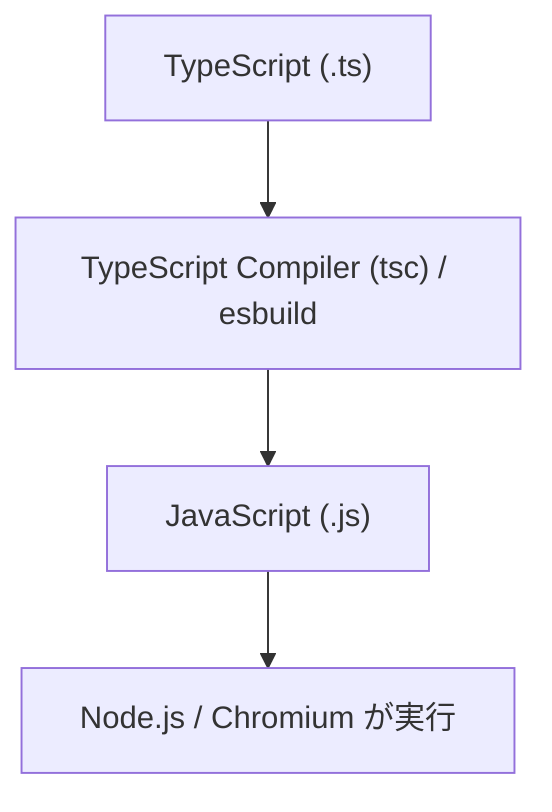
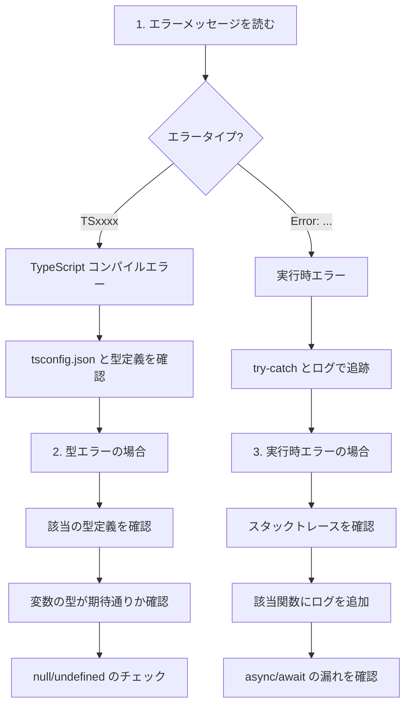

# TypeScript / Node.js デバッグガイド

## 1. 幹：TypeScript コンパイルの仕組み

### 1.1 ビルドパイプライン



**本プロジェクトのビルド**：

```bash
# package.json より
npm run build:main     # src/main/ → dist/main/
npm run build:preload  # src/preload/ → dist/preload/
npm run build:renderer # src/renderer/ → dist/renderer/
```

### 1.2 なぜ TypeScript を使うか

```typescript
// TypeScript の型チェックがバグを未然に防ぐ
interface Message {
  role: 'user' | 'assistant';
  content: string;
}

function processMessage(msg: Message) {
  // msg.role は必ず 'user' か 'assistant'
  // msg.content は必ず string
  // 型の間違いはコンパイル時にエラー
}
```

### 1.3 コンパイルエラー vs 実行時エラー

| 種類 | 発見時点 | 対処法 |
|------|---------|-------|
| コンパイルエラー | `npm run build` 時 | IDE/エディタで即座に修正 |
| 実行時エラー | アプリ実行時 | console.log + デバッガ |

---

## 2. 枝葉：TypeScript 特有のエラー対処

### 2.1 型エラーの読み方

#### エラー例 1: プロパティが存在しない

```
error TS2339: Property 'foo' does not exist on type 'Bar'.
```

**対処**：
```typescript
// 型定義を確認
interface Bar {
  name: string;
  // foo は定義されていない
}

// 修正1: プロパティを追加
interface Bar {
  name: string;
  foo?: string; // オプショナルで追加
}

// 修正2: 型アサーション（非推奨だが緊急時に）
(bar as any).foo
```

#### エラー例 2: 型の不一致

```
error TS2322: Type 'string' is not assignable to type 'number'.
```

**対処**：
```typescript
// 変数の型を確認
let count: number = "5"; // エラー

// 修正
let count: number = parseInt("5", 10);
// または
let count: number = 5;
```

#### エラー例 3: null/undefined の可能性

```
error TS2531: Object is possibly 'null'.
```

**対処**：
```typescript
// mainWindow が null の可能性がある
mainWindow.webContents.send('event'); // エラー

// 修正1: 存在確認
if (mainWindow) {
  mainWindow.webContents.send('event');
}

// 修正2: オプショナルチェーン
mainWindow?.webContents.send('event');

// 修正3: 非nullアサーション（確実な場合のみ）
mainWindow!.webContents.send('event');
```

### 2.2 本プロジェクトでよく使う型

#### 設定型（`src/main/config/types.ts`）

```typescript
// 設定全体の型
interface AppConfig {
  llm: LLMConfig;
  stt: STTConfig;
  tts: TTSConfig;
  memory: MemoryConfig;
  autonomous: AutonomousConfig;
  discord: DiscordConfig;
  prompts: PromptConfig;
}

// 使用例
import { AppConfig } from './config/types';

function initSystem(config: AppConfig) {
  console.log('LLM設定:', config.llm.preference);
}
```

#### メッセージ型

```typescript
interface Message {
  role: 'user' | 'assistant' | 'system';
  content: string;
}

// 配列として使用
const history: Message[] = [
  { role: 'system', content: 'あなたはAIアシスタントです' },
  { role: 'user', content: 'こんにちは' }
];
```

---

## 3. async/await のデバッグ

### 3.1 非同期処理の基本

```typescript
// Promise チェーン
fetchData()
  .then(data => processData(data))
  .then(result => saveResult(result))
  .catch(error => console.error(error));

// async/await（推奨）
async function main() {
  try {
    const data = await fetchData();
    const result = await processData(data);
    await saveResult(result);
  } catch (error) {
    console.error(error);
  }
}
```

### 3.2 よくあるミス

#### ミス 1: await 忘れ

```typescript
// NG: Promise オブジェクトが返る
const data = fetchData(); // Promise<Data>

// OK: 実際のデータが返る
const data = await fetchData(); // Data
```

#### ミス 2: 並列実行したいのに直列になっている

```typescript
// 遅い: 順番に実行（合計時間 = A + B + C）
const a = await fetchA();
const b = await fetchB();
const c = await fetchC();

// 速い: 並列実行（合計時間 = max(A, B, C)）
const [a, b, c] = await Promise.all([
  fetchA(),
  fetchB(),
  fetchC()
]);
```

#### ミス 3: エラーハンドリング漏れ

```typescript
// NG: エラーが握りつぶされる
async function riskyOperation() {
  const result = await mightFail(); // エラー時に止まる
  return result;
}

// OK: 適切にハンドリング
async function safeOperation() {
  try {
    const result = await mightFail();
    return result;
  } catch (error) {
    console.error('操作失敗:', error);
    throw error; // 必要に応じて再throw
  }
}
```

### 3.3 非同期処理のデバッグ

```typescript
// タイミングを確認
async function debugAsync() {
  console.log('1. 処理開始');

  const promise = fetchData();
  console.log('2. fetchData 呼び出し完了（まだ待っていない）');

  const data = await promise;
  console.log('3. データ取得完了:', data);

  return data;
}
```

---

## 4. Node.js 固有のデバッグ

### 4.1 モジュール解決

```typescript
// 相対パス
import { foo } from './utils';        // 同じディレクトリ
import { bar } from '../config';      // 親ディレクトリ
import { baz } from './sub/module';   // サブディレクトリ

// node_modules
import Anthropic from '@anthropic-ai/sdk';  // npm パッケージ

// Node.js 組み込み
import * as fs from 'fs';
import * as path from 'path';
```

### 4.2 パスの問題

```typescript
// __dirname: 現在のファイルのディレクトリ
console.log('現在のディレクトリ:', __dirname);

// path.join で安全にパスを結合
import * as path from 'path';
const configPath = path.join(__dirname, '..', 'config', 'default.json');

// process.cwd(): Node.js を実行したディレクトリ
console.log('実行ディレクトリ:', process.cwd());
```

### 4.3 環境変数

```typescript
// 環境変数の読み取り
const apiKey = process.env.ANTHROPIC_API_KEY;

// デバッグ: 環境変数の確認
console.log('環境変数一覧:', Object.keys(process.env));
console.log('API_KEY 設定:', !!process.env.ANTHROPIC_API_KEY);

// dotenv で .env ファイルから読み込み
import 'dotenv/config';
```

---

## 5. 実行時エラーの追跡

### 5.1 try-catch パターン

```typescript
// 基本パターン
try {
  riskyOperation();
} catch (error) {
  console.error('エラー発生:', error);
  console.error('スタックトレース:', (error as Error).stack);
}

// 非同期版
try {
  await asyncRiskyOperation();
} catch (error) {
  if (error instanceof NetworkError) {
    console.error('ネットワークエラー');
  } else if (error instanceof ValidationError) {
    console.error('バリデーションエラー');
  } else {
    console.error('不明なエラー:', error);
  }
}
```

### 5.2 エラークラスの活用

```typescript
// カスタムエラークラス
class LLMError extends Error {
  constructor(
    message: string,
    public readonly provider: string,
    public readonly statusCode?: number
  ) {
    super(message);
    this.name = 'LLMError';
  }
}

// 使用
throw new LLMError('API呼び出し失敗', 'anthropic', 429);

// キャッチ
catch (error) {
  if (error instanceof LLMError) {
    console.error(`${error.provider}でエラー: ${error.message}`);
  }
}
```

---

## 6. デバッグツール

### 6.1 VSCode でのデバッグ設定

`.vscode/launch.json`:
```json
{
  "version": "0.2.0",
  "configurations": [
    {
      "name": "Debug Main Process",
      "type": "node",
      "request": "launch",
      "cwd": "${workspaceFolder}",
      "runtimeExecutable": "${workspaceFolder}/node_modules/.bin/electron",
      "args": ["."],
      "env": {
        "DEBUG": "true"
      }
    }
  ]
}
```

### 6.2 ブレークポイント

```typescript
// 強制的にブレークポイント
debugger; // DevTools が開いていると停止

// 条件付きログ
if (DEBUG) {
  console.log('詳細情報:', complexObject);
}
```

### 6.3 プロファイリング

```typescript
// 処理時間の計測
console.time('LLM処理');
await llmRouter.sendMessageStream(messages, callbacks);
console.timeEnd('LLM処理'); // "LLM処理: 1234ms"

// より詳細に
const start = performance.now();
await heavyOperation();
const elapsed = performance.now() - start;
console.log(`処理時間: ${elapsed.toFixed(2)}ms`);
```

---

## 7. 本プロジェクト固有のデバッグポイント

### 7.1 ビルドエラーが出た場合

```bash
# クリーンビルド
rm -rf dist/
npm run build

# 依存関係の問題
rm -rf node_modules/
npm install
```

### 7.2 型定義が見つからない場合

```bash
# @types パッケージをインストール
npm install --save-dev @types/better-sqlite3

# 型定義がない場合は宣言ファイルを作成
# src/types/missing-module.d.ts
declare module 'missing-module' {
  export function someFunction(): void;
}
```

### 7.3 tsconfig.json の確認ポイント

```json
{
  "compilerOptions": {
    "strict": true,           // 厳格モード（型チェック強化）
    "skipLibCheck": true,     // ライブラリの型チェックスキップ
    "esModuleInterop": true,  // CommonJS/ESM 互換
    "resolveJsonModule": true // JSON インポート許可
  }
}
```

---

## 8. まとめ：TypeScript デバッグの流れ



## 関連ドキュメント

- [01-electron-fundamentals.md](01-electron-fundamentals.md) - Electron の基礎
- [03-ipc-debugging.md](03-ipc-debugging.md) - IPC 通信のデバッグ
