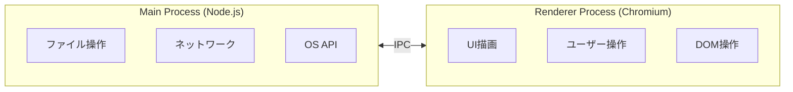
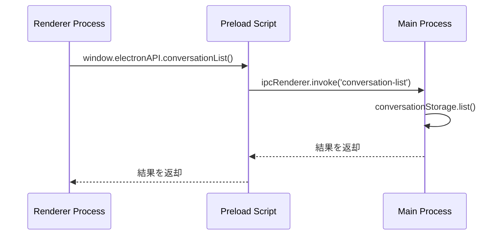
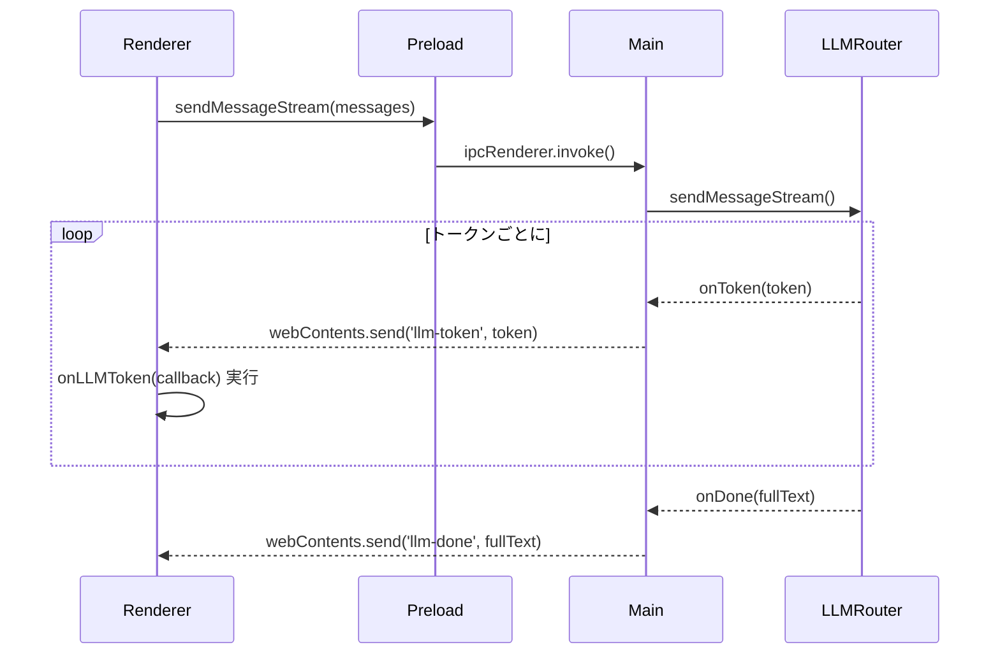

# IPC 通信デバッグガイド

## 1. 幹：IPC（プロセス間通信）の原理

### 1.1 なぜ IPC が必要か

Electron の **Main Process** と **Renderer Process** は完全に分離されている。
セキュリティ上、Renderer から直接 Node.js API にアクセスできない。



### 1.2 IPC の通信パターン

| パターン | 方向 | 用途 |
|---------|------|------|
| `invoke` / `handle` | Renderer → Main → Renderer | 戻り値が必要な処理 |
| `send` / `on` | Renderer → Main | 一方向通知 |
| `webContents.send` / `on` | Main → Renderer | プッシュ通知 |

### 1.3 本プロジェクトの IPC アーキテクチャ



---

## 2. 枝葉：IPC デバッグの実践

### 2.1 デバッグログを仕込む場所（3箇所）

#### 1. Renderer（呼び出し元）

```typescript
// src/renderer/renderer.ts
async function loadConversations() {
  console.log('[Renderer] conversationList 呼び出し開始');
  try {
    const result = await window.electronAPI.conversationList();
    console.log('[Renderer] conversationList 結果:', result);
    return result;
  } catch (error) {
    console.error('[Renderer] conversationList エラー:', error);
    throw error;
  }
}
```

#### 2. Preload（ブリッジ）

```typescript
// src/preload/index.ts
conversationList: async () => {
  console.log('[Preload] conversationList invoke');
  const result = await ipcRenderer.invoke('conversation-list');
  console.log('[Preload] conversationList 結果受信');
  return result;
},
```

#### 3. Main（処理本体）

```typescript
// src/main/index.ts
ipcMain.handle('conversation-list', async (event) => {
  console.log('[Main] conversation-list ハンドラ実行');
  console.log('[Main] 呼び出し元:', event.sender.id);
  try {
    const result = await conversationStorage.list();
    console.log('[Main] 結果:', result.length, '件');
    return result;
  } catch (error) {
    console.error('[Main] エラー:', error);
    throw error;
  }
});
```

### 2.2 本プロジェクトの主要 IPC チャンネル一覧

#### 会話管理

| チャンネル | 方向 | 用途 |
|-----------|------|------|
| `conversation-list` | invoke | 会話一覧取得 |
| `conversation-create` | invoke | 新規会話作成 |
| `conversation-load` | invoke | 会話履歴読み込み |
| `conversation-delete` | invoke | 会話削除 |

#### LLM ストリーミング

| チャンネル | 方向 | 用途 |
|-----------|------|------|
| `send-message-stream` | invoke | メッセージ送信開始 |
| `llm-token` | Main→Renderer | トークン受信 |
| `llm-done` | Main→Renderer | 完了通知 |
| `llm-error` | Main→Renderer | エラー通知 |

#### 音声関連

| チャンネル | 方向 | 用途 |
|-----------|------|------|
| `voice-start` | invoke | 音声認識開始 |
| `voice-stop` | invoke | 音声認識停止 |
| `voice-transcription` | Main→Renderer | 文字起こし結果 |
| `tts-speak` | invoke | 音声合成開始 |
| `tts-stop` | invoke | 音声合成停止 |

#### 対話制御

| チャンネル | 方向 | 用途 |
|-----------|------|------|
| `dialogue-start` | invoke | 音声対話開始 |
| `dialogue-stop` | invoke | 音声対話停止 |
| `dialogue-state` | Main→Renderer | 状態変更通知 |

---

## 3. よくある IPC エラーと対処

### 3.1 「No handler registered for 'xxx'」

**原因**：Main 側で `ipcMain.handle` が登録されていない

```typescript
// デバッグ: 登録されているハンドラを確認
// src/main/index.ts に一時的に追加
console.log('登録ハンドラ:', (ipcMain as any)._events);
```

**確認ポイント**：
1. `ipcMain.handle('channel-name', ...)` が存在するか
2. チャンネル名のスペルミス
3. ハンドラ登録前に呼び出していないか

### 3.2 「electronAPI.xxx is not a function」

**原因**：Preload で公開されていない

```typescript
// src/preload/index.ts を確認
contextBridge.exposeInMainWorld('electronAPI', {
  // ここに存在しないメソッドは呼べない
  conversationList: () => ipcRenderer.invoke('conversation-list'),
  // xxx: () => ... // これが無いと undefined
});
```

### 3.3 応答が返ってこない（タイムアウト）

**原因**：Main 側の処理がハングしている

```typescript
// デバッグ: タイムアウト検出
ipcMain.handle('slow-operation', async () => {
  console.log('[Main] 処理開始', new Date().toISOString());

  const timeoutId = setTimeout(() => {
    console.warn('[Main] 処理が10秒以上かかっています');
  }, 10000);

  try {
    const result = await verySlowOperation();
    clearTimeout(timeoutId);
    console.log('[Main] 処理完了', new Date().toISOString());
    return result;
  } catch (error) {
    clearTimeout(timeoutId);
    throw error;
  }
});
```

### 3.4 ストリーミングが途切れる

**原因**：イベントリスナーが解除されている or ウィンドウが閉じた

```typescript
// デバッグ: 送信前にウィンドウ確認
if (mainWindow && !mainWindow.isDestroyed()) {
  console.log('[Main] llm-token 送信');
  mainWindow.webContents.send('llm-token', token);
} else {
  console.warn('[Main] ウィンドウが無効、送信スキップ');
}
```

---

## 4. ストリーミング通信のデバッグ

### 4.1 LLM ストリーミングの流れ



### 4.2 ストリーミングデバッグのポイント

```typescript
// Main側: 送信確認
llmRouter.sendMessageStream(messages, {
  onToken: (token) => {
    console.log('[Main] トークン送信:', token.substring(0, 20));
    event.sender.send('llm-token', token);
  },
  onDone: (fullText) => {
    console.log('[Main] 完了, 全長:', fullText.length);
    event.sender.send('llm-done', fullText);
  },
  onError: (error) => {
    console.error('[Main] LLMエラー:', error);
    event.sender.send('llm-error', error.message);
  }
});

// Renderer側: 受信確認
window.electronAPI.onLLMToken((token) => {
  console.log('[Renderer] トークン受信:', token.substring(0, 20));
  appendToUI(token);
});
```

### 4.3 イベントリスナーの管理

```typescript
// Renderer側: リスナーの重複登録を防ぐ
let tokenListener: ((token: string) => void) | null = null;

function startListening() {
  // 古いリスナーを解除
  if (tokenListener) {
    window.electronAPI.offLLMToken(tokenListener);
  }

  // 新しいリスナーを登録
  tokenListener = (token) => {
    console.log('[Renderer] トークン:', token);
  };
  window.electronAPI.onLLMToken(tokenListener);
}
```

---

## 5. IPC デバッグツール

### 5.1 全 IPC 通信をログに出す

```typescript
// src/main/index.ts の先頭に追加
import { ipcMain } from 'electron';

// 全ての invoke をログ
const originalHandle = ipcMain.handle.bind(ipcMain);
ipcMain.handle = (channel: string, handler: any) => {
  return originalHandle(channel, async (event, ...args) => {
    console.log(`[IPC:invoke] ${channel}`, args);
    const result = await handler(event, ...args);
    console.log(`[IPC:result] ${channel}`, result);
    return result;
  });
};
```

### 5.2 DevTools での Network 監視に相当するもの

```typescript
// IPC の送受信を時系列で記録
const ipcLog: Array<{
  timestamp: number;
  direction: 'send' | 'receive';
  channel: string;
  data: any;
}> = [];

// 使用例
ipcLog.push({
  timestamp: Date.now(),
  direction: 'send',
  channel: 'conversation-list',
  data: null
});

// 後で確認
console.table(ipcLog);
```

---

## 6. エラー伝播のパターン

### 6.1 Main で発生したエラーを Renderer に伝える

```typescript
// Main側
ipcMain.handle('risky-operation', async () => {
  try {
    return await riskyOperation();
  } catch (error) {
    // エラーをシリアライズして返す
    throw new Error(JSON.stringify({
      message: (error as Error).message,
      code: (error as any).code,
      stack: (error as Error).stack
    }));
  }
});

// Renderer側
try {
  await window.electronAPI.riskyOperation();
} catch (error) {
  const errorInfo = JSON.parse((error as Error).message);
  console.error('エラーコード:', errorInfo.code);
  console.error('メッセージ:', errorInfo.message);
}
```

### 6.2 ストリーミング中のエラー

```typescript
// Main側: エラーイベントを送信
try {
  await streamingOperation({
    onData: (data) => sender.send('stream-data', data)
  });
  sender.send('stream-done');
} catch (error) {
  sender.send('stream-error', {
    message: (error as Error).message,
    recoverable: error instanceof RecoverableError
  });
}

// Renderer側: エラーハンドリング
window.electronAPI.onStreamError((errorInfo) => {
  if (errorInfo.recoverable) {
    showRetryButton();
  } else {
    showErrorMessage(errorInfo.message);
  }
});
```

---

## 7. デバッグチェックリスト

### IPC が動かない時の確認項目

```
□ 1. チャンネル名は一致しているか？
     - Main: ipcMain.handle('channel-name', ...)
     - Preload: ipcRenderer.invoke('channel-name')

□ 2. Preload で expose されているか？
     - contextBridge.exposeInMainWorld に含まれている

□ 3. Main のハンドラは登録されているか？
     - アプリ起動後に登録されている
     - 非同期処理の場合、await されている

□ 4. エラーは発生していないか？
     - Main: ターミナルを確認
     - Renderer: DevTools Console を確認

□ 5. 戻り値はシリアライズ可能か？
     - 関数やクラスインスタンスは送れない
     - プレーンオブジェクトに変換が必要
```

---

## 8. 本プロジェクト固有の IPC パターン

### 8.1 LLM ストリーミング（src/main/index.ts:200付近）

```typescript
ipcMain.handle('send-message-stream', async (event, messages, conversationId) => {
  // 1. ユーザーメッセージを保存
  await conversationStorage.addMessage(conversationId, {
    role: 'user',
    content: messages[messages.length - 1].content
  });

  // 2. メモリからコンテキスト取得
  const context = await memoryManager.getRelevantContext(userMessage);

  // 3. ストリーミング開始
  llmRouter.sendMessageStream(enrichedMessages, {
    onToken: (token) => event.sender.send('llm-token', token),
    onDone: async (fullText) => {
      // 4. アシスタントメッセージを保存
      await conversationStorage.addMessage(conversationId, {
        role: 'assistant',
        content: fullText
      });
      event.sender.send('llm-done', fullText);
    },
    onError: (error) => event.sender.send('llm-error', error.message)
  });
});
```

### 8.2 音声対話の状態遷移

```typescript
// 状態変更を Renderer に通知
voiceDialogueController.onStateChange((state) => {
  console.log('[Main] 対話状態変更:', state);
  if (mainWindow) {
    mainWindow.webContents.send('dialogue-state', state);
  }
});
```

## 関連ドキュメント

- [01-electron-fundamentals.md](01-electron-fundamentals.md) - Electron の基礎
- [04-llm-voice-memory-debugging.md](04-llm-voice-memory-debugging.md) - 各システムのデバッグ
