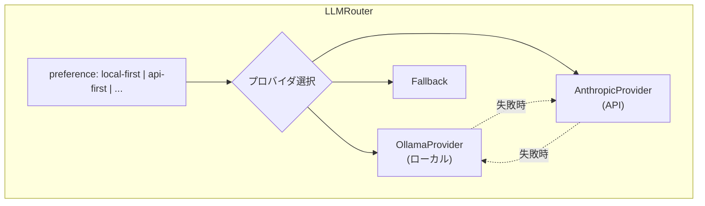
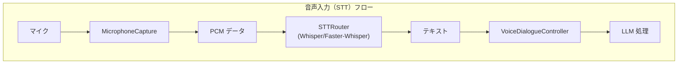
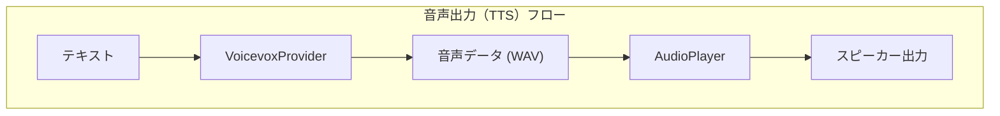
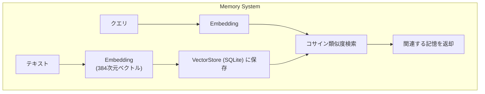
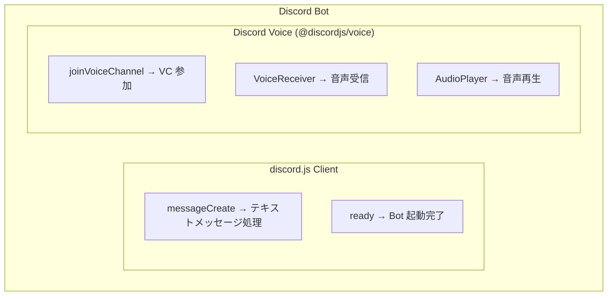

# LLM / Voice / Memory システムのデバッグ

## 1. LLM システム

### 1.1 幹：LLM Router の仕組み



**設定による動作の違い**：

| preference | 動作 |
|------------|------|
| `local-first` | Ollama → 失敗したら Anthropic |
| `api-first` | Anthropic → 失敗したら Ollama |
| `local-only` | Ollama のみ（失敗時はエラー）|
| `api-only` | Anthropic のみ（失敗時はエラー）|

### 1.2 枝葉：LLM デバッグの実践

#### 最初に確認すべきこと

```typescript
// src/main/llm/router.ts での確認ポイント
console.log('[LLM] 現在のpreference:', config.llm.preference);
console.log('[LLM] Ollama URL:', config.llm.ollama.baseUrl);
console.log('[LLM] Anthropic モデル:', config.llm.anthropic.model);
```

#### Ollama 接続確認

```bash
# Ollama サーバーが起動しているか
curl http://localhost:11434/api/tags

# 期待される応答
# {"models":[{"name":"gemma3:latest",...}]}
```

```typescript
// コード内での確認
async function checkOllama() {
  try {
    const response = await fetch('http://localhost:11434/api/tags');
    const data = await response.json();
    console.log('[Ollama] 利用可能モデル:', data.models.map(m => m.name));
  } catch (error) {
    console.error('[Ollama] 接続失敗:', error);
  }
}
```

#### Anthropic API 確認

```typescript
// API キーの確認（一部マスク）
const key = process.env.ANTHROPIC_API_KEY || '';
console.log('[Anthropic] APIキー:', key ? `${key.slice(0, 10)}...` : '未設定');

// API呼び出しテスト
async function testAnthropic() {
  try {
    const response = await anthropic.messages.create({
      model: 'claude-sonnet-4-20250514',
      max_tokens: 10,
      messages: [{ role: 'user', content: 'Hello' }]
    });
    console.log('[Anthropic] テスト成功');
  } catch (error) {
    console.error('[Anthropic] エラー:', error);
  }
}
```

### 1.3 よくある LLM エラー

#### エラー 1: 「ECONNREFUSED」（Ollama）

```
Error: connect ECONNREFUSED 127.0.0.1:11434
```

**原因**：Ollama サーバーが起動していない

**対処**：
```bash
# Ollama を起動
ollama serve

# 別ターミナルでモデル確認
ollama list
```

#### エラー 2: 「401 Unauthorized」（Anthropic）

```
Error: 401 Unauthorized
```

**原因**：API キーが無効または未設定

**対処**：
```bash
# 環境変数を確認
echo $ANTHROPIC_API_KEY

# .env ファイルに設定
ANTHROPIC_API_KEY=sk-ant-...
```

#### エラー 3: 「429 Rate Limit」（Anthropic）

```
Error: 429 Too Many Requests
```

**原因**：API レート制限に達した

**対処**：
- リクエスト間隔を空ける
- `local-first` に切り替える
- リトライロジックを追加

```typescript
// リトライ例
async function sendWithRetry(messages, maxRetries = 3) {
  for (let i = 0; i < maxRetries; i++) {
    try {
      return await llmRouter.sendMessageStream(messages, callbacks);
    } catch (error) {
      if ((error as any).status === 429 && i < maxRetries - 1) {
        console.log(`[LLM] レート制限、${i + 1}回目のリトライ待機`);
        await new Promise(r => setTimeout(r, 1000 * (i + 1)));
      } else {
        throw error;
      }
    }
  }
}
```

---

## 2. 音声システム（STT / TTS）

### 2.1 幹：音声処理のフロー





### 2.2 枝葉：音声デバッグの実践

#### STT（音声認識）のデバッグ

```typescript
// src/main/voice/sttRouter.ts
console.log('[STT] プロバイダ:', config.stt.provider);
console.log('[STT] Faster-Whisper URL:', config.stt.fasterWhisper.serverUrl);
```

**Faster-Whisper サーバー確認**：
```bash
# サーバーが起動しているか
curl http://localhost:8000/health

# または Python サーバーを起動
python -m faster_whisper_server
```

**マイク入力の確認**：
```typescript
// src/main/voice/microphoneCapture.ts
micCapture.on('data', (buffer: Buffer) => {
  console.log('[Mic] データ受信:', buffer.length, 'bytes');
});

micCapture.on('silence', () => {
  console.log('[Mic] 無音検出');
});
```

#### TTS（音声合成）のデバッグ

**VOICEVOX 確認**：
```bash
# VOICEVOX Engine が起動しているか
curl http://localhost:50021/speakers

# 音声合成テスト
curl -X POST "http://localhost:50021/audio_query?text=こんにちは&speaker=1" \
  -H "Content-Type: application/json"
```

```typescript
// src/main/voice/voicevoxProvider.ts
console.log('[TTS] VOICEVOX URL:', config.tts.voicevox.baseUrl);
console.log('[TTS] スピーカーID:', config.tts.voicevox.speakerId);
```

### 2.3 よくある音声エラー

#### エラー 1: マイクが認識されない

```
Error: No recording device found
```

**対処**：
```bash
# Linux: マイクデバイス確認
arecord -l

# パーミッション確認
sudo usermod -a -G audio $USER
```

#### エラー 2: VOICEVOX 接続失敗

```
Error: connect ECONNREFUSED 127.0.0.1:50021
```

**対処**：
```bash
# VOICEVOX Engine を起動
./run.sh  # または VOICEVOX アプリを起動
```

#### エラー 3: 音声認識結果が空

**確認ポイント**：
```typescript
// 音声データのサイズを確認
console.log('[STT] 送信データサイズ:', audioBuffer.length);

// 最小サイズを確認
if (audioBuffer.length < 16000) { // 0.5秒未満
  console.warn('[STT] 音声データが短すぎる');
}
```

---

## 3. メモリシステム

### 3.1 幹：ベクトル検索の原理



**類似度スコア**：
- 1.0 = 完全一致
- 0.7+ = 高い関連性
- 0.5+ = 中程度の関連性
- 0.3- = 低い関連性

### 3.2 枝葉：メモリデバッグの実践

#### メモリ追加の確認

```typescript
// src/main/memory/memoryManager.ts
async function addMemoryWithDebug(content: string, type: string) {
  console.log('[Memory] 追加開始:', { content: content.slice(0, 50), type });

  // Embedding 生成
  const embedding = await embeddingProvider.embed(content);
  console.log('[Memory] Embedding 生成完了:', embedding.length, '次元');

  // 保存
  const id = await vectorStore.add(content, embedding, { type });
  console.log('[Memory] 保存完了, ID:', id);

  return id;
}
```

#### メモリ検索の確認

```typescript
// 検索結果の詳細
const results = await memoryManager.search(query, { limit: 5 });
console.log('[Memory] 検索結果:');
results.forEach((r, i) => {
  console.log(`  ${i + 1}. score=${r.score.toFixed(3)}, type=${r.type}`);
  console.log(`     content: ${r.content.slice(0, 50)}...`);
});
```

#### データベース直接確認

```bash
# SQLite データベースを直接確認
sqlite3 ~/.config/ai-agent/memory.db

# テーブル一覧
.tables

# メモリ件数
SELECT COUNT(*) FROM memories;

# 最新5件
SELECT id, type, importance, content FROM memories
ORDER BY createdAt DESC LIMIT 5;
```

### 3.3 よくあるメモリエラー

#### エラー 1: Embedding 生成失敗

```
Error: Failed to generate embedding
```

**対処**：
```typescript
// Embedding プロバイダの確認
console.log('[Embedding] プロバイダ:', config.memory.embedding.provider);

// xenova の場合: モデルダウンロード確認
// ollama の場合: サーバー起動確認
```

#### エラー 2: 検索結果が0件

**確認ポイント**：
```typescript
// 1. メモリが存在するか
const count = await vectorStore.count();
console.log('[Memory] 総件数:', count);

// 2. 検索閾値を確認
console.log('[Memory] 最小スコア:', config.memory.contextMinScore);

// 3. 閾値を下げてテスト
const results = await memoryManager.search(query, {
  limit: 10,
  minScore: 0.1 // 低い閾値でテスト
});
```

---

## 4. Discord システム

### 4.1 幹：Discord Bot アーキテクチャ



### 4.2 枝葉：Discord デバッグの実践

#### Bot 接続確認

```typescript
// src/main/discord/discordBot.ts
client.on('ready', () => {
  console.log('[Discord] Bot ログイン完了:', client.user?.tag);
  console.log('[Discord] 参加サーバー数:', client.guilds.cache.size);
});

client.on('error', (error) => {
  console.error('[Discord] クライアントエラー:', error);
});
```

#### トークン確認

```bash
# 環境変数確認
echo $DISCORD_BOT_TOKEN | head -c 20
# NjEyMzQ1Njc4OTAxMjM0...

# トークンが設定されているか
node -e "console.log(!!process.env.DISCORD_BOT_TOKEN)"
```

#### 音声処理のデバッグ

```typescript
// 音声受信の確認
voiceReceiver.subscribe(userId, {
  end: {
    behavior: EndBehaviorType.AfterSilence,
    duration: 1000
  }
}).on('data', (chunk) => {
  console.log(`[Discord Voice] ${userId} からデータ:`, chunk.length, 'bytes');
});
```

### 4.3 よくある Discord エラー

#### エラー 1: 「Invalid Token」

```
Error [TokenInvalid]: An invalid token was provided.
```

**対処**：
1. Discord Developer Portal でトークンをリセット
2. `.env` ファイルを更新
3. トークンに余分な空白がないか確認

#### エラー 2: 「Missing Access」（VC参加時）

```
Error: Missing Access
```

**対処**：
- Bot の権限を確認（Connect, Speak, Use Voice Activity）
- サーバーの招待 URL を権限付きで再生成

---

## 5. デバッグチェックリスト

### LLM が動かない

```
□ Ollama: `curl http://localhost:11434/api/tags` が応答するか
□ Anthropic: ANTHROPIC_API_KEY が設定されているか
□ config: preference の設定は正しいか
□ ネットワーク: インターネット接続は正常か
```

### 音声入力が動かない

```
□ マイク: OS でマイクが認識されているか
□ Faster-Whisper: サーバーが起動しているか
□ 権限: マイクへのアクセス権限があるか
□ 設定: config.stt.provider は正しいか
```

### 音声出力が動かない

```
□ VOICEVOX: Engine が起動しているか
□ スピーカー: OS でスピーカーが認識されているか
□ 設定: config.tts.voicevox.speakerId は有効か
```

### メモリ検索が動かない

```
□ DB: memory.db ファイルが存在するか
□ データ: メモリが1件以上保存されているか
□ Embedding: プロバイダが正常に動作しているか
□ 閾値: contextMinScore が高すぎないか
```

### Discord Bot が動かない

```
□ トークン: DISCORD_BOT_TOKEN が正しいか
□ 権限: Bot に必要な権限があるか
□ Intent: Privileged Gateway Intents が有効か
□ ネットワーク: Discord API に接続できるか
```

## 関連ドキュメント

- [03-ipc-debugging.md](03-ipc-debugging.md) - IPC 通信のデバッグ
- [05-html-json-debugging.md](05-html-json-debugging.md) - フロントエンドと設定のデバッグ
