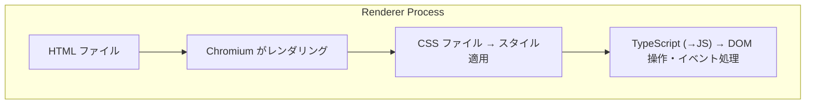
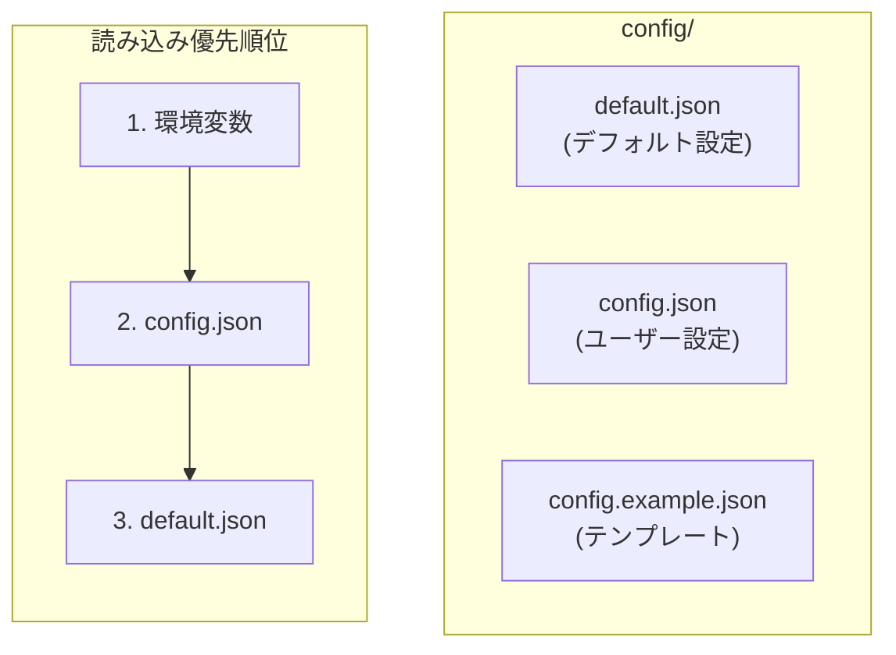

# HTML / CSS / JSON デバッグガイド

## 1. HTML / CSS（Renderer UI）

### 1.1 幹：Electron での UI レンダリング



**本プロジェクトの UI ファイル**：

| ファイル | 役割 |
|---------|------|
| `src/renderer/renderer.html` | メイン UI |
| `src/renderer/mascot.html` | マスコットウィンドウ |
| `src/renderer/renderer.ts` | メイン UI ロジック |
| `src/renderer/mascot.ts` | マスコット UI ロジック |
| `src/renderer/live2d.ts` | Live2D 描画 |

### 1.2 枝葉：HTML/CSS デバッグの実践

#### DevTools を開く

```typescript
// 開発時に自動で開く設定
// src/main/index.ts
mainWindow.webContents.openDevTools();

// または実行時に手動で
// Ctrl+Shift+I / Cmd+Option+I / F12
```

#### Elements パネルの使い方

1. **要素の検査**：右クリック → 「検証」
2. **スタイルの確認**：Styles パネルで CSS を確認
3. **リアルタイム編集**：スタイルを直接変更してテスト

```html
<!-- 例: メッセージ表示部分 -->
<div id="messages" class="message-container">
  <div class="message user">ユーザーのメッセージ</div>
  <div class="message assistant">アシスタントの応答</div>
</div>
```

#### よくある CSS の問題

**問題 1: 要素が表示されない**

```css
/* デバッグ: 境界線を付けて可視化 */
.problem-element {
  border: 2px solid red !important;
  background: yellow !important;
}
```

確認ポイント：
- `display: none` になっていないか
- `visibility: hidden` になっていないか
- 親要素に `overflow: hidden` がないか
- z-index が低すぎないか

**問題 2: レイアウトが崩れる**

```css
/* Flexbox デバッグ */
.flex-container {
  display: flex;
  /* 各アイテムに色を付けて確認 */
}
.flex-container > * {
  border: 1px solid blue;
}
```

### 1.3 Live2D デバッグ

```typescript
// src/renderer/live2d.ts のデバッグポイント

// モデル読み込み確認
console.log('[Live2D] モデルパス:', modelPath);

// 初期化完了確認
model.once('load', () => {
  console.log('[Live2D] モデル読み込み完了');
  console.log('[Live2D] パラメータ:', model.internalModel.coreModel.getParameterIds());
});

// エラー確認
model.on('error', (e) => {
  console.error('[Live2D] エラー:', e);
});
```

**Canvas が表示されない場合**：

```typescript
// Canvas サイズ確認
const canvas = document.getElementById('live2d-canvas') as HTMLCanvasElement;
console.log('[Live2D] Canvas サイズ:', canvas.width, 'x', canvas.height);

// 親要素のサイズ確認
const parent = canvas.parentElement;
console.log('[Live2D] 親要素サイズ:', parent?.clientWidth, 'x', parent?.clientHeight);
```

---

## 2. JSON 設定ファイル

### 2.1 幹：設定ファイルの構造



### 2.2 枝葉：JSON デバッグの実践

#### JSON 構文エラーの確認

```bash
# JSON の構文チェック
cat config/config.json | jq .

# エラーがあれば行番号が表示される
# parse error: Invalid numeric literal at line 15, column 10
```

**よくある JSON エラー**：

```json
// NG: 末尾のカンマ
{
  "name": "value",  // ← このカンマがエラー
}

// NG: シングルクォート
{
  'name': 'value'  // ← ダブルクォートを使う
}

// NG: コメント
{
  "name": "value"  // これはコメント → エラー
}
```

#### 設定の読み込み確認

```typescript
// src/main/config/configLoader.ts でのデバッグ

import * as fs from 'fs';
import * as path from 'path';

function loadConfigWithDebug() {
  const defaultPath = path.join(__dirname, '../../config/default.json');
  const userPath = path.join(__dirname, '../../config/config.json');

  console.log('[Config] default.json パス:', defaultPath);
  console.log('[Config] default.json 存在:', fs.existsSync(defaultPath));

  console.log('[Config] config.json パス:', userPath);
  console.log('[Config] config.json 存在:', fs.existsSync(userPath));

  // 読み込み
  const defaultConfig = JSON.parse(fs.readFileSync(defaultPath, 'utf-8'));
  console.log('[Config] デフォルト設定:', JSON.stringify(defaultConfig, null, 2));

  if (fs.existsSync(userPath)) {
    const userConfig = JSON.parse(fs.readFileSync(userPath, 'utf-8'));
    console.log('[Config] ユーザー設定:', JSON.stringify(userConfig, null, 2));
  }
}
```

### 2.3 主要な設定項目

#### LLM 設定

```json
{
  "llm": {
    "preference": "local-first",  // "local-first" | "api-first" | "local-only" | "api-only"
    "ollama": {
      "baseUrl": "http://localhost:11434",
      "model": "gemma3:latest",
      "healthCheckTimeoutMs": 5000
    },
    "anthropic": {
      "model": "claude-sonnet-4-20250514",
      "maxTokens": 4096
    }
  }
}
```

**デバッグポイント**：
- `baseUrl` は正しいか（ポート番号）
- `model` 名は存在するか（`ollama list` で確認）

#### 音声設定

```json
{
  "stt": {
    "provider": "faster-whisper",  // "faster-whisper" | "whisper-node"
    "fasterWhisper": {
      "serverUrl": "http://localhost:8000",
      "model": "base",
      "language": "ja"
    }
  },
  "tts": {
    "voicevox": {
      "baseUrl": "http://localhost:50021",
      "speakerId": 1,
      "speedScale": 1.0
    }
  }
}
```

**デバッグポイント**：
- `serverUrl` / `baseUrl` でサービスに接続できるか
- `speakerId` は VOICEVOX で有効な値か

#### メモリ設定

```json
{
  "memory": {
    "embedding": {
      "provider": "xenova",  // "xenova" | "ollama"
      "model": "Xenova/all-MiniLM-L6-v2"
    },
    "contextSearchLimit": 5,
    "contextMinScore": 0.3
  }
}
```

**デバッグポイント**：
- `contextMinScore` が高すぎると検索結果が0件になる
- `contextSearchLimit` で取得件数を制御

---

## 3. package.json

### 3.1 幹：依存関係の管理

```json
{
  "dependencies": {
    // 本番で必要なパッケージ
    "electron": "^39.2.7",
    "@anthropic-ai/sdk": "^0.71.2"
  },
  "devDependencies": {
    // 開発時のみ必要
    "typescript": "^5.0.0",
    "esbuild": "^0.20.0"
  }
}
```

### 3.2 枝葉：依存関係のデバッグ

#### パッケージが見つからない

```bash
# インストールされているか確認
npm list <package-name>

# 再インストール
npm install

# 特定パッケージを再インストール
npm install <package-name>
```

#### バージョンの競合

```bash
# 依存関係ツリーを確認
npm ls

# 重複パッケージを確認
npm dedupe
```

#### ネイティブモジュールの問題

```bash
# better-sqlite3 などのリビルド
npm rebuild

# Electron 用にリビルド
npx electron-rebuild
```

---

## 4. tsconfig.json

### 4.1 幹：TypeScript コンパイラ設定

```json
{
  "compilerOptions": {
    "target": "ES2022",        // 出力 JS バージョン
    "module": "CommonJS",      // モジュール形式
    "strict": true,            // 厳格な型チェック
    "esModuleInterop": true,   // import/export 互換
    "resolveJsonModule": true, // JSON インポート許可
    "skipLibCheck": true       // ライブラリ型チェックスキップ
  }
}
```

### 4.2 枝葉：コンパイル設定のデバッグ

#### 型エラーが大量に出る

```json
{
  "compilerOptions": {
    // 一時的に緩和してビルド
    "strict": false,
    "noImplicitAny": false
  }
}
```

#### モジュール解決の問題

```json
{
  "compilerOptions": {
    // パスエイリアス設定
    "baseUrl": ".",
    "paths": {
      "@/*": ["src/*"]
    }
  }
}
```

---

## 5. デバッグチェックリスト

### UI が表示されない

```
□ DevTools でエラーが出ていないか（Console タブ）
□ HTML ファイルのパスは正しいか
□ CSS が正しく読み込まれているか（Network タブ）
□ JavaScript がエラーなく実行されているか
```

### スタイルが適用されない

```
□ セレクタが正しいか（Elements パネルで確認）
□ CSS の優先順位は十分か（!important でテスト）
□ 別のスタイルで上書きされていないか
□ CSS ファイルが読み込まれているか
```

### Live2D が表示されない

```
□ Canvas 要素が存在するか
□ モデルファイルのパスは正しいか
□ PIXI.js が正しく初期化されているか
□ WebGL がサポートされているか
```

### 設定が反映されない

```
□ JSON 構文エラーがないか（jq でチェック）
□ 設定ファイルのパスは正しいか
□ 設定の優先順位を理解しているか
□ アプリを再起動したか
```

---

## 6. 便利なコマンド・ツール

### JSON 操作

```bash
# 整形して表示
cat config.json | jq .

# 特定のキーを取得
cat config.json | jq '.llm.preference'

# 構文チェック
python -m json.tool < config.json
```

### CSS デバッグ用スタイル

```css
/* すべての要素にボーダーを付ける */
* {
  outline: 1px solid red !important;
}

/* 特定のクラスをハイライト */
.debug-me {
  background: rgba(255, 0, 0, 0.3) !important;
}
```

### HTML 構造の確認

```javascript
// DevTools Console で実行
// DOM ツリーを確認
document.body.innerHTML;

// 特定の要素を取得
document.querySelectorAll('.message');

// イベントリスナーを確認
getEventListeners(document.getElementById('send-button'));
```

## 関連ドキュメント

- [01-electron-fundamentals.md](01-electron-fundamentals.md) - Electron の基礎
- [../develop/04-frontend-development.md](../develop/04-frontend-development.md) - フロントエンド開発ガイド
