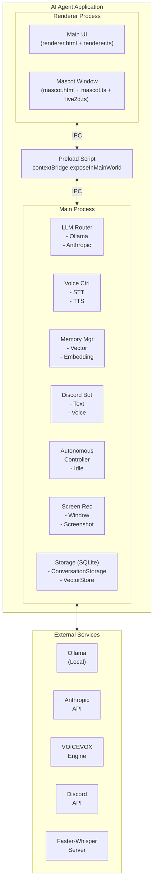
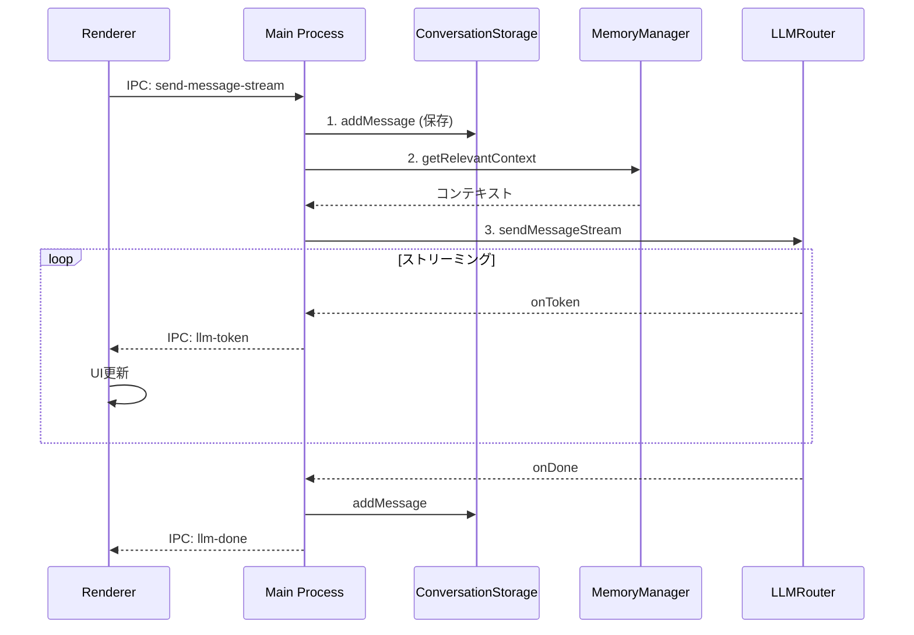
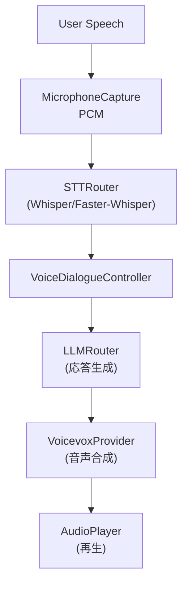

# アーキテクチャ概要

## 1. 幹：プロジェクト全体像

### 1.1 システム構成図



### 1.2 ディレクトリ構造と責務

```
src/
├── main/                    # Main Process（バックエンド）
│   ├── index.ts            # エントリーポイント、IPC定義
│   ├── agent/              # 自律行動システム
│   ├── config/             # 設定管理
│   ├── discord/            # Discord Bot
│   ├── events/             # イベントシステム
│   ├── llm/                # LLMルーター、ツール
│   ├── mascot/             # マスコット関連
│   ├── memory/             # 記憶システム
│   ├── screen/             # 画面認識
│   ├── storage/            # 会話ストレージ
│   ├── voice/              # 音声入出力
│   └── windows/            # ウィンドウ管理
├── preload/                 # Preload Script
│   └── index.ts            # IPC ブリッジ
└── renderer/                # Renderer Process（フロントエンド）
    ├── renderer.html       # メイン UI
    ├── renderer.ts         # メイン UI ロジック
    ├── mascot.html         # マスコット UI
    ├── mascot.ts           # マスコット UI ロジック
    ├── live2d.ts           # Live2D 操作
    ├── assets/             # アセット（Live2D モデル等）
    └── lib/                # 外部ライブラリ
```

---

## 2. 枝葉：各コンポーネントの詳細

### 2.1 Main Process コンポーネント

#### index.ts（エントリーポイント）

**役割**：
- Electron アプリケーションの初期化
- 各コンポーネントのインスタンス化
- IPC ハンドラの登録

**主要な初期化順序**：
```typescript
app.whenReady().then(async () => {
  // 1. 設定読み込み
  const config = initConfig();

  // 2. LLM システム初期化
  const llmRouter = new LLMRouter(config.llm);

  // 3. ストレージ初期化
  const conversationStorage = new ConversationStorage();
  const vectorStore = new VectorStore();

  // 4. メモリシステム初期化
  const memoryManager = new MemoryManager(vectorStore, embeddingProvider);

  // 5. 音声システム初期化
  const micCapture = new MicrophoneCapture();
  const sttRouter = new STTRouter(config.stt);
  const voicevoxProvider = new VoicevoxProvider(config.tts);

  // 6. 音声対話コントローラ初期化
  const voiceDialogue = new VoiceDialogueController(...);

  // 7. Discord Bot 初期化
  const discordBot = new DiscordBot(...);

  // 8. イベントシステム初期化
  const eventBus = new EventBus();
  const idleDetector = new IdleDetector(eventBus);

  // 9. 自律行動コントローラ初期化
  const autonomousController = new AutonomousController(...);

  // 10. 画面認識初期化
  const screenRecognitionController = new ScreenRecognitionController(...);

  // 11. ウィンドウ作成
  createWindow();
});
```

#### llm/ ディレクトリ

```
llm/
├── router.ts         # LLM プロバイダ切り替え
├── anthropic.ts      # Claude API ラッパー
├── ollama.ts         # Ollama ラッパー
├── history.ts        # 会話履歴管理
└── tools/            # Function Calling ツール
    ├── registry.ts   # ツール登録
    ├── appLauncher.ts
    ├── calculator.ts
    ├── fileBrowser.ts
    ├── shellExecutor.ts
    ├── nightMode.ts
    └── notification.ts
```

#### voice/ ディレクトリ

```
voice/
├── voiceDialogueController.ts  # 音声対話フロー管理
├── microphoneCapture.ts        # マイク入力
├── sttRouter.ts                # STT プロバイダ切り替え
├── whisperProvider.ts          # Whisper 統合
├── fasterWhisperProvider.ts    # Faster-Whisper 統合
├── voicevoxProvider.ts         # VOICEVOX TTS
└── audioPlayer.ts              # 音声再生
```

#### memory/ ディレクトリ

```
memory/
├── memoryManager.ts      # 記憶管理の統合層
├── vectorStore.ts        # ベクトル検索・保存
├── embedding.ts          # Embedding プロバイダ
├── userProfile.ts        # ユーザープロファイル
├── memoryLifecycle.ts    # 記憶のメンテナンス
└── discordUsers.ts       # Discord ユーザー情報
```

### 2.2 データフロー

#### テキストメッセージ処理



#### 音声対話処理



---

## 3. 設計パターン

### 3.1 プロバイダパターン（Strategy）

複数の実装を切り替え可能にする設計。

```typescript
// インターフェース
interface LLMProvider {
  sendMessageStream(
    messages: Message[],
    callbacks: StreamCallbacks
  ): Promise<void>;
}

// 実装1: Ollama
class OllamaProvider implements LLMProvider {
  async sendMessageStream(...) { /* Ollama実装 */ }
}

// 実装2: Anthropic
class AnthropicProvider implements LLMProvider {
  async sendMessageStream(...) { /* Anthropic実装 */ }
}

// ルーターで切り替え
class LLMRouter {
  private providers: LLMProvider[];

  async sendMessageStream(...) {
    for (const provider of this.providers) {
      try {
        return await provider.sendMessageStream(...);
      } catch (error) {
        console.log('フォールバック');
      }
    }
  }
}
```

### 3.2 ハンドラ注入パターン

外部から処理ロジックを注入。

```typescript
class VoiceDialogueController {
  private llmHandler?: (text: string) => Promise<string>;

  setLLMHandler(handler: (text: string) => Promise<string>) {
    this.llmHandler = handler;
  }

  private async processUserSpeech(text: string) {
    if (this.llmHandler) {
      const response = await this.llmHandler(text);
      await this.speak(response);
    }
  }
}

// 使用側で注入
voiceDialogue.setLLMHandler(async (text) => {
  return await processVoiceMessage(text);
});
```

### 3.3 イベント駆動パターン

システム間を疎結合に保つ。

```typescript
// EventBus
class EventBus {
  private listeners = new Map<string, Function[]>();

  register(event: string, callback: Function) {
    const callbacks = this.listeners.get(event) || [];
    callbacks.push(callback);
    this.listeners.set(event, callbacks);
  }

  emit(event: string, data: any) {
    const callbacks = this.listeners.get(event) || [];
    callbacks.forEach(cb => cb(data));
  }
}

// 登録
eventBus.register('system:idle', (event) => {
  autonomousController.handleIdle(event);
});

// 発火
idleDetector.on('idle', () => {
  eventBus.emit('system:idle', { timestamp: Date.now() });
});
```

---

## 4. 型システム

### 4.1 主要な型定義

```typescript
// メッセージ
interface Message {
  role: 'user' | 'assistant' | 'system';
  content: string;
}

// 会話
interface Conversation {
  id: string;
  title: string;
  createdAt: number;
  updatedAt: number;
}

// 記憶
interface Memory {
  id: string;
  content: string;
  type: 'fact' | 'event' | 'preference' | 'reminder';
  importance: number;
  createdAt: number;
}

// 音声対話状態
type DialogueState =
  | 'idle'
  | 'listening'
  | 'recording'
  | 'transcribing'
  | 'thinking'
  | 'speaking';
```

### 4.2 設定型（src/main/config/types.ts）

```typescript
interface AppConfig {
  llm: {
    preference: 'local-first' | 'api-first' | 'local-only' | 'api-only';
    ollama: { baseUrl: string; model: string; };
    anthropic: { model: string; maxTokens: number; };
  };
  stt: {
    provider: 'faster-whisper' | 'whisper-node';
    fasterWhisper: { serverUrl: string; model: string; };
  };
  tts: {
    voicevox: { baseUrl: string; speakerId: number; };
  };
  memory: {
    embedding: { provider: 'xenova' | 'ollama'; };
    contextSearchLimit: number;
    contextMinScore: number;
  };
  discord: {
    prefix: string;
    admin: { id: string; name: string; };
  };
  autonomous: {
    enabled: boolean;
    minIntervalMs: number;
  };
}
```

---

## 5. 外部サービス連携

### 5.1 LLM プロバイダ

| サービス | 用途 | 接続先 |
|---------|------|-------|
| Ollama | ローカルLLM | `http://localhost:11434` |
| Anthropic | Claude API | `https://api.anthropic.com` |

### 5.2 音声サービス

| サービス | 用途 | 接続先 |
|---------|------|-------|
| Faster-Whisper | 音声認識 | `http://localhost:8000` |
| VOICEVOX | 音声合成 | `http://localhost:50021` |

### 5.3 その他

| サービス | 用途 | 接続先 |
|---------|------|-------|
| Discord | Bot 連携 | Discord API |

---

## 6. データストレージ

### 6.1 SQLite データベース

| DB | 用途 | ファイル |
|-----|------|---------|
| 会話 | メッセージ履歴 | `conversations.db` |
| メモリ | ベクトル記憶 | `memory.db` |

### 6.2 設定ファイル

| ファイル | 用途 |
|---------|------|
| `config/default.json` | デフォルト設定 |
| `config/config.json` | ユーザー設定 |
| `.env` | 環境変数（APIキー等）|

---

## 7. ビルドシステム

### 7.1 esbuild による高速ビルド

```bash
# Main Process
esbuild src/main/index.ts \
  --bundle --platform=node \
  --external:electron --external:better-sqlite3 \
  --outfile=dist/main/index.js

# Preload
esbuild src/preload/index.ts \
  --bundle --platform=node \
  --external:electron \
  --outfile=dist/preload/index.js

# Renderer
esbuild src/renderer/renderer.ts \
  --bundle --platform=browser \
  --outfile=dist/renderer/renderer.js
```

### 7.2 ビルド成果物

```
dist/
├── main/
│   └── index.js        # Main Process
├── preload/
│   └── index.js        # Preload Script
└── renderer/
    ├── renderer.js     # UI ロジック
    ├── live2d.js       # Live2D
    ├── mascot.js       # マスコット
    ├── *.html          # HTML ファイル
    └── assets/         # アセット
```

---

## 8. 新機能追加時の影響範囲

### 8.1 新しい IPC チャンネル追加

影響ファイル：
1. `src/main/index.ts` - ハンドラ登録
2. `src/preload/index.ts` - ブリッジ追加
3. `src/renderer/*.ts` - 呼び出し

### 8.2 新しい設定項目追加

影響ファイル：
1. `src/main/config/types.ts` - 型定義
2. `config/default.json` - デフォルト値
3. 使用箇所 - 設定読み取り

### 8.3 新しい外部サービス連携

影響ファイル：
1. 新規プロバイダファイル作成
2. ルーターに統合
3. 設定に接続先追加

## 関連ドキュメント

- [02-adding-new-features.md](02-adding-new-features.md) - 新機能追加の手順
- [03-ipc-handler-development.md](03-ipc-handler-development.md) - IPC ハンドラ開発
