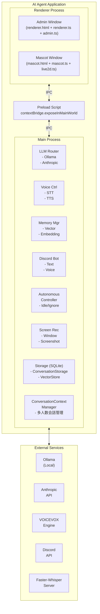
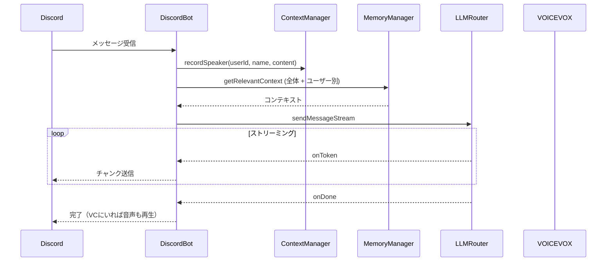
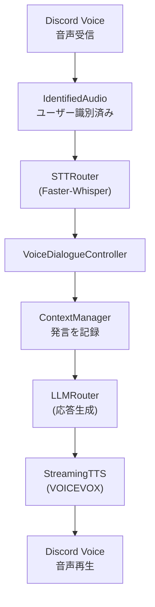

# アーキテクチャ概要

## 1. 幹：プロジェクト全体像

### 1.1 システム構成図



> **重要な変更点**：最新の更新で UI 構造が大幅に変更されました。
> - メインウィンドウ → **管理者ウィンドウ（Admin Window）** に変更
> - 音声対話やチャットは **Discord が主要インターフェース** に
> - マスコットウィンドウは常時表示のコンパニオンとして機能

### 1.2 ディレクトリ構造と責務

```
src/
├── main/                    # Main Process（バックエンド）
│   ├── index.ts            # エントリーポイント、IPC定義、ConversationContextManager
│   ├── agent/              # 自律行動システム
│   │   ├── autonomousController.ts
│   │   └── index.ts
│   ├── config/             # 設定管理
│   │   ├── autonomous.ts   # 自律行動の動的設定
│   │   ├── configLoader.ts
│   │   ├── types.ts
│   │   └── index.ts
│   ├── discord/            # Discord Bot（メインUI）
│   │   ├── discordBot.ts   # テキスト処理
│   │   ├── discordVoice.ts # 音声処理
│   │   ├── types.ts
│   │   └── index.ts
│   ├── events/             # イベント駆動システム
│   │   ├── eventBus.ts     # イベントバス
│   │   ├── idleDetector.ts # アイドル検出
│   │   ├── ignoreDetector.ts # 無視検出（新機能）
│   │   ├── timerTrigger.ts
│   │   ├── types.ts
│   │   └── index.ts
│   ├── llm/                # LLMルーター、ツール
│   │   ├── router.ts
│   │   ├── anthropic.ts
│   │   ├── ollama.ts
│   │   ├── history.ts
│   │   └── tools/
│   │       ├── registry.ts
│   │       ├── appLauncher.ts
│   │       ├── calculator.ts
│   │       ├── currentTime.ts
│   │       ├── fileBrowser.ts
│   │       ├── shellExecutor.ts
│   │       ├── notification.ts
│   │       ├── nightMode.ts
│   │       └── types.ts
│   ├── mascot/             # マスコット関連
│   │   └── alwaysOnListener.ts
│   ├── memory/             # 記憶システム
│   │   ├── memoryManager.ts
│   │   ├── memoryLifecycle.ts
│   │   ├── vectorStore.ts
│   │   ├── embedding.ts
│   │   ├── userProfile.ts
│   │   ├── discordUsers.ts  # Discord ユーザー管理（新機能）
│   │   └── types.ts
│   ├── screen/             # 画面認識
│   │   ├── screenshotCapture.ts
│   │   ├── activeWindowMonitor.ts
│   │   ├── screenRecognitionController.ts
│   │   └── index.ts
│   ├── storage/            # 会話ストレージ
│   │   ├── conversationStorage.ts
│   │   └── types.ts
│   ├── voice/              # 音声入出力
│   │   ├── voiceDialogueController.ts
│   │   ├── microphoneCapture.ts
│   │   ├── sttRouter.ts
│   │   ├── whisperProvider.ts
│   │   ├── fasterWhisperProvider.ts
│   │   ├── voicevoxProvider.ts
│   │   ├── audioPlayer.ts
│   │   ├── streamingTTSController.ts
│   │   └── types.ts
│   └── windows/            # ウィンドウ管理
│       └── MascotWindow.ts
├── preload/                 # Preload Script
│   └── index.ts            # IPC ブリッジ
└── renderer/                # Renderer Process（フロントエンド）
    ├── renderer.html       # 管理者ウィンドウ HTML
    ├── renderer.ts         # 管理者ウィンドウ ロジック
    ├── admin.ts            # 管理機能（タブ切り替え、各種管理UI）
    ├── mascot.html         # マスコット UI
    ├── mascot.ts           # マスコット UI ロジック
    ├── live2d.ts           # Live2D 操作
    ├── assets/             # アセット（Live2D モデル等）
    └── lib/                # 外部ライブラリ
```

---

## 2. 枝葉：各コンポーネントの詳細

### 2.1 Main Process コンポーネント

#### index.ts（エントリーポイント）

**役割**：
- Electron アプリケーションの初期化
- 各コンポーネントのインスタンス化
- IPC ハンドラの登録
- **ConversationContextManager** による多人数会話管理

**ConversationContextManager（新機能）**：
```typescript
// 多人数会話の文脈を管理するクラス
class ConversationContextManager {
    // 現在の会話参加者（最近発言した順）
    private participants: Map<string, SpeakerEntry> = new Map();
    // 発言履歴（最新10件）
    private speakerHistory: Array<{...}> = [];

    // 発言を記録
    recordSpeaker(discordUserId: string, displayName: string, content: string): void;
    // 参加者リストを取得
    getParticipants(): SpeakerEntry[];
    // 最近の発言者を取得
    getRecentSpeakers(count: number): Array<{...}>;
    // LLM プロンプト用にフォーマット
    formatForPrompt(): string;
}
```

**主要な初期化順序**：
```typescript
app.whenReady().then(async () => {
  // 1. 設定読み込み
  const config = initConfig();

  // 2. LLM システム初期化
  const llmRouter = new LLMRouter(config.llm);

  // 3. ストレージ初期化
  const conversationStorage = new ConversationStorage();
  const vectorStore = new VectorStore();

  // 4. メモリシステム初期化
  const memoryManager = new MemoryManager(vectorStore, embeddingProvider);

  // 5. 音声システム初期化
  const sttRouter = new STTRouter(config.stt);
  const voicevoxProvider = new VoicevoxProvider(config.tts);

  // 6. 音声対話コントローラ初期化
  const voiceDialogue = new VoiceDialogueController(...);

  // 7. Discord Bot 初期化（メインインターフェース）
  const discordBot = new DiscordBot(...);

  // 8. イベントシステム初期化
  const eventBus = new EventBus();
  const idleDetector = new IdleDetector(eventBus);
  const ignoreDetector = new IgnoreDetector();  // 新機能

  // 9. 自律行動コントローラ初期化
  const autonomousController = new AutonomousController(...);

  // 10. 画面認識初期化
  const screenRecognitionController = new ScreenRecognitionController(...);

  // 11. ウィンドウ作成
  createWindow();
});
```

#### discord/ ディレクトリ（メインUI）

```
discord/
├── discordBot.ts     # メイン Bot クラス
├── discordVoice.ts   # 音声チャンネル処理
├── types.ts          # 型定義
└── index.ts          # エクスポート
```

**主要な機能**：
- テキストメッセージ処理（prefix コマンド + 常時会話）
- 音声チャンネル参加/退出
- 音声ストリーム処理
- ユーザー管理（preferred names）
- Admin ユーザー認識

**重要な型**：
```typescript
interface DiscordMessageContext {
    message: Message;
    userId: string;
    displayName: string;
    channelId: string;
    guildId?: string;
}

interface IdentifiedAudio {
    userId: string;
    displayName: string;
    audio: Buffer;
    timestamp: number;
}
```

#### memory/ ディレクトリ

```
memory/
├── memoryManager.ts      # 記憶管理の統合層
├── vectorStore.ts        # ベクトル検索・保存
├── embedding.ts          # Embedding プロバイダ
├── userProfile.ts        # ユーザープロファイル
├── memoryLifecycle.ts    # 記憶のメンテナンス
├── discordUsers.ts       # Discord ユーザー情報（新機能）
└── types.ts              # 型定義
```

**Discord ユーザー管理（新機能）**：
```typescript
// src/main/memory/discordUsers.ts
interface DiscordUser {
    discordId: string;
    displayName: string;
    preferredName?: string;  // ユーザーが設定した呼び名
    firstSeen: number;
    lastSeen: number;
    messageCount: number;
}

class DiscordUserManager {
    // ユーザー情報を取得または作成
    getOrCreateUser(discordId: string, displayName: string): DiscordUser;
    // 呼び名を設定
    setPreferredName(discordId: string, name: string): void;
    // 全ユーザーを取得
    getAllUsers(): DiscordUser[];
    // 統計情報を取得
    getStats(): { totalUsers: number; namedUsers: number };
}
```

#### events/ ディレクトリ

```
events/
├── eventBus.ts          # イベントバス
├── idleDetector.ts      # アイドル検出
├── ignoreDetector.ts    # 無視検出（新機能）
├── timerTrigger.ts      # タイマーイベント
├── types.ts             # イベント型定義
└── index.ts             # エクスポート
```

**IgnoreDetector（新機能）**：
```typescript
// AI の発話後、ユーザーからの反応がない場合を検出
class IgnoreDetector {
    // 設定
    config: {
        ignoreThresholdSeconds: number;  // 無視と判定する閾値（デフォルト30秒）
        checkIntervalMs: number;         // チェック間隔
    };

    start(config?: Partial<IgnoreConfig>): void;
    stop(): void;
    getState(): { isIgnoring: boolean; ignoreTime: number };
}
```

### 2.2 データフロー

#### Discord テキストメッセージ処理



#### Discord 音声対話処理



---

## 3. 設計パターン

### 3.1 プロバイダパターン（Strategy）

複数の実装を切り替え可能にする設計。

```typescript
// インターフェース
interface LLMProvider {
  sendMessageStream(
    messages: Message[],
    callbacks: StreamCallbacks
  ): Promise<void>;
}

// 実装1: Ollama
class OllamaProvider implements LLMProvider {
  async sendMessageStream(...) { /* Ollama実装 */ }
}

// 実装2: Anthropic
class AnthropicProvider implements LLMProvider {
  async sendMessageStream(...) { /* Anthropic実装 */ }
}

// ルーターで切り替え
class LLMRouter {
  private providers: LLMProvider[];

  async sendMessageStream(...) {
    for (const provider of this.providers) {
      try {
        return await provider.sendMessageStream(...);
      } catch (error) {
        console.log('フォールバック');
      }
    }
  }
}
```

### 3.2 ハンドラ注入パターン

外部から処理ロジックを注入。

```typescript
class VoiceDialogueController {
  private llmHandler?: (text: string) => Promise<string>;

  setLLMHandler(handler: (text: string) => Promise<string>) {
    this.llmHandler = handler;
  }

  private async processUserSpeech(text: string) {
    if (this.llmHandler) {
      const response = await this.llmHandler(text);
      await this.speak(response);
    }
  }
}

// 使用側で注入
voiceDialogue.setLLMHandler(async (text) => {
  return await processVoiceMessage(text);
});
```

### 3.3 イベント駆動パターン

システム間を疎結合に保つ。

```typescript
// EventBus
class EventBus {
  private listeners = new Map<string, Function[]>();

  register(event: string, callback: Function, priority?: EventPriority) {
    const callbacks = this.listeners.get(event) || [];
    callbacks.push(callback);
    this.listeners.set(event, callbacks);
  }

  publish(event: AgentEvent) {
    const callbacks = this.listeners.get(event.type) || [];
    callbacks.forEach(cb => cb(event));
  }
}

// 登録
eventBus.register('system:idle', (event) => {
  autonomousController.handleIdle(event);
});

eventBus.register('user:ignoring', (event) => {
  autonomousController.handleIgnore(event);
});

// 発火
idleDetector.on('idle', () => {
  eventBus.publish({ type: 'system:idle', ... });
});
```

---

## 4. 型システム

### 4.1 主要な型定義

```typescript
// メッセージ
interface Message {
  role: 'user' | 'assistant' | 'system';
  content: string;
}

// 会話（拡張版）
interface Conversation {
  id: string;
  title: string;
  createdAt: number;
  updatedAt: number;
  messages: Array<{
    role: string;
    content: string;
    discordUserId?: string;   // 新機能
    displayName?: string;      // 新機能
    timestamp: number;
  }>;
}

// 記憶
interface Memory {
  id: string;
  content: string;
  type: 'fact' | 'event' | 'preference' | 'reminder';
  importance: number;
  createdAt: number;
  metadata?: {
    discordUserId?: string;  // 新機能：ユーザー別記憶
    tags?: string[];
    accessCount?: number;
  };
}

// 音声対話状態
type DialogueState =
  | 'idle'
  | 'listening'
  | 'recording'
  | 'transcribing'
  | 'thinking'
  | 'speaking';

// イベント優先度
enum EventPriority {
  LOW = 0,
  NORMAL = 1,
  HIGH = 2
}
```

### 4.2 設定型（src/main/config/types.ts）

```typescript
interface AppConfig {
  llm: {
    preference: 'local-first' | 'api-first' | 'local-only' | 'api-only';
    ollama: { baseUrl: string; model: string; };
    anthropic: { model: string; maxTokens: number; };
  };
  stt: {
    provider: 'faster-whisper' | 'whisper-node';
    fasterWhisper: { serverUrl: string; model: string; };
  };
  tts: {
    voicevox: { baseUrl: string; speakerId: number; };
  };
  memory: {
    embedding: { provider: 'xenova' | 'ollama'; };
    contextSearchLimit: number;
    contextMinScore: number;
  };
  discord: {
    prefix: string;
    admin: { id: string; name: string; };
    voice: { silenceDurationMs: number; minAudioDurationMs: number; };
    autonomous: { enabled: boolean; sendToTextChannel: boolean; };
  };
  autonomous: {
    enabled: boolean;
    minIntervalMs: number;
  };
  idleDetector: {
    idleThresholdSeconds: number;
    checkIntervalMs: number;
  };
  ignoreDetector: {  // 新機能
    ignoreThresholdSeconds: number;
    checkIntervalMs: number;
  };
}
```

---

## 5. 外部サービス連携

### 5.1 LLM プロバイダ

| サービス | 用途 | 接続先 |
|---------|------|-------|
| Ollama | ローカルLLM | `http://localhost:11434` |
| Anthropic | Claude API | `https://api.anthropic.com` |

### 5.2 音声サービス

| サービス | 用途 | 接続先 |
|---------|------|-------|
| Faster-Whisper | 音声認識 | `http://localhost:8000` |
| VOICEVOX | 音声合成 | `http://localhost:50021` |

### 5.3 その他

| サービス | 用途 | 接続先 |
|---------|------|-------|
| Discord | Bot 連携（メインUI） | Discord API |

---

## 6. データストレージ

### 6.1 SQLite データベース

| DB | 用途 | ファイル |
|-----|------|---------|
| 会話 | メッセージ履歴 | `conversations.db` |
| メモリ | ベクトル記憶 | `memory.db` |
| ユーザー | Discord ユーザー情報 | `discord_users.db` |

### 6.2 設定ファイル

| ファイル | 用途 |
|---------|------|
| `config/default.json` | デフォルト設定 |
| `config/config.json` | ユーザー設定 |
| `.env` | 環境変数（APIキー等）|

---

## 7. ビルドシステム

### 7.1 esbuild による高速ビルド

```bash
# Main Process
esbuild src/main/index.ts \
  --bundle --platform=node \
  --external:electron --external:better-sqlite3 \
  --outfile=dist/main/index.js

# Preload
esbuild src/preload/index.ts \
  --bundle --platform=node \
  --external:electron \
  --outfile=dist/preload/index.js

# Renderer (複数ファイル)
esbuild src/renderer/renderer.ts src/renderer/admin.ts \
  --bundle --platform=browser \
  --outdir=dist/renderer
```

### 7.2 ビルド成果物

```
dist/
├── main/
│   └── index.js        # Main Process
├── preload/
│   └── index.js        # Preload Script
└── renderer/
    ├── renderer.js     # メインUI ロジック
    ├── admin.js        # 管理機能
    ├── live2d.js       # Live2D
    ├── mascot.js       # マスコット
    ├── *.html          # HTML ファイル
    └── assets/         # アセット
```

---

## 8. 新機能追加時の影響範囲

### 8.1 新しい IPC チャンネル追加

影響ファイル：
1. `src/main/index.ts` - ハンドラ登録
2. `src/preload/index.ts` - ブリッジ追加
3. `src/renderer/*.ts` - 呼び出し

### 8.2 新しい設定項目追加

影響ファイル：
1. `src/main/config/types.ts` - 型定義
2. `config/default.json` - デフォルト値
3. 使用箇所 - 設定読み取り

### 8.3 新しい外部サービス連携

影響ファイル：
1. 新規プロバイダファイル作成
2. ルーターに統合
3. 設定に接続先追加

### 8.4 Discord 関連機能の追加

影響ファイル：
1. `src/main/discord/discordBot.ts` - Bot 機能
2. `src/main/memory/discordUsers.ts` - ユーザー管理
3. `src/main/index.ts` - IPC ハンドラ
4. `src/renderer/admin.ts` - 管理UI

## 関連ドキュメント

- [02-adding-new-features.md](02-adding-new-features.md) - 新機能追加の手順
- [03-ipc-handler-development.md](03-ipc-handler-development.md) - IPC ハンドラ開発
