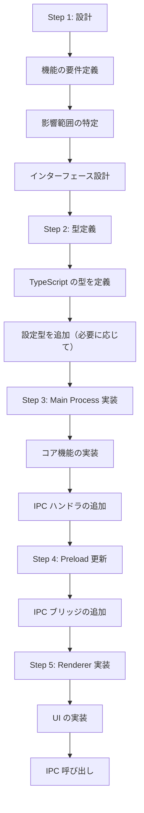

# 新機能追加ガイド

## 1. 幹：機能追加の基本フロー

### 1.1 開発の5ステップ



### 1.2 どこから書き始めるか

**推奨順序**：

1. **型定義から始める**
   - データ構造を明確にする
   - TypeScript の補完が効くようになる

2. **Main Process（バックエンド）を実装**
   - コア機能を先に作る
   - IPC なしで単体テスト可能

3. **IPC を繋ぐ**
   - Main → Preload → Renderer の順に

4. **UI を最後に**
   - バックエンドが動いていれば UI は後から

---

## 2. 枝葉：実践的な開発手順

### 2.1 例：新しいツール機能の追加

「タイマー機能」を追加する例で説明する。

#### Step 1: 設計

```
機能要件：
- ユーザーが「5分後にアラーム」と言ったらタイマーセット
- 時間になったら通知を出す

影響範囲：
- LLM ツールに新しいツールを追加
- 通知システムを利用
- 設定は不要（シンプルな機能）
```

#### Step 2: 型定義

```typescript
// src/main/llm/tools/types.ts（新規または追加）

interface TimerToolParams {
  duration: number;  // 秒数
  message: string;   // タイマー完了時のメッセージ
}

interface TimerToolResult {
  success: boolean;
  timerId: string;
  scheduledTime: number;
}
```

#### Step 3: Main Process 実装

```typescript
// src/main/llm/tools/timer.ts（新規作成）

import { Notification } from 'electron';

interface ActiveTimer {
  id: string;
  timeoutId: NodeJS.Timeout;
  message: string;
  scheduledTime: number;
}

const activeTimers = new Map<string, ActiveTimer>();

export function setTimer(duration: number, message: string): TimerToolResult {
  const id = `timer-${Date.now()}`;
  const scheduledTime = Date.now() + duration * 1000;

  const timeoutId = setTimeout(() => {
    // タイマー完了
    new Notification({
      title: 'タイマー',
      body: message
    }).show();

    activeTimers.delete(id);
  }, duration * 1000);

  activeTimers.set(id, { id, timeoutId, message, scheduledTime });

  return {
    success: true,
    timerId: id,
    scheduledTime
  };
}

export function cancelTimer(timerId: string): boolean {
  const timer = activeTimers.get(timerId);
  if (timer) {
    clearTimeout(timer.timeoutId);
    activeTimers.delete(timerId);
    return true;
  }
  return false;
}

// ツール定義（LLM用）
export const timerTool = {
  name: 'timer',
  description: '指定した時間後にアラームを鳴らす',
  parameters: {
    type: 'object',
    properties: {
      duration: {
        type: 'number',
        description: 'タイマーの時間（秒）'
      },
      message: {
        type: 'string',
        description: 'タイマー完了時に表示するメッセージ'
      }
    },
    required: ['duration', 'message']
  },
  execute: async (params: TimerToolParams) => {
    return setTimer(params.duration, params.message);
  }
};
```

#### Step 4: ツールをレジストリに登録

```typescript
// src/main/llm/tools/registry.ts に追加

import { timerTool } from './timer';

export const tools = [
  // 既存のツール...
  appLauncherTool,
  calculatorTool,
  // 新しいツールを追加
  timerTool
];
```

#### Step 5: テスト

```typescript
// 直接テスト（Main Process で）
import { setTimer } from './llm/tools/timer';

// テスト実行
const result = setTimer(5, 'テストタイマー');
console.log('タイマー設定:', result);
// 5秒後に通知が出ることを確認
```

---

### 2.2 例：Discord ユーザー管理機能の追加（実際の実装例）

本プロジェクトで実装された「Discord ユーザー管理」機能を例に説明する。

#### Step 1: 設計

```
機能要件：
- Discord ユーザーの情報を記録・管理する
- ユーザーごとに呼び名（preferred name）を設定できる
- 管理画面でユーザー一覧を表示できる

影響範囲：
- memory/ に新しいモジュールを追加
- IPC ハンドラを追加
- 管理画面（admin.ts）に UI を追加
```

#### Step 2: 型定義

```typescript
// src/main/memory/discordUsers.ts

export interface DiscordUser {
    discordId: string;           // Discord のユーザー ID
    displayName: string;         // Discord 表示名
    preferredName?: string;      // AI が呼ぶ名前
    firstSeen: number;           // 初回認識時刻
    lastSeen: number;            // 最終認識時刻
    messageCount: number;        // メッセージ数
}

export interface DiscordUserStats {
    totalUsers: number;
    namedUsers: number;          // preferred name が設定されているユーザー数
}
```

#### Step 3: Main Process 実装

```typescript
// src/main/memory/discordUsers.ts

import Database from 'better-sqlite3';
import * as path from 'path';
import { app } from 'electron';

export class DiscordUserManager {
    private db: Database.Database;

    constructor() {
        const dbPath = path.join(app.getPath('userData'), 'discord_users.db');
        this.db = new Database(dbPath);
        this.initTable();
    }

    private initTable(): void {
        this.db.exec(`
            CREATE TABLE IF NOT EXISTS discord_users (
                discord_id TEXT PRIMARY KEY,
                display_name TEXT NOT NULL,
                preferred_name TEXT,
                first_seen INTEGER NOT NULL,
                last_seen INTEGER NOT NULL,
                message_count INTEGER DEFAULT 0
            )
        `);
    }

    // ユーザー情報を取得または作成
    getOrCreateUser(discordId: string, displayName: string): DiscordUser {
        const existing = this.db.prepare(
            'SELECT * FROM discord_users WHERE discord_id = ?'
        ).get(discordId) as any;

        if (existing) {
            // 最終アクセス時刻とメッセージ数を更新
            this.db.prepare(`
                UPDATE discord_users
                SET last_seen = ?, message_count = message_count + 1, display_name = ?
                WHERE discord_id = ?
            `).run(Date.now(), displayName, discordId);

            return {
                discordId: existing.discord_id,
                displayName: displayName,
                preferredName: existing.preferred_name,
                firstSeen: existing.first_seen,
                lastSeen: Date.now(),
                messageCount: existing.message_count + 1
            };
        }

        // 新規ユーザーを作成
        const now = Date.now();
        this.db.prepare(`
            INSERT INTO discord_users (discord_id, display_name, first_seen, last_seen, message_count)
            VALUES (?, ?, ?, ?, 1)
        `).run(discordId, displayName, now, now);

        return {
            discordId,
            displayName,
            firstSeen: now,
            lastSeen: now,
            messageCount: 1
        };
    }

    // 呼び名を設定
    setPreferredName(discordId: string, name: string): void {
        this.db.prepare(
            'UPDATE discord_users SET preferred_name = ? WHERE discord_id = ?'
        ).run(name, discordId);
    }

    // 全ユーザーを取得
    getAllUsers(): DiscordUser[] {
        const rows = this.db.prepare(
            'SELECT * FROM discord_users ORDER BY last_seen DESC'
        ).all() as any[];

        return rows.map(row => ({
            discordId: row.discord_id,
            displayName: row.display_name,
            preferredName: row.preferred_name,
            firstSeen: row.first_seen,
            lastSeen: row.last_seen,
            messageCount: row.message_count
        }));
    }

    // 統計情報を取得
    getStats(): DiscordUserStats {
        const total = this.db.prepare(
            'SELECT COUNT(*) as count FROM discord_users'
        ).get() as any;

        const named = this.db.prepare(
            'SELECT COUNT(*) as count FROM discord_users WHERE preferred_name IS NOT NULL'
        ).get() as any;

        return {
            totalUsers: total.count,
            namedUsers: named.count
        };
    }
}

// シングルトンインスタンス
let userManager: DiscordUserManager | null = null;

export function getDiscordUserManager(): DiscordUserManager {
    if (!userManager) {
        userManager = new DiscordUserManager();
    }
    return userManager;
}
```

#### Step 4: IPC ハンドラ追加

```typescript
// src/main/index.ts に追加

import { getDiscordUserManager } from './memory/discordUsers.js';

// Discord ユーザー管理 IPC
ipcMain.handle('discord-users-get-all', async () => {
    console.log('[IPC] discord-users-get-all');
    const manager = getDiscordUserManager();
    return manager.getAllUsers();
});

ipcMain.handle('discord-users-stats', async () => {
    console.log('[IPC] discord-users-stats');
    const manager = getDiscordUserManager();
    return manager.getStats();
});

ipcMain.handle('discord-users-get', async (event, discordId: string) => {
    console.log('[IPC] discord-users-get:', discordId);
    const manager = getDiscordUserManager();
    const users = manager.getAllUsers();
    return users.find(u => u.discordId === discordId);
});

ipcMain.handle('discord-users-set-name', async (event, discordId: string, name: string) => {
    console.log('[IPC] discord-users-set-name:', discordId, name);
    const manager = getDiscordUserManager();
    manager.setPreferredName(discordId, name);
    return { success: true };
});
```

#### Step 5: Preload 更新

```typescript
// src/preload/index.ts に追加

contextBridge.exposeInMainWorld('electronAPI', {
    // 既存のメソッド...

    // Discord ユーザー管理
    discordUsersGetAll: () => ipcRenderer.invoke('discord-users-get-all'),
    discordUsersStats: () => ipcRenderer.invoke('discord-users-stats'),
    discordUsersGet: (discordId: string) =>
        ipcRenderer.invoke('discord-users-get', discordId),
    discordUsersSetName: (discordId: string, name: string) =>
        ipcRenderer.invoke('discord-users-set-name', discordId, name),
});
```

#### Step 6: Renderer（管理画面）実装

```typescript
// src/renderer/admin.ts に追加

// ============================================================
// ユーザー管理
// ============================================================

const usersRefreshBtn = document.getElementById('users-refresh-btn');
const usersList = document.getElementById('users-list');

async function loadUsersData(): Promise<void> {
    try {
        const stats = await (window as any).electronAPI.discordUsersStats();
        document.getElementById('users-total')!.textContent = String(stats?.totalUsers || 0);
        document.getElementById('users-named')!.textContent = String(stats?.namedUsers || 0);

        const users = await (window as any).electronAPI.discordUsersGetAll();
        renderUsersList(users || []);
    } catch (error) {
        console.error('Failed to load users:', error);
    }
}

function renderUsersList(users: any[]): void {
    if (!usersList) return;

    if (users.length === 0) {
        usersList.innerHTML = '<p class="no-data">登録ユーザーがいません</p>';
        return;
    }

    usersList.innerHTML = users.map(user => `
        <div class="user-item">
            <div class="user-header">
                <span class="user-name">${escapeHtml(user.preferredName || user.displayName)}</span>
                <span class="user-id">ID: ${user.discordId}</span>
            </div>
            <div class="user-meta">
                メッセージ数: ${user.messageCount || 0} |
                初回: ${formatDate(user.firstSeen)} |
                最終: ${formatDate(user.lastSeen)}
            </div>
        </div>
    `).join('');
}

usersRefreshBtn?.addEventListener('click', loadUsersData);
```

---

## 3. 新しいモジュール追加のパターン

### 3.1 新しいプロバイダの追加

例：新しい TTS プロバイダ（Google TTS）を追加

```typescript
// 1. src/main/voice/googleTtsProvider.ts（新規）
export class GoogleTtsProvider {
  constructor(private config: GoogleTtsConfig) {}

  async synthesize(text: string): Promise<Buffer> {
    // Google TTS API を呼び出す実装
  }
}

// 2. 設定型に追加
// src/main/config/types.ts
interface TTSConfig {
  voicevox: { ... };
  google: {
    apiKey: string;
    languageCode: string;
  };
}

// 3. ルーターに統合
// src/main/voice/ttsRouter.ts（新規または既存を修正）
export class TTSRouter {
  private providers: TTSProvider[];

  async synthesize(text: string) {
    for (const provider of this.providers) {
      try {
        return await provider.synthesize(text);
      } catch {
        continue;
      }
    }
    throw new Error('All TTS providers failed');
  }
}
```

### 3.2 新しいイベントの追加

例：「新しいメモリが追加されたとき」のイベント

```typescript
// 1. イベント定義
// src/main/events/types.ts
export type EventType =
    | 'system:idle'
    | 'system:active'
    | 'user:ignoring'
    | 'memory:added'      // 新規
    | 'memory:searched';  // 新規

// 2. イベント発火
// src/main/memory/memoryManager.ts
async addMemory(content: string, type: string) {
  const id = await this.vectorStore.add(...);

  // イベント発火
  eventBus.publish({
    type: 'memory:added',
    priority: EventPriority.LOW,
    timestamp: Date.now(),
    data: { id, content, type }
  });

  return id;
}

// 3. イベント購読
// 使用箇所（例：自律行動コントローラ）
eventBus.register('memory:added', (event) => {
  console.log('新しいメモリが追加されました:', event);
});
```

---

## 4. チェックリスト

### 新機能追加時の確認項目

```
□ 型定義
  - 必要なインターフェースを定義したか
  - 既存の型と整合性があるか

□ Main Process
  - 機能を実装したか
  - エラーハンドリングを入れたか
  - console.log でデバッグログを入れたか

□ IPC（必要な場合）
  - ipcMain.handle でハンドラを登録したか
  - Preload に expose したか
  - 型定義を共有しているか

□ Renderer（必要な場合）
  - UI 要素を追加したか
  - IPC 呼び出しを実装したか
  - エラー時の表示を実装したか

□ 設定（必要な場合）
  - config/types.ts に型を追加したか
  - config/default.json にデフォルト値を追加したか

□ Discord 連携（必要な場合）
  - discordBot.ts に処理を追加したか
  - ユーザー情報を記録しているか（discordUsers.ts）

□ テスト
  - 手動でテストしたか
  - エッジケースを確認したか
```

---

## 5. よくある問題と解決策

### 5.1 IPC が繋がらない

**症状**：Renderer から呼び出してもエラー

**原因と対処**：

```typescript
// 1. チャンネル名の確認
// Main
ipcMain.handle('my-channel', ...);
// Preload
ipcRenderer.invoke('my-channel'); // 名前が一致しているか

// 2. Preload の expose 確認
contextBridge.exposeInMainWorld('electronAPI', {
  myMethod: () => ipcRenderer.invoke('my-channel')
  // ここに追加したか？
});

// 3. Renderer での呼び出し
window.electronAPI.myMethod(); // 名前が一致しているか
```

### 5.2 型エラーが出る

**症状**：TypeScript のコンパイルエラー

**対処**：

```typescript
// 1. import を確認
import { MyType } from './types'; // パスが正しいか

// 2. 型定義を確認
interface MyType {
  // 必要なプロパティがあるか
}

// 3. 型アサーション（緊急時のみ）
const data = (response as any).data;
```

### 5.3 変更が反映されない

**症状**：コードを変更しても動作が変わらない

**対処**：

```bash
# 1. リビルド
npm run build

# 2. キャッシュクリア
rm -rf dist/
npm run build

# 3. 再起動
# アプリを完全に終了してから再起動
```

### 5.4 Discord Bot が反応しない

**症状**：メッセージを送信しても Bot が反応しない

**対処**：

```typescript
// 1. Bot のログイン状態を確認
console.log('[Discord] Bot状態:', discordBot.isReady());

// 2. MESSAGE CONTENT INTENT が有効か確認
// Discord Developer Portal で確認

// 3. prefix の確認
const config = getConfig();
console.log('prefix:', config.discord.prefix);
// prefix なしでも常時会話モードなら反応する
```

---

## 6. コード例テンプレート

### 6.1 新しいツールのテンプレート

```typescript
// src/main/llm/tools/myTool.ts

interface MyToolParams {
  // パラメータ定義
}

interface MyToolResult {
  success: boolean;
  data?: any;
  error?: string;
}

export const myTool = {
  name: 'my_tool',
  description: 'ツールの説明',
  parameters: {
    type: 'object',
    properties: {
      // パラメータスキーマ
    },
    required: []
  },
  execute: async (params: MyToolParams): Promise<MyToolResult> => {
    try {
      // 実装
      return { success: true, data: result };
    } catch (error) {
      return { success: false, error: (error as Error).message };
    }
  }
};
```

### 6.2 新しい IPC ハンドラのテンプレート

```typescript
// src/main/index.ts に追加

ipcMain.handle('my-channel', async (event, arg1, arg2) => {
  console.log('[IPC] my-channel:', { arg1, arg2 });
  try {
    const result = await myOperation(arg1, arg2);
    return { success: true, data: result };
  } catch (error) {
    console.error('[IPC] my-channel error:', error);
    return { success: false, error: (error as Error).message };
  }
});
```

### 6.3 新しいプロバイダのテンプレート

```typescript
// src/main/[category]/myProvider.ts

interface MyProviderConfig {
  // 設定
}

export class MyProvider {
  constructor(private config: MyProviderConfig) {
    console.log('[MyProvider] 初期化');
  }

  async doSomething(input: string): Promise<string> {
    console.log('[MyProvider] doSomething:', input);
    // 実装
    return result;
  }
}
```

### 6.4 管理画面（admin.ts）の機能追加テンプレート

```typescript
// src/renderer/admin.ts に追加

// ============================================================
// 新機能セクション
// ============================================================

const myRefreshBtn = document.getElementById('my-refresh-btn');
const myContainer = document.getElementById('my-container');

async function loadMyData(): Promise<void> {
    try {
        const data = await (window as any).electronAPI.myDataGet();
        renderMyData(data);
    } catch (error) {
        console.error('Failed to load my data:', error);
        if (myContainer) {
            myContainer.innerHTML = '<p class="error">データの読み込みに失敗しました</p>';
        }
    }
}

function renderMyData(data: any[]): void {
    if (!myContainer) return;

    if (data.length === 0) {
        myContainer.innerHTML = '<p class="no-data">データがありません</p>';
        return;
    }

    myContainer.innerHTML = data.map(item => `
        <div class="my-item">
            <span class="title">${escapeHtml(item.title)}</span>
            <span class="meta">${formatDate(item.timestamp)}</span>
        </div>
    `).join('');
}

myRefreshBtn?.addEventListener('click', loadMyData);
```

## 関連ドキュメント

- [01-architecture-overview.md](01-architecture-overview.md) - アーキテクチャ概要
- [03-ipc-handler-development.md](03-ipc-handler-development.md) - IPC ハンドラ開発の詳細
- [06-adding-new-events.md](06-adding-new-events.md) - イベント追加ガイド
