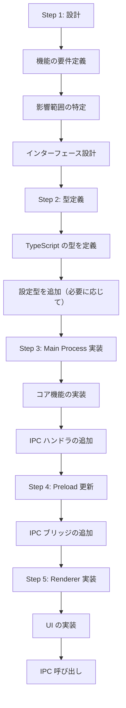

# 新機能追加ガイド

## 1. 幹：機能追加の基本フロー

### 1.1 開発の5ステップ



### 1.2 どこから書き始めるか

**推奨順序**：

1. **型定義から始める**
   - データ構造を明確にする
   - TypeScript の補完が効くようになる

2. **Main Process（バックエンド）を実装**
   - コア機能を先に作る
   - IPC なしで単体テスト可能

3. **IPC を繋ぐ**
   - Main → Preload → Renderer の順に

4. **UI を最後に**
   - バックエンドが動いていれば UI は後から

---

## 2. 枝葉：実践的な開発手順

### 2.1 例：新しいツール機能の追加

「タイマー機能」を追加する例で説明する。

#### Step 1: 設計

```
機能要件：
- ユーザーが「5分後にアラーム」と言ったらタイマーセット
- 時間になったら通知を出す

影響範囲：
- LLM ツールに新しいツールを追加
- 通知システムを利用
- 設定は不要（シンプルな機能）
```

#### Step 2: 型定義

```typescript
// src/main/llm/tools/types.ts（新規または追加）

interface TimerToolParams {
  duration: number;  // 秒数
  message: string;   // タイマー完了時のメッセージ
}

interface TimerToolResult {
  success: boolean;
  timerId: string;
  scheduledTime: number;
}
```

#### Step 3: Main Process 実装

```typescript
// src/main/llm/tools/timer.ts（新規作成）

import { Notification } from 'electron';

interface ActiveTimer {
  id: string;
  timeoutId: NodeJS.Timeout;
  message: string;
  scheduledTime: number;
}

const activeTimers = new Map<string, ActiveTimer>();

export function setTimer(duration: number, message: string): TimerToolResult {
  const id = `timer-${Date.now()}`;
  const scheduledTime = Date.now() + duration * 1000;

  const timeoutId = setTimeout(() => {
    // タイマー完了
    new Notification({
      title: 'タイマー',
      body: message
    }).show();

    activeTimers.delete(id);
  }, duration * 1000);

  activeTimers.set(id, { id, timeoutId, message, scheduledTime });

  return {
    success: true,
    timerId: id,
    scheduledTime
  };
}

export function cancelTimer(timerId: string): boolean {
  const timer = activeTimers.get(timerId);
  if (timer) {
    clearTimeout(timer.timeoutId);
    activeTimers.delete(timerId);
    return true;
  }
  return false;
}

// ツール定義（LLM用）
export const timerTool = {
  name: 'timer',
  description: '指定した時間後にアラームを鳴らす',
  parameters: {
    type: 'object',
    properties: {
      duration: {
        type: 'number',
        description: 'タイマーの時間（秒）'
      },
      message: {
        type: 'string',
        description: 'タイマー完了時に表示するメッセージ'
      }
    },
    required: ['duration', 'message']
  },
  execute: async (params: TimerToolParams) => {
    return setTimer(params.duration, params.message);
  }
};
```

#### Step 4: ツールをレジストリに登録

```typescript
// src/main/llm/tools/registry.ts に追加

import { timerTool } from './timer';

export const tools = [
  // 既存のツール...
  appLauncherTool,
  calculatorTool,
  // 新しいツールを追加
  timerTool
];
```

#### Step 5: テスト

```typescript
// 直接テスト（Main Process で）
import { setTimer } from './llm/tools/timer';

// テスト実行
const result = setTimer(5, 'テストタイマー');
console.log('タイマー設定:', result);
// 5秒後に通知が出ることを確認
```

---

### 2.2 例：新しい IPC 機能の追加

「アプリ設定の取得・更新」機能を追加する例。

#### Step 1: 設計

```
機能要件：
- Renderer から現在の設定を取得
- Renderer から設定を更新
- 更新後は再起動不要で反映

影響範囲：
- Main: 設定読み書き
- Preload: IPC ブリッジ
- Renderer: 設定画面 UI
```

#### Step 2: 型定義

```typescript
// src/main/config/types.ts に追加

export interface SettingsUpdate {
  path: string;   // 'llm.preference' のようなドット区切りパス
  value: any;     // 新しい値
}
```

#### Step 3: Main Process 実装

```typescript
// src/main/index.ts に IPC ハンドラ追加

import { getConfig, updateConfig } from './config';

// 設定取得
ipcMain.handle('settings-get', async () => {
  console.log('[IPC] settings-get');
  return getConfig();
});

// 設定更新
ipcMain.handle('settings-update', async (event, update: SettingsUpdate) => {
  console.log('[IPC] settings-update:', update);
  try {
    await updateConfig(update.path, update.value);
    return { success: true };
  } catch (error) {
    return { success: false, error: (error as Error).message };
  }
});
```

#### Step 4: Preload 更新

```typescript
// src/preload/index.ts に追加

contextBridge.exposeInMainWorld('electronAPI', {
  // 既存のメソッド...

  // 設定関連
  settingsGet: () => ipcRenderer.invoke('settings-get'),
  settingsUpdate: (update: { path: string; value: any }) =>
    ipcRenderer.invoke('settings-update', update),
});
```

#### Step 5: Renderer 実装

```typescript
// src/renderer/renderer.ts に追加

// 設定を取得して表示
async function loadSettings() {
  const settings = await window.electronAPI.settingsGet();
  console.log('現在の設定:', settings);

  // UIに反映
  document.getElementById('llm-preference')!.value = settings.llm.preference;
}

// 設定を更新
async function updateSetting(path: string, value: any) {
  const result = await window.electronAPI.settingsUpdate({ path, value });
  if (result.success) {
    console.log('設定を更新しました');
  } else {
    console.error('更新失敗:', result.error);
  }
}

// 使用例
document.getElementById('save-settings')?.addEventListener('click', () => {
  const newPreference = document.getElementById('llm-preference')!.value;
  updateSetting('llm.preference', newPreference);
});
```

---

## 3. 新しいモジュール追加のパターン

### 3.1 新しいプロバイダの追加

例：新しい TTS プロバイダ（Google TTS）を追加

```typescript
// 1. src/main/voice/googleTtsProvider.ts（新規）
export class GoogleTtsProvider {
  constructor(private config: GoogleTtsConfig) {}

  async synthesize(text: string): Promise<Buffer> {
    // Google TTS API を呼び出す実装
  }
}

// 2. 設定型に追加
// src/main/config/types.ts
interface TTSConfig {
  voicevox: { ... };
  google: {
    apiKey: string;
    languageCode: string;
  };
}

// 3. ルーターに統合
// src/main/voice/ttsRouter.ts（新規または既存を修正）
export class TTSRouter {
  private providers: TTSProvider[];

  async synthesize(text: string) {
    for (const provider of this.providers) {
      try {
        return await provider.synthesize(text);
      } catch {
        continue;
      }
    }
    throw new Error('All TTS providers failed');
  }
}
```

### 3.2 新しいイベントの追加

例：「新しいメモリが追加されたとき」のイベント

```typescript
// 1. イベント定義
// src/main/events/eventTypes.ts（新規または追加）
export const EventTypes = {
  SYSTEM_IDLE: 'system:idle',
  SYSTEM_ACTIVE: 'system:active',
  MEMORY_ADDED: 'memory:added',     // 新規
  MEMORY_SEARCHED: 'memory:searched' // 新規
} as const;

// 2. イベント発火
// src/main/memory/memoryManager.ts
async addMemory(content: string, type: string) {
  const id = await this.vectorStore.add(...);

  // イベント発火
  eventBus.emit(EventTypes.MEMORY_ADDED, {
    id,
    content,
    type,
    timestamp: Date.now()
  });

  return id;
}

// 3. イベント購読
// 使用箇所（例：自律行動コントローラ）
eventBus.register(EventTypes.MEMORY_ADDED, (event) => {
  console.log('新しいメモリが追加されました:', event);
});
```

---

## 4. チェックリスト

### 新機能追加時の確認項目

```
□ 型定義
  - 必要なインターフェースを定義したか
  - 既存の型と整合性があるか

□ Main Process
  - 機能を実装したか
  - エラーハンドリングを入れたか
  - console.log でデバッグログを入れたか

□ IPC（必要な場合）
  - ipcMain.handle でハンドラを登録したか
  - Preload に expose したか
  - 型定義を共有しているか

□ Renderer（必要な場合）
  - UI 要素を追加したか
  - IPC 呼び出しを実装したか
  - エラー時の表示を実装したか

□ 設定（必要な場合）
  - config/types.ts に型を追加したか
  - config/default.json にデフォルト値を追加したか

□ テスト
  - 手動でテストしたか
  - エッジケースを確認したか
```

---

## 5. よくある問題と解決策

### 5.1 IPC が繋がらない

**症状**：Renderer から呼び出してもエラー

**原因と対処**：

```typescript
// 1. チャンネル名の確認
// Main
ipcMain.handle('my-channel', ...);
// Preload
ipcRenderer.invoke('my-channel'); // 名前が一致しているか

// 2. Preload の expose 確認
contextBridge.exposeInMainWorld('electronAPI', {
  myMethod: () => ipcRenderer.invoke('my-channel')
  // ここに追加したか？
});

// 3. Renderer での呼び出し
window.electronAPI.myMethod(); // 名前が一致しているか
```

### 5.2 型エラーが出る

**症状**：TypeScript のコンパイルエラー

**対処**：

```typescript
// 1. import を確認
import { MyType } from './types'; // パスが正しいか

// 2. 型定義を確認
interface MyType {
  // 必要なプロパティがあるか
}

// 3. 型アサーション（緊急時のみ）
const data = (response as any).data;
```

### 5.3 変更が反映されない

**症状**：コードを変更しても動作が変わらない

**対処**：

```bash
# 1. リビルド
npm run build

# 2. キャッシュクリア
rm -rf dist/
npm run build

# 3. 再起動
# アプリを完全に終了してから再起動
```

---

## 6. コード例テンプレート

### 6.1 新しいツールのテンプレート

```typescript
// src/main/llm/tools/myTool.ts

interface MyToolParams {
  // パラメータ定義
}

interface MyToolResult {
  success: boolean;
  data?: any;
  error?: string;
}

export const myTool = {
  name: 'my_tool',
  description: 'ツールの説明',
  parameters: {
    type: 'object',
    properties: {
      // パラメータスキーマ
    },
    required: []
  },
  execute: async (params: MyToolParams): Promise<MyToolResult> => {
    try {
      // 実装
      return { success: true, data: result };
    } catch (error) {
      return { success: false, error: (error as Error).message };
    }
  }
};
```

### 6.2 新しい IPC ハンドラのテンプレート

```typescript
// src/main/index.ts に追加

ipcMain.handle('my-channel', async (event, arg1, arg2) => {
  console.log('[IPC] my-channel:', { arg1, arg2 });
  try {
    const result = await myOperation(arg1, arg2);
    return { success: true, data: result };
  } catch (error) {
    console.error('[IPC] my-channel error:', error);
    return { success: false, error: (error as Error).message };
  }
});
```

### 6.3 新しいプロバイダのテンプレート

```typescript
// src/main/[category]/myProvider.ts

interface MyProviderConfig {
  // 設定
}

export class MyProvider {
  constructor(private config: MyProviderConfig) {
    console.log('[MyProvider] 初期化');
  }

  async doSomething(input: string): Promise<string> {
    console.log('[MyProvider] doSomething:', input);
    // 実装
    return result;
  }
}
```

## 関連ドキュメント

- [01-architecture-overview.md](01-architecture-overview.md) - アーキテクチャ概要
- [03-ipc-handler-development.md](03-ipc-handler-development.md) - IPC ハンドラ開発の詳細
