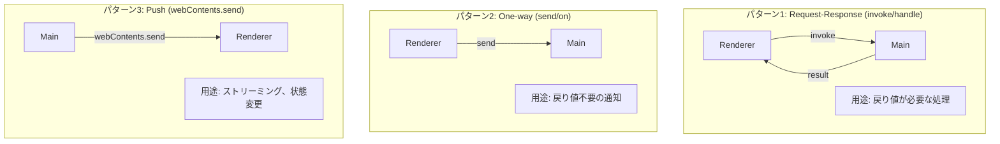

# IPC ハンドラ開発ガイド

## 1. 幹：IPC 通信の設計原則

### 1.1 Electron の IPC モデル



### 1.2 セキュリティ原則

```typescript
// NG: nodeIntegration を有効にする（危険）
new BrowserWindow({
  webPreferences: {
    nodeIntegration: true,  // NG
    contextIsolation: false // NG
  }
});

// OK: Preload を通じた安全な通信
new BrowserWindow({
  webPreferences: {
    nodeIntegration: false,   // OK
    contextIsolation: true,   // OK
    preload: path.join(__dirname, 'preload.js')
  }
});
```

### 1.3 データのシリアライズ

IPC で送受信できるのは **JSON シリアライズ可能** なデータのみ。

```typescript
// OK: プリミティブ、オブジェクト、配列
{ name: 'John', age: 30 }
['a', 'b', 'c']
'string'
123
true

// NG: 関数、クラスインスタンス、循環参照
function() {}
new MyClass()
{ self: this }  // 循環参照
```

---

## 2. 枝葉：IPC ハンドラの実装パターン

### 2.1 基本的な invoke/handle パターン

#### Main Process（ハンドラ登録）

```typescript
// src/main/index.ts

import { ipcMain } from 'electron';

// 基本パターン
ipcMain.handle('channel-name', async (event, arg1, arg2) => {
  // event: IpcMainInvokeEvent（送信元情報）
  // arg1, arg2: Renderer から渡された引数

  console.log('[IPC] channel-name 呼び出し:', { arg1, arg2 });

  try {
    const result = await someOperation(arg1, arg2);
    return result;  // Renderer に返される
  } catch (error) {
    // エラーは Renderer で catch される
    throw error;
  }
});
```

#### Preload（ブリッジ）

```typescript
// src/preload/index.ts

import { contextBridge, ipcRenderer } from 'electron';

contextBridge.exposeInMainWorld('electronAPI', {
  // 基本パターン
  methodName: (arg1: string, arg2: number) =>
    ipcRenderer.invoke('channel-name', arg1, arg2),
});
```

#### Renderer（呼び出し）

```typescript
// src/renderer/renderer.ts

// 型定義（推奨）
declare global {
  interface Window {
    electronAPI: {
      methodName: (arg1: string, arg2: number) => Promise<ResultType>;
    };
  }
}

// 使用
async function callMethod() {
  try {
    const result = await window.electronAPI.methodName('hello', 42);
    console.log('結果:', result);
  } catch (error) {
    console.error('エラー:', error);
  }
}
```

### 2.2 ストリーミングパターン（Main → Renderer へのプッシュ）

#### Main Process

```typescript
// src/main/index.ts

ipcMain.handle('start-stream', async (event) => {
  const sender = event.sender;  // WebContents

  // 非同期でデータを送信
  for await (const chunk of dataStream) {
    // ウィンドウが閉じていないか確認
    if (!sender.isDestroyed()) {
      sender.send('stream-data', chunk);
    }
  }

  if (!sender.isDestroyed()) {
    sender.send('stream-done');
  }

  return { started: true };
});
```

#### Preload

```typescript
// src/preload/index.ts

contextBridge.exposeInMainWorld('electronAPI', {
  // ストリーム開始
  startStream: () => ipcRenderer.invoke('start-stream'),

  // データ受信リスナー
  onStreamData: (callback: (data: any) => void) => {
    const handler = (_event: IpcRendererEvent, data: any) => callback(data);
    ipcRenderer.on('stream-data', handler);
    // クリーンアップ関数を返す
    return () => ipcRenderer.removeListener('stream-data', handler);
  },

  // 完了リスナー
  onStreamDone: (callback: () => void) => {
    const handler = () => callback();
    ipcRenderer.on('stream-done', handler);
    return () => ipcRenderer.removeListener('stream-done', handler);
  },
});
```

#### Renderer

```typescript
// src/renderer/renderer.ts

// リスナー登録
const cleanup1 = window.electronAPI.onStreamData((data) => {
  console.log('データ受信:', data);
  appendToUI(data);
});

const cleanup2 = window.electronAPI.onStreamDone(() => {
  console.log('ストリーム完了');
  cleanup1();  // リスナー解除
  cleanup2();
});

// ストリーム開始
await window.electronAPI.startStream();
```

### 2.3 本プロジェクトの具体例

#### LLM ストリーミング

```typescript
// Main: src/main/index.ts
ipcMain.handle('send-message-stream', async (event, messages, conversationId) => {
  const sender = event.sender;

  // メモリからコンテキスト取得
  const userMessage = messages[messages.length - 1].content;
  const context = await memoryManager.getRelevantContext(userMessage);

  // LLM にストリーミングリクエスト
  await llmRouter.sendMessageStream(
    enrichedMessages,
    {
      onToken: (token) => {
        if (!sender.isDestroyed()) {
          sender.send('llm-token', token);
        }
      },
      onDone: async (fullText) => {
        // 応答を保存
        await conversationStorage.addMessage(conversationId, {
          role: 'assistant',
          content: fullText
        });

        if (!sender.isDestroyed()) {
          sender.send('llm-done', fullText);
        }
      },
      onError: (error) => {
        if (!sender.isDestroyed()) {
          sender.send('llm-error', error.message);
        }
      }
    }
  );

  return { started: true };
});

// Preload: src/preload/index.ts
sendMessageStream: (messages, conversationId) =>
  ipcRenderer.invoke('send-message-stream', messages, conversationId),

onLLMToken: (callback) => {
  const handler = (_e, token) => callback(token);
  ipcRenderer.on('llm-token', handler);
  return () => ipcRenderer.removeListener('llm-token', handler);
},

onLLMDone: (callback) => {
  const handler = (_e, text) => callback(text);
  ipcRenderer.on('llm-done', handler);
  return () => ipcRenderer.removeListener('llm-done', handler);
},

// Renderer: src/renderer/renderer.ts
async function sendMessage(content: string) {
  // リスナー設定
  const cleanupToken = window.electronAPI.onLLMToken((token) => {
    appendToken(token);
  });

  const cleanupDone = window.electronAPI.onLLMDone((fullText) => {
    cleanupToken();
    cleanupDone();
    finishMessage(fullText);
  });

  // 送信開始
  await window.electronAPI.sendMessageStream(messages, conversationId);
}
```

---

## 3. IPC ハンドラ開発の手順

### 3.1 Step-by-Step ガイド

```
Step 1: チャンネル名を決める
  └─ 命名規則: [機能]-[動作]（例: conversation-list, voice-start）

Step 2: Main でハンドラを実装
  └─ ipcMain.handle('channel-name', async (event, ...args) => { ... })

Step 3: Preload でブリッジを追加
  └─ contextBridge.exposeInMainWorld に追加

Step 4: Renderer で呼び出し
  └─ window.electronAPI.methodName(...args)

Step 5: テスト
  └─ 各レイヤーで console.log を入れて動作確認
```

### 3.2 新しいハンドラ追加の具体例

「ユーザープロファイル取得」機能を追加する例：

#### Step 1: チャンネル名

```
チャンネル名: user-profile-get
```

#### Step 2: Main Process

```typescript
// src/main/index.ts

import { userProfile } from './memory/userProfile';

ipcMain.handle('user-profile-get', async () => {
  console.log('[IPC] user-profile-get');
  try {
    const profile = await userProfile.get();
    return { success: true, data: profile };
  } catch (error) {
    console.error('[IPC] user-profile-get error:', error);
    return { success: false, error: (error as Error).message };
  }
});
```

#### Step 3: Preload

```typescript
// src/preload/index.ts

contextBridge.exposeInMainWorld('electronAPI', {
  // ... 既存のメソッド

  // 追加
  getUserProfile: () => ipcRenderer.invoke('user-profile-get'),
});
```

#### Step 4: Renderer

```typescript
// src/renderer/renderer.ts

interface UserProfile {
  name: string;
  preferences: Record<string, any>;
}

async function loadUserProfile() {
  const result = await window.electronAPI.getUserProfile();
  if (result.success) {
    console.log('プロファイル:', result.data);
    displayProfile(result.data);
  } else {
    console.error('取得失敗:', result.error);
  }
}
```

---

## 4. エラーハンドリングパターン

### 4.1 統一されたレスポンス形式

```typescript
// 成功時
interface SuccessResponse<T> {
  success: true;
  data: T;
}

// 失敗時
interface ErrorResponse {
  success: false;
  error: string;
  code?: string;
}

type IpcResponse<T> = SuccessResponse<T> | ErrorResponse;

// 使用例
ipcMain.handle('my-operation', async (): Promise<IpcResponse<MyData>> => {
  try {
    const data = await myOperation();
    return { success: true, data };
  } catch (error) {
    return {
      success: false,
      error: (error as Error).message,
      code: (error as any).code
    };
  }
});
```

### 4.2 Renderer でのエラー処理

```typescript
async function callWithErrorHandling() {
  const result = await window.electronAPI.myOperation();

  if (result.success) {
    // 成功処理
    handleSuccess(result.data);
  } else {
    // エラー処理
    if (result.code === 'NOT_FOUND') {
      showNotFoundMessage();
    } else {
      showGenericError(result.error);
    }
  }
}
```

---

## 5. 本プロジェクトの IPC チャンネル一覧

### 5.1 会話管理

| チャンネル | 方向 | 説明 |
|-----------|------|------|
| `conversation-list` | invoke | 会話一覧取得 |
| `conversation-create` | invoke | 新規会話作成 |
| `conversation-load` | invoke | 会話読み込み |
| `conversation-delete` | invoke | 会話削除 |
| `conversation-get-active` | invoke | アクティブ会話取得 |

### 5.2 LLM

| チャンネル | 方向 | 説明 |
|-----------|------|------|
| `send-message-stream` | invoke | メッセージ送信 |
| `llm-token` | push | トークン受信 |
| `llm-done` | push | 完了通知 |
| `llm-error` | push | エラー通知 |

### 5.3 音声

| チャンネル | 方向 | 説明 |
|-----------|------|------|
| `voice-start` | invoke | 音声認識開始 |
| `voice-stop` | invoke | 音声認識停止 |
| `voice-status` | invoke | 状態取得 |
| `voice-transcription` | push | 文字起こし結果 |
| `tts-speak` | invoke | 音声合成 |
| `tts-stop` | invoke | 合成停止 |

### 5.4 音声対話

| チャンネル | 方向 | 説明 |
|-----------|------|------|
| `dialogue-start` | invoke | 対話開始 |
| `dialogue-stop` | invoke | 対話停止 |
| `dialogue-state` | push | 状態変更 |

### 5.5 記憶

| チャンネル | 方向 | 説明 |
|-----------|------|------|
| `memory-add` | invoke | 記憶追加 |
| `memory-search` | invoke | 記憶検索 |
| `memory-get-all` | invoke | 全記憶取得 |
| `memory-clear` | invoke | 記憶クリア |

### 5.6 Discord

| チャンネル | 方向 | 説明 |
|-----------|------|------|
| `discord-start` | invoke | Bot 起動 |
| `discord-stop` | invoke | Bot 停止 |
| `discord-status` | invoke | 状態取得 |
| `discord-voice-join` | invoke | VC 参加 |
| `discord-voice-leave` | invoke | VC 退出 |
| `discord-voice-status` | invoke | VC 状態取得 |

### 5.7 Discord ユーザー管理（新機能）

| チャンネル | 方向 | 説明 |
|-----------|------|------|
| `discord-users-get-all` | invoke | 全ユーザー取得 |
| `discord-users-stats` | invoke | ユーザー統計取得 |
| `discord-users-get` | invoke | 特定ユーザー取得 |
| `discord-users-set-name` | invoke | 呼び名を設定 |

### 5.8 管理機能

| チャンネル | 方向 | 説明 |
|-----------|------|------|
| `get-provider-preference` | invoke | LLM 設定取得 |
| `set-provider-preference` | invoke | LLM 設定更新 |
| `show-mascot` | invoke | マスコットウィンドウ表示 |

---

## 6. ベストプラクティス

### 6.1 チャンネル命名規則

```
[機能カテゴリ]-[動作]

例:
- conversation-list    # 会話の一覧
- conversation-create  # 会話の作成
- voice-start          # 音声の開始
- memory-search        # 記憶の検索
```

### 6.2 引数の設計

```typescript
// NG: 引数が多すぎる
ipcMain.handle('op', (e, a, b, c, d, e, f) => ...);

// OK: オブジェクトにまとめる
interface OperationParams {
  field1: string;
  field2: number;
  options?: {
    flag1: boolean;
    flag2: string;
  };
}

ipcMain.handle('operation', (event, params: OperationParams) => {
  const { field1, field2, options } = params;
  // ...
});
```

### 6.3 リスナーのクリーンアップ

```typescript
// Preload でクリーンアップ関数を返す
onSomeEvent: (callback) => {
  const handler = (_e, data) => callback(data);
  ipcRenderer.on('some-event', handler);
  return () => ipcRenderer.removeListener('some-event', handler);
},

// Renderer で必ずクリーンアップ
const cleanup = window.electronAPI.onSomeEvent(handler);
// コンポーネントがアンマウントされる時など
cleanup();
```

### 6.4 デバッグログ

```typescript
// 開発時は詳細ログを出力
ipcMain.handle('my-channel', async (event, params) => {
  const start = Date.now();
  console.log('[IPC] my-channel 開始:', params);

  try {
    const result = await operation(params);
    console.log(`[IPC] my-channel 成功: ${Date.now() - start}ms`);
    return result;
  } catch (error) {
    console.error('[IPC] my-channel エラー:', error);
    throw error;
  }
});
```

## 関連ドキュメント

- [02-adding-new-features.md](02-adding-new-features.md) - 新機能追加ガイド
- [../debug/03-ipc-debugging.md](../debug/03-ipc-debugging.md) - IPC デバッグガイド
