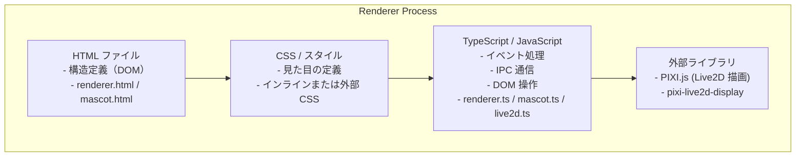

# フロントエンド（HTML/CSS/TypeScript）開発ガイド

## 1. 幹：Renderer Process の構造

### 1.1 フロントエンドの全体像



### 1.2 本プロジェクトのファイル構成

```
src/renderer/
├── renderer.html     # メイン UI の HTML
├── renderer.ts       # メイン UI のロジック
├── mascot.html       # マスコットウィンドウの HTML
├── mascot.ts         # マスコットウィンドウのロジック
├── live2d.ts         # Live2D 描画処理
├── assets/           # アセットファイル
│   └── Hiyori/       # Live2D モデル
└── lib/              # 外部ライブラリ
    ├── pixi.min.js
    └── live2dcubismcore.min.js
```

---

## 2. 枝葉：HTML 開発

### 2.1 基本的な HTML 構造

```html
<!-- src/renderer/renderer.html -->
<!DOCTYPE html>
<html lang="ja">
<head>
  <meta charset="UTF-8">
  <meta http-equiv="Content-Security-Policy"
        content="default-src 'self'; script-src 'self'">
  <title>AI Agent</title>
  <style>
    /* インラインスタイル */
  </style>
</head>
<body>
  <!-- UI 要素 -->
  <div id="app">
    <div id="sidebar">
      <!-- 会話一覧 -->
    </div>
    <div id="main">
      <div id="messages">
        <!-- メッセージ表示 -->
      </div>
      <div id="input-area">
        <textarea id="user-input"></textarea>
        <button id="send-button">送信</button>
      </div>
    </div>
  </div>

  <!-- スクリプト読み込み -->
  <script src="renderer.js"></script>
</body>
</html>
```

### 2.2 Content Security Policy (CSP)

Electron のセキュリティ要件として CSP を設定。

```html
<meta http-equiv="Content-Security-Policy"
      content="
        default-src 'self';
        script-src 'self';
        style-src 'self' 'unsafe-inline';
        img-src 'self' data:;
        font-src 'self';
      ">
```

**CSP ディレクティブ**：
- `default-src 'self'` - デフォルトは同一オリジンのみ
- `script-src 'self'` - スクリプトは同一オリジンのみ
- `style-src 'self' 'unsafe-inline'` - インラインスタイル許可
- `img-src 'self' data:` - data URL の画像も許可

### 2.3 ID とクラスの命名規則

```html
<!-- ID: 一意の要素に使用 -->
<div id="message-container">
<button id="send-button">

<!-- クラス: 再利用可能なスタイル -->
<div class="message user">
<div class="message assistant">
<span class="timestamp">
```

---

## 3. CSS 開発

### 3.1 基本的なスタイル構造

```css
/* リセット */
* {
  margin: 0;
  padding: 0;
  box-sizing: border-box;
}

/* 全体レイアウト */
body {
  font-family: -apple-system, BlinkMacSystemFont, 'Segoe UI', Roboto, sans-serif;
  background-color: #1e1e1e;
  color: #ffffff;
  height: 100vh;
  overflow: hidden;
}

#app {
  display: flex;
  height: 100%;
}

/* サイドバー */
#sidebar {
  width: 250px;
  background-color: #252525;
  border-right: 1px solid #333;
  overflow-y: auto;
}

/* メインエリア */
#main {
  flex: 1;
  display: flex;
  flex-direction: column;
}

/* メッセージ表示 */
#messages {
  flex: 1;
  overflow-y: auto;
  padding: 1rem;
}

/* メッセージスタイル */
.message {
  margin-bottom: 1rem;
  padding: 0.75rem 1rem;
  border-radius: 8px;
  max-width: 80%;
}

.message.user {
  background-color: #0d6efd;
  margin-left: auto;
}

.message.assistant {
  background-color: #333;
}

/* 入力エリア */
#input-area {
  display: flex;
  padding: 1rem;
  border-top: 1px solid #333;
}

#user-input {
  flex: 1;
  resize: none;
  padding: 0.75rem;
  border-radius: 8px;
  border: 1px solid #444;
  background-color: #2d2d2d;
  color: #fff;
}

#send-button {
  margin-left: 0.5rem;
  padding: 0.75rem 1.5rem;
  border-radius: 8px;
  background-color: #0d6efd;
  color: white;
  border: none;
  cursor: pointer;
}

#send-button:hover {
  background-color: #0b5ed7;
}
```

### 3.2 Flexbox レイアウト

```css
/* 横並び */
.horizontal {
  display: flex;
  flex-direction: row;
}

/* 縦並び */
.vertical {
  display: flex;
  flex-direction: column;
}

/* 中央寄せ */
.center {
  display: flex;
  justify-content: center;
  align-items: center;
}

/* スペース配分 */
.space-between {
  display: flex;
  justify-content: space-between;
}

/* 伸縮する要素 */
.grow {
  flex: 1;
}
```

### 3.3 スクロール可能なコンテナ

```css
.scrollable {
  overflow-y: auto;
  /* スクロールバーのカスタマイズ */
}

.scrollable::-webkit-scrollbar {
  width: 8px;
}

.scrollable::-webkit-scrollbar-track {
  background: #1e1e1e;
}

.scrollable::-webkit-scrollbar-thumb {
  background: #444;
  border-radius: 4px;
}

.scrollable::-webkit-scrollbar-thumb:hover {
  background: #555;
}
```

---

## 4. TypeScript 開発

### 4.1 基本的な構造

```typescript
// src/renderer/renderer.ts

// 型定義
interface Message {
  role: 'user' | 'assistant';
  content: string;
}

interface Conversation {
  id: string;
  title: string;
  messages: Message[];
}

// グローバル変数
let activeConversationId: string | null = null;
let messages: Message[] = [];

// DOM 要素の取得
const messageContainer = document.getElementById('messages')!;
const userInput = document.getElementById('user-input') as HTMLTextAreaElement;
const sendButton = document.getElementById('send-button')!;

// 初期化
document.addEventListener('DOMContentLoaded', async () => {
  await init();
});

async function init() {
  // 会話一覧の読み込み
  await loadConversations();

  // イベントリスナーの設定
  setupEventListeners();

  // IPC リスナーの設定
  setupIPCListeners();
}
```

### 4.2 イベントハンドリング

```typescript
function setupEventListeners() {
  // クリックイベント
  sendButton.addEventListener('click', () => {
    sendMessage();
  });

  // キーボードイベント
  userInput.addEventListener('keydown', (e) => {
    // Ctrl+Enter で送信
    if (e.key === 'Enter' && e.ctrlKey) {
      e.preventDefault();
      sendMessage();
    }
  });

  // フォームイベント
  userInput.addEventListener('input', () => {
    // 入力内容に応じてボタンの状態を変更
    sendButton.disabled = userInput.value.trim() === '';
  });
}
```

### 4.3 IPC 通信

```typescript
// IPC リスナーの設定
function setupIPCListeners() {
  // LLM トークン受信
  window.electronAPI.onLLMToken((token) => {
    appendToken(token);
  });

  // LLM 完了
  window.electronAPI.onLLMDone((fullText) => {
    finishMessage();
  });

  // LLM エラー
  window.electronAPI.onLLMError((error) => {
    showError(error);
  });

  // 対話状態変更
  window.electronAPI.onDialogueState((state) => {
    updateDialogueStateUI(state);
  });
}

// メッセージ送信
async function sendMessage() {
  const content = userInput.value.trim();
  if (!content) return;

  // UI に即座に反映
  addMessageToUI({ role: 'user', content });
  userInput.value = '';

  // アシスタントメッセージの準備
  createAssistantMessagePlaceholder();

  // 送信
  try {
    await window.electronAPI.sendMessageStream(
      [...messages, { role: 'user', content }],
      activeConversationId
    );
  } catch (error) {
    showError('メッセージ送信に失敗しました');
  }
}
```

### 4.4 DOM 操作

```typescript
// メッセージを UI に追加
function addMessageToUI(message: Message) {
  const div = document.createElement('div');
  div.className = `message ${message.role}`;
  div.textContent = message.content;
  messageContainer.appendChild(div);

  // 自動スクロール
  scrollToBottom();
}

// プレースホルダー作成（ストリーミング用）
function createAssistantMessagePlaceholder(): HTMLElement {
  const div = document.createElement('div');
  div.className = 'message assistant streaming';
  div.id = 'current-assistant-message';
  messageContainer.appendChild(div);
  return div;
}

// トークンを追加
function appendToken(token: string) {
  const placeholder = document.getElementById('current-assistant-message');
  if (placeholder) {
    placeholder.textContent += token;
    scrollToBottom();
  }
}

// ストリーミング完了
function finishMessage() {
  const placeholder = document.getElementById('current-assistant-message');
  if (placeholder) {
    placeholder.classList.remove('streaming');
    placeholder.removeAttribute('id');
  }
}

// スクロール
function scrollToBottom() {
  messageContainer.scrollTop = messageContainer.scrollHeight;
}
```

---

## 5. Live2D 開発

### 5.1 初期化

```typescript
// src/renderer/live2d.ts

import * as PIXI from 'pixi.js';
import { Live2DModel } from 'pixi-live2d-display';

let app: PIXI.Application;
let model: Live2DModel | null = null;

export async function initLive2D(canvas: HTMLCanvasElement) {
  // PIXI アプリケーション作成
  app = new PIXI.Application({
    view: canvas,
    backgroundAlpha: 0,  // 透明背景
    width: canvas.clientWidth,
    height: canvas.clientHeight,
    resolution: window.devicePixelRatio || 1,
  });

  // モデル読み込み
  try {
    model = await Live2DModel.from('assets/Hiyori/Hiyori.model3.json');

    // サイズ調整
    model.scale.set(0.3);

    // 位置調整
    model.x = app.screen.width / 2;
    model.y = app.screen.height / 2;

    // ステージに追加
    app.stage.addChild(model);

    console.log('[Live2D] モデル読み込み完了');
  } catch (error) {
    console.error('[Live2D] モデル読み込み失敗:', error);
  }
}
```

### 5.2 モーション制御

```typescript
// モーション再生
export function playMotion(group: string, index: number = 0) {
  if (model) {
    model.motion(group, index);
  }
}

// 表情設定
export function setExpression(name: string) {
  if (model) {
    model.expression(name);
  }
}

// 口パク（リップシンク）
export function setMouthOpenY(value: number) {
  if (model) {
    // value: 0.0 (閉) ~ 1.0 (開)
    const coreModel = model.internalModel.coreModel;
    coreModel.setParameterValueById('ParamMouthOpenY', value);
  }
}

// 瞬き
export function setBlink(leftValue: number, rightValue: number) {
  if (model) {
    const coreModel = model.internalModel.coreModel;
    coreModel.setParameterValueById('ParamEyeLOpen', leftValue);
    coreModel.setParameterValueById('ParamEyeROpen', rightValue);
  }
}
```

### 5.3 TTS連動の口パク

```typescript
// 音声波形に基づく口パク
let lipSyncInterval: number | null = null;

export function startLipSync(audioContext: AudioContext, source: AudioNode) {
  const analyser = audioContext.createAnalyser();
  analyser.fftSize = 256;
  source.connect(analyser);

  const dataArray = new Uint8Array(analyser.frequencyBinCount);

  lipSyncInterval = window.setInterval(() => {
    analyser.getByteFrequencyData(dataArray);

    // 音量を計算
    const volume = dataArray.reduce((a, b) => a + b) / dataArray.length;
    const normalized = Math.min(volume / 128, 1);

    // 口の開き具合に反映
    setMouthOpenY(normalized);
  }, 50);
}

export function stopLipSync() {
  if (lipSyncInterval) {
    clearInterval(lipSyncInterval);
    lipSyncInterval = null;
    setMouthOpenY(0);
  }
}
```

---

## 6. 開発手順

### 6.1 新しい UI 要素を追加する場合

```
Step 1: HTML に要素を追加
  └─ id または class を付ける

Step 2: CSS でスタイルを定義
  └─ レイアウト、色、サイズ等

Step 3: TypeScript でイベントを設定
  └─ DOM 取得 → リスナー登録

Step 4: IPC 連携（必要な場合）
  └─ Preload の API を呼び出す
```

### 6.2 例：新しいボタンの追加

```html
<!-- Step 1: HTML -->
<button id="clear-history-button" class="danger-button">
  履歴をクリア
</button>
```

```css
/* Step 2: CSS */
.danger-button {
  background-color: #dc3545;
  color: white;
  border: none;
  padding: 0.5rem 1rem;
  border-radius: 4px;
  cursor: pointer;
}

.danger-button:hover {
  background-color: #c82333;
}
```

```typescript
// Step 3 & 4: TypeScript
const clearButton = document.getElementById('clear-history-button')!;

clearButton.addEventListener('click', async () => {
  if (confirm('本当に履歴を削除しますか？')) {
    await window.electronAPI.clearConversation(activeConversationId);
    messages = [];
    messageContainer.innerHTML = '';
  }
});
```

---

## 7. よくあるパターン

### 7.1 ローディング状態の表示

```typescript
function showLoading() {
  const loader = document.createElement('div');
  loader.id = 'loader';
  loader.className = 'loader';
  loader.innerHTML = '<span class="spinner"></span> 処理中...';
  document.body.appendChild(loader);
}

function hideLoading() {
  document.getElementById('loader')?.remove();
}

// 使用
async function heavyOperation() {
  showLoading();
  try {
    await doSomething();
  } finally {
    hideLoading();
  }
}
```

```css
.loader {
  position: fixed;
  top: 50%;
  left: 50%;
  transform: translate(-50%, -50%);
  background: rgba(0, 0, 0, 0.8);
  padding: 1rem 2rem;
  border-radius: 8px;
  z-index: 1000;
}

.spinner {
  display: inline-block;
  width: 20px;
  height: 20px;
  border: 2px solid #fff;
  border-top-color: transparent;
  border-radius: 50%;
  animation: spin 1s linear infinite;
}

@keyframes spin {
  to { transform: rotate(360deg); }
}
```

### 7.2 通知トースト

```typescript
function showToast(message: string, type: 'success' | 'error' | 'info' = 'info') {
  const toast = document.createElement('div');
  toast.className = `toast toast-${type}`;
  toast.textContent = message;
  document.body.appendChild(toast);

  // 3秒後に消える
  setTimeout(() => {
    toast.classList.add('fade-out');
    setTimeout(() => toast.remove(), 300);
  }, 3000);
}
```

```css
.toast {
  position: fixed;
  bottom: 20px;
  right: 20px;
  padding: 1rem;
  border-radius: 8px;
  color: white;
  z-index: 1000;
  animation: slide-in 0.3s ease;
}

.toast-success { background: #28a745; }
.toast-error { background: #dc3545; }
.toast-info { background: #17a2b8; }

.fade-out {
  animation: fade-out 0.3s ease forwards;
}

@keyframes slide-in {
  from { transform: translateX(100%); opacity: 0; }
  to { transform: translateX(0); opacity: 1; }
}

@keyframes fade-out {
  to { opacity: 0; }
}
```

### 7.3 モーダルダイアログ

```html
<div id="modal-overlay" class="modal-overlay hidden">
  <div class="modal">
    <div class="modal-header">
      <h2 id="modal-title">タイトル</h2>
      <button id="modal-close">&times;</button>
    </div>
    <div id="modal-content" class="modal-content">
      <!-- 内容 -->
    </div>
    <div class="modal-footer">
      <button id="modal-cancel" class="btn-secondary">キャンセル</button>
      <button id="modal-ok" class="btn-primary">OK</button>
    </div>
  </div>
</div>
```

```typescript
function showModal(title: string, content: string): Promise<boolean> {
  return new Promise((resolve) => {
    const overlay = document.getElementById('modal-overlay')!;
    document.getElementById('modal-title')!.textContent = title;
    document.getElementById('modal-content')!.innerHTML = content;

    overlay.classList.remove('hidden');

    const handleOk = () => {
      cleanup();
      resolve(true);
    };

    const handleCancel = () => {
      cleanup();
      resolve(false);
    };

    const cleanup = () => {
      overlay.classList.add('hidden');
      document.getElementById('modal-ok')!.removeEventListener('click', handleOk);
      document.getElementById('modal-cancel')!.removeEventListener('click', handleCancel);
    };

    document.getElementById('modal-ok')!.addEventListener('click', handleOk);
    document.getElementById('modal-cancel')!.addEventListener('click', handleCancel);
    document.getElementById('modal-close')!.addEventListener('click', handleCancel);
  });
}

// 使用
const confirmed = await showModal('確認', '本当に削除しますか？');
if (confirmed) {
  // 削除処理
}
```

---

## 8. チェックリスト

### 新しい UI 要素を追加する時

```
□ HTML
  - 意味のある id/class を付けたか
  - 適切な要素タグを使ったか

□ CSS
  - レスポンシブを考慮したか
  - ダークテーマに合っているか
  - ホバー/フォーカス状態を定義したか

□ TypeScript
  - null チェックを入れたか
  - エラーハンドリングを入れたか
  - クリーンアップ処理があるか

□ IPC（必要な場合）
  - Preload に expose されているか
  - Main にハンドラがあるか
```

## 関連ドキュメント

- [../debug/05-html-json-debugging.md](../debug/05-html-json-debugging.md) - フロントエンドのデバッグ
- [03-ipc-handler-development.md](03-ipc-handler-development.md) - IPC ハンドラ開発
