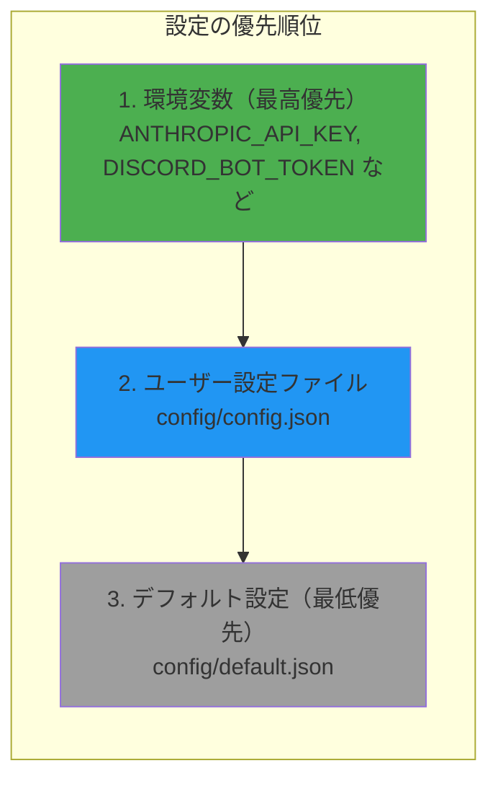

# 設定システム開発ガイド

## 1. 幹：設定システムの構造

### 1.1 設定の階層構造



### 1.2 ファイル構成

```
config/
├── default.json       # デフォルト設定（変更禁止）
├── config.json        # ユーザー設定（部分的に上書き）
└── config.example.json # 設定テンプレート

src/main/config/
├── types.ts           # 型定義
├── configLoader.ts    # 設定読み込みロジック
├── autonomous.ts      # 自律行動設定
└── index.ts           # エクスポート
```

### 1.3 設定のマージ動作

```typescript
// default.json
{
  "llm": {
    "preference": "local-first",
    "ollama": {
      "baseUrl": "http://localhost:11434",
      "model": "gemma3:latest"
    }
  }
}

// config.json（ユーザー設定）
{
  "llm": {
    "preference": "api-first"  // これだけ上書き
  }
}

// マージ結果
{
  "llm": {
    "preference": "api-first",      // ← 上書きされた
    "ollama": {
      "baseUrl": "http://localhost:11434",  // ← デフォルト維持
      "model": "gemma3:latest"              // ← デフォルト維持
    }
  }
}
```

---

## 2. 枝葉：設定の開発実践

### 2.1 型定義（types.ts）

```typescript
// src/main/config/types.ts

export interface AppConfig {
  llm: LLMConfig;
  stt: STTConfig;
  tts: TTSConfig;
  memory: MemoryConfig;
  autonomous: AutonomousConfig;
  idleDetector: IdleDetectorConfig;
  screenRecognition: ScreenRecognitionConfig;
  discord: DiscordConfig;
  prompts: PromptConfig;
}

export interface LLMConfig {
  preference: 'local-first' | 'api-first' | 'local-only' | 'api-only';
  ollama: {
    baseUrl: string;
    model: string;
    healthCheckTimeoutMs: number;
  };
  anthropic: {
    model: string;
    maxTokens: number;
  };
}

export interface STTConfig {
  provider: 'faster-whisper' | 'whisper-node';
  fasterWhisper: {
    serverUrl: string;
    model: string;
    language: string;
    device: string;
    computeType: string;
  };
  whisperNode: {
    modelName: string;
  };
}

export interface TTSConfig {
  voicevox: {
    baseUrl: string;
    speakerId: number;
    speedScale: number;
    volumeScale: number;
    pitchScale: number;
    intonationScale: number;
  };
}

export interface MemoryConfig {
  embedding: {
    provider: 'xenova' | 'ollama';
    model: string;
  };
  vectorStore: {
    defaultSearchLimit: number;
    lowImportanceThreshold: number;
  };
  lifecycle: {
    compressionAgeDays: number;
    forgetImportanceThreshold: number;
  };
  contextSearchLimit: number;
  contextMinScore: number;
}

export interface AutonomousConfig {
  enabled: boolean;
  minIntervalMs: number;
  maxDailyActions: number;
  idleThresholdMs: number;
}

export interface IdleDetectorConfig {
  idleThresholdSeconds: number;
  checkIntervalMs: number;
}

export interface ScreenRecognitionConfig {
  windowMonitorEnabled: boolean;
  screenshotEnabled: boolean;
  screenshotIntervalMs: number;
  reactToWindowChange: boolean;
}

export interface DiscordConfig {
  prefix: string;
  maxMessageLength: number;
  admin: {
    id: string;
    name: string;
  };
  voice: {
    silenceDurationMs: number;
    minAudioDurationMs: number;
  };
  autonomous: {
    enabled: boolean;
    sendToTextChannel: boolean;
    speakInVoice: boolean;
  };
}

export interface PromptConfig {
  character: {
    name: string;
  };
  system: string;
  memory: {
    compression: string;
    evaluation: string;
  };
}
```

### 2.2 設定読み込み（configLoader.ts）

```typescript
// src/main/config/configLoader.ts

import * as fs from 'fs';
import * as path from 'path';
import { AppConfig } from './types';

// ディープマージ関数
function deepMerge<T extends object>(target: T, source: Partial<T>): T {
  const result = { ...target };

  for (const key in source) {
    const sourceValue = source[key];
    const targetValue = target[key];

    if (
      sourceValue !== undefined &&
      typeof sourceValue === 'object' &&
      !Array.isArray(sourceValue) &&
      typeof targetValue === 'object' &&
      !Array.isArray(targetValue)
    ) {
      // オブジェクトの場合は再帰的にマージ
      (result as any)[key] = deepMerge(targetValue, sourceValue);
    } else if (sourceValue !== undefined) {
      // それ以外は上書き
      (result as any)[key] = sourceValue;
    }
  }

  return result;
}

export function loadConfig(): AppConfig {
  // パス解決
  const configDir = path.join(process.cwd(), 'config');
  const defaultPath = path.join(configDir, 'default.json');
  const userPath = path.join(configDir, 'config.json');

  // デフォルト設定を読み込み
  if (!fs.existsSync(defaultPath)) {
    throw new Error(`Default config not found: ${defaultPath}`);
  }
  const defaultConfig: AppConfig = JSON.parse(
    fs.readFileSync(defaultPath, 'utf-8')
  );

  // ユーザー設定をマージ（存在する場合）
  let config = defaultConfig;
  if (fs.existsSync(userPath)) {
    const userConfig = JSON.parse(fs.readFileSync(userPath, 'utf-8'));
    config = deepMerge(defaultConfig, userConfig);
  }

  // 環境変数で上書き
  config = applyEnvironmentVariables(config);

  return config;
}

function applyEnvironmentVariables(config: AppConfig): AppConfig {
  // Ollama
  if (process.env.OLLAMA_BASE_URL) {
    config.llm.ollama.baseUrl = process.env.OLLAMA_BASE_URL;
  }
  if (process.env.OLLAMA_MODEL) {
    config.llm.ollama.model = process.env.OLLAMA_MODEL;
  }

  // Anthropic
  if (process.env.ANTHROPIC_MODEL) {
    config.llm.anthropic.model = process.env.ANTHROPIC_MODEL;
  }

  // STT
  if (process.env.FASTER_WHISPER_URL) {
    config.stt.fasterWhisper.serverUrl = process.env.FASTER_WHISPER_URL;
  }

  // TTS
  if (process.env.VOICEVOX_URL) {
    config.tts.voicevox.baseUrl = process.env.VOICEVOX_URL;
  }

  return config;
}
```

### 2.3 設定のエクスポート（index.ts）

```typescript
// src/main/config/index.ts

import { loadConfig } from './configLoader';
import { AppConfig } from './types';

let config: AppConfig | null = null;

export function initConfig(): AppConfig {
  if (!config) {
    config = loadConfig();
    console.log('[Config] 設定読み込み完了');
  }
  return config;
}

export function getConfig(): AppConfig {
  if (!config) {
    throw new Error('Config not initialized. Call initConfig() first.');
  }
  return config;
}

export * from './types';
```

---

## 3. 新しい設定項目の追加手順

### 3.1 Step-by-Step ガイド

```
Step 1: 型を定義
  └─ src/main/config/types.ts

Step 2: デフォルト値を設定
  └─ config/default.json

Step 3: 設定を使用
  └─ コンポーネントで getConfig() から取得

Step 4: 環境変数対応（オプション）
  └─ configLoader.ts の applyEnvironmentVariables
```

### 3.2 例：新しい通知設定を追加

#### Step 1: 型定義

```typescript
// src/main/config/types.ts に追加

export interface NotificationConfig {
  enabled: boolean;
  sound: boolean;
  duration: number;  // ミリ秒
}

export interface AppConfig {
  // ... 既存の設定
  notification: NotificationConfig;  // 追加
}
```

#### Step 2: デフォルト値

```json
// config/default.json に追加
{
  // ... 既存の設定
  "notification": {
    "enabled": true,
    "sound": true,
    "duration": 5000
  }
}
```

#### Step 3: 設定を使用

```typescript
// 使用箇所
import { getConfig } from './config';

function showNotification(title: string, body: string) {
  const config = getConfig();

  if (!config.notification.enabled) {
    return;  // 通知が無効
  }

  const notification = new Notification({
    title,
    body,
    silent: !config.notification.sound
  });

  // 設定された時間後に閉じる
  setTimeout(() => {
    notification.close();
  }, config.notification.duration);
}
```

#### Step 4: 環境変数対応（オプション）

```typescript
// configLoader.ts の applyEnvironmentVariables に追加

function applyEnvironmentVariables(config: AppConfig): AppConfig {
  // ... 既存の処理

  // 通知設定
  if (process.env.NOTIFICATION_ENABLED === 'false') {
    config.notification.enabled = false;
  }

  return config;
}
```

---

## 4. 設定ファイルの書き方

### 4.1 default.json の構造

```json
{
  "llm": {
    "preference": "local-first",
    "ollama": {
      "baseUrl": "http://localhost:11434",
      "model": "gemma3:latest",
      "healthCheckTimeoutMs": 5000
    },
    "anthropic": {
      "model": "claude-sonnet-4-20250514",
      "maxTokens": 4096
    }
  },

  "stt": {
    "provider": "faster-whisper",
    "fasterWhisper": {
      "serverUrl": "http://localhost:8000",
      "model": "base",
      "language": "ja",
      "device": "cuda",
      "computeType": "float16"
    },
    "whisperNode": {
      "modelName": "base"
    }
  },

  "tts": {
    "voicevox": {
      "baseUrl": "http://localhost:50021",
      "speakerId": 1,
      "speedScale": 1.0,
      "volumeScale": 1.0,
      "pitchScale": 0.0,
      "intonationScale": 1.0
    }
  },

  "memory": {
    "embedding": {
      "provider": "xenova",
      "model": "Xenova/all-MiniLM-L6-v2"
    },
    "vectorStore": {
      "defaultSearchLimit": 10,
      "lowImportanceThreshold": 0.3
    },
    "lifecycle": {
      "compressionAgeDays": 30,
      "forgetImportanceThreshold": 0.1
    },
    "contextSearchLimit": 5,
    "contextMinScore": 0.3
  },

  "autonomous": {
    "enabled": true,
    "minIntervalMs": 600000,
    "maxDailyActions": 50,
    "idleThresholdMs": 300000
  },

  "idleDetector": {
    "idleThresholdSeconds": 300,
    "checkIntervalMs": 60000
  },

  "screenRecognition": {
    "windowMonitorEnabled": true,
    "screenshotEnabled": false,
    "screenshotIntervalMs": 30000,
    "reactToWindowChange": true
  },

  "discord": {
    "prefix": "!",
    "maxMessageLength": 2000,
    "admin": {
      "id": "",
      "name": ""
    },
    "voice": {
      "silenceDurationMs": 1500,
      "minAudioDurationMs": 500
    },
    "autonomous": {
      "enabled": false,
      "sendToTextChannel": true,
      "speakInVoice": true
    }
  },

  "prompts": {
    "character": {
      "name": "アシスタント"
    },
    "system": "あなたは親切なAIアシスタントです。",
    "memory": {
      "compression": "以下の会話を要約してください。",
      "evaluation": "この情報の重要度を0-1で評価してください。"
    }
  }
}
```

### 4.2 config.json（ユーザー設定）の例

```json
{
  "llm": {
    "preference": "api-first",
    "anthropic": {
      "maxTokens": 8192
    }
  },

  "discord": {
    "admin": {
      "id": "123456789012345678",
      "name": "MyUsername"
    }
  },

  "prompts": {
    "character": {
      "name": "マイアシスタント"
    },
    "system": "あなたは私の個人的なAIアシスタントです。"
  }
}
```

---

## 5. 環境変数

### 5.1 使用される環境変数一覧

| 変数名 | 用途 | 例 |
|-------|------|-----|
| `ANTHROPIC_API_KEY` | Claude API キー | `sk-ant-...` |
| `DISCORD_BOT_TOKEN` | Discord Bot トークン | `NjEy...` |
| `OLLAMA_BASE_URL` | Ollama サーバー URL | `http://localhost:11434` |
| `OLLAMA_MODEL` | Ollama モデル名 | `gemma3:latest` |
| `FASTER_WHISPER_URL` | Faster-Whisper URL | `http://localhost:8000` |
| `VOICEVOX_URL` | VOICEVOX URL | `http://localhost:50021` |

### 5.2 .env ファイルの例

```bash
# .env

# API Keys
ANTHROPIC_API_KEY=sk-ant-api03-...
DISCORD_BOT_TOKEN=NjEy...

# Service URLs
OLLAMA_BASE_URL=http://localhost:11434
FASTER_WHISPER_URL=http://localhost:8000
VOICEVOX_URL=http://localhost:50021

# Optional overrides
OLLAMA_MODEL=llama2:13b
```

### 5.3 環境変数の読み込み

```typescript
// src/main/index.ts の先頭
import 'dotenv/config';  // .env ファイルを読み込む
```

---

## 6. 設定の動的更新

### 6.1 実行時に設定を変更

```typescript
// 設定の更新関数
export function updateConfig(path: string, value: any): void {
  const keys = path.split('.');
  let current: any = config;

  // パスをたどる
  for (let i = 0; i < keys.length - 1; i++) {
    current = current[keys[i]];
    if (!current) {
      throw new Error(`Invalid config path: ${path}`);
    }
  }

  // 値を更新
  const lastKey = keys[keys.length - 1];
  current[lastKey] = value;

  console.log(`[Config] 更新: ${path} = ${JSON.stringify(value)}`);
}

// 使用例
updateConfig('llm.preference', 'api-only');
updateConfig('memory.contextMinScore', 0.5);
```

### 6.2 設定の永続化

```typescript
// 設定をファイルに保存
export function saveUserConfig(updates: Partial<AppConfig>): void {
  const configDir = path.join(process.cwd(), 'config');
  const userPath = path.join(configDir, 'config.json');

  let userConfig: Partial<AppConfig> = {};

  // 既存のユーザー設定を読み込み
  if (fs.existsSync(userPath)) {
    userConfig = JSON.parse(fs.readFileSync(userPath, 'utf-8'));
  }

  // マージして保存
  const newConfig = deepMerge(userConfig, updates);
  fs.writeFileSync(userPath, JSON.stringify(newConfig, null, 2));

  console.log('[Config] ユーザー設定を保存しました');
}
```

---

## 7. チェックリスト

### 新しい設定を追加する時

```
□ 型定義
  - types.ts にインターフェースを追加したか
  - 必要なプロパティに型を付けたか

□ デフォルト値
  - default.json にデフォルト値を追加したか
  - 値が妥当か（安全なデフォルト）

□ 使用箇所
  - getConfig() で取得しているか
  - null チェックは不要（型で保証）

□ ドキュメント
  - config.example.json を更新したか
  - 必要なら README を更新

□ 環境変数（オプション）
  - 環境変数で上書き可能にするか検討
  - applyEnvironmentVariables に追加
```

---

## 8. トラブルシューティング

### 8.1 設定が反映されない

```typescript
// デバッグ: 読み込まれた設定を確認
const config = getConfig();
console.log('設定全体:', JSON.stringify(config, null, 2));

// 特定の項目を確認
console.log('LLM preference:', config.llm.preference);
```

### 8.2 JSON パースエラー

```bash
# JSON の構文チェック
cat config/config.json | jq .

# エラー例
# parse error: Expected separator between values at line 10
```

**よくある原因**：
- 末尾のカンマ
- コメント（JSON ではコメント不可）
- 引用符の不一致

### 8.3 型エラー

```typescript
// 型が合わない場合
const preference = config.llm.preference;
// Type 'string' is not assignable to type 'local-first' | 'api-first' | ...

// 対処: 型アサーション（設定が正しいことが保証される場合）
const preference = config.llm.preference as LLMPreference;
```

---

## 9. 動的設定（autonomous.ts）

自律行動システムなど、環境によって設定を切り替えたい場合は、JSON ではなく **TypeScript での動的設定** を使用します。

### 9.1 動的設定の構造

```typescript
// src/main/config/autonomous.ts

// 型定義
export interface AutonomousConfig {
    enabled: boolean;
    minIntervalMs: number;
    maxDailyActions: number;
    workDurationMs: number;
    idleThresholdMs: number;
    greetingIdleThresholdSeconds: number;
}

export interface IdleDetectorConfig {
    idleThresholdSeconds: number;
    checkIntervalMs: number;
}

export interface IgnoreDetectorConfig {
    ignoreThresholdSeconds: number;
    checkIntervalMs: number;
}
```

### 9.2 本番用とテスト用の設定

```typescript
// 本番用設定
export const productionConfig: AutonomousConfig = {
    enabled: true,
    minIntervalMs: 30 * 60 * 1000,          // 30分
    maxDailyActions: 5,
    workDurationMs: 60 * 60 * 1000,         // 1時間
    idleThresholdMs: 5 * 60 * 1000,         // 5分
    greetingIdleThresholdSeconds: 600,      // 10分
};

export const productionIdleConfig: IdleDetectorConfig = {
    idleThresholdSeconds: 300,              // 5分
    checkIntervalMs: 60000,                 // 1分ごとにチェック
};

export const productionIgnoreConfig: IgnoreDetectorConfig = {
    ignoreThresholdSeconds: 30,             // 30秒
    checkIntervalMs: 10000,                 // 10秒ごとにチェック
};

// テスト用設定（短い間隔）
export const testConfig: AutonomousConfig = {
    enabled: true,
    minIntervalMs: 10 * 1000,               // 10秒
    maxDailyActions: 10,
    workDurationMs: 2 * 60 * 1000,          // 2分
    idleThresholdMs: 10 * 1000,             // 10秒
    greetingIdleThresholdSeconds: 30,       // 30秒
};

export const testIdleConfig: IdleDetectorConfig = {
    idleThresholdSeconds: 10,               // 10秒
    checkIntervalMs: 5000,                  // 5秒ごとにチェック
};

export const testIgnoreConfig: IgnoreDetectorConfig = {
    ignoreThresholdSeconds: 10,             // 10秒
    checkIntervalMs: 5000,                  // 5秒ごとにチェック
};
```

### 9.3 環境に応じた設定の取得

```typescript
/**
 * 環境に応じた設定を取得
 * NODE_ENV=test または AUTONOMOUS_TEST=true でテスト設定を使用
 */
export function getAutonomousConfig(): AutonomousConfig {
    const isTest = process.env.NODE_ENV === 'test' ||
                   process.env.AUTONOMOUS_TEST === 'true';
    return isTest ? testConfig : productionConfig;
}

export function getIdleDetectorConfig(): IdleDetectorConfig {
    const isTest = process.env.NODE_ENV === 'test' ||
                   process.env.AUTONOMOUS_TEST === 'true';
    return isTest ? testIdleConfig : productionIdleConfig;
}

export function getIgnoreDetectorConfig(): IgnoreDetectorConfig {
    const isTest = process.env.NODE_ENV === 'test' ||
                   process.env.AUTONOMOUS_TEST === 'true';
    return isTest ? testIgnoreConfig : productionIgnoreConfig;
}
```

### 9.4 使用例

```typescript
// src/main/index.ts
import {
    getAutonomousConfig,
    getIdleDetectorConfig,
    getIgnoreDetectorConfig
} from './config/autonomous.js';

// 設定を取得
const autonomousConfig = getAutonomousConfig();
const idleConfig = getIdleDetectorConfig();
const ignoreConfig = getIgnoreDetectorConfig();

// イベント検出器を初期化
idleDetector.start(idleConfig);
ignoreDetector.start(ignoreConfig);

// 自律行動コントローラを初期化
autonomousController.initialize({
    enabled: autonomousConfig.enabled,
    minInterval: autonomousConfig.minIntervalMs,
    maxDaily: autonomousConfig.maxDailyActions
});
```

### 9.5 テストモードでの起動

```bash
# テストモードで起動（短い間隔で動作確認）
AUTONOMOUS_TEST=true npm run dev

# または
NODE_ENV=test npm run dev
```

### 9.6 動的設定と JSON 設定の使い分け

| 設定タイプ | 使用場面 | 例 |
|-----------|---------|-----|
| JSON (`config/`) | ユーザーがカスタマイズする設定 | API URL、モデル名、スピーカー ID |
| TypeScript (`autonomous.ts`) | 環境依存・デバッグ用の設定 | タイマー間隔、閾値 |

**動的設定を使う場合**：
- 本番とテストで値を大きく変えたい場合
- 値が相互に関連している場合（例：アイドル時間とチェック間隔）
- コード内で計算が必要な場合

## 関連ドキュメント

- [01-architecture-overview.md](01-architecture-overview.md) - アーキテクチャ概要
- [../debug/05-html-json-debugging.md](../debug/05-html-json-debugging.md) - JSON デバッグ
- [06-adding-new-events.md](06-adding-new-events.md) - イベント追加ガイド
