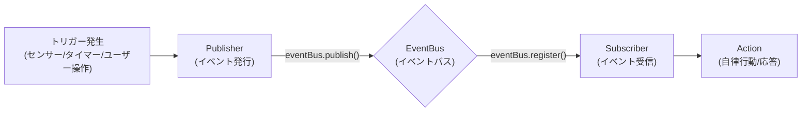

# 新イベント追加ガイド

## 1. 幹：イベントシステムの基本原理

本システムのイベント駆動アーキテクチャは、**Pub/Sub（パブリッシャー/サブスクライバー）モデル**を採用しています。
各コンポーネントは疎結合に保たれ、`EventBus` を介して情報のやり取りを行います。

### 1.1 フローの概要



### 1.2 コアコンポーネント

*   **EventType**: イベントの種類を識別する文字列リテラル型（例：`'system:idle'`, `'user:ignoring'`）。
*   **AgentEvent**: イベントデータの共通インターフェース。タイムスタンプや優先度（Priority）を持ちます。
*   **EventBus**: イベントを仲介するシングルトンインスタンス。
*   **AutonomousController**: 主なイベント受信者。イベントを受け取り、状況コンテキスト（SituationContext）を構築して LLM に判断を仰ぎます。

---

## 2. 枝葉：詳細な実装手順

新しくイベントを追加する際は、データの流れに沿って型定義から実装していきます。

### Step 1: イベントの型定義

まず、システムが新しいイベントを認識できるように型を拡張します。

**編集ファイル**: `src/main/events/types.ts`

1.  `EventType` に新しいタイプを追加します。
2.  必要に応じてデータ構造（`SystemEvent` など）を拡張します。

```typescript
// src/main/events/types.ts

export type EventType =
    | 'system:idle'
    | 'user:greeting'
    | 'my:new_event'; // ← 新しいイベントタイプを追加

export interface SystemEvent extends BaseEvent {
    type: 'system:idle' | 'my:new_event'; // ← ここにも追加
    data: {
        idleTime?: number;
        // 新しいイベントに必要なデータがあればここに追加
        newFeatureData?: string;
    };
}
```

### Step 2: イベントの発火（Publisher 実装）

イベントが発生する場所（検出器やハンドラ）でイベントを発行します。

**実装パターン**:

```typescript
import { eventBus, EventPriority } from '../events';

// ... どこかの処理の中 ...

// イベントデータの作成
const event: SystemEvent = {
    type: 'my:new_event',
    priority: EventPriority.NORMAL, // 重要度 (LOW, NORMAL, HIGH)
    timestamp: Date.now(),
    data: {
        newFeatureData: 'something happened'
    }
};

// イベント発行
eventBus.publish(event);
console.log('[Component] Published my:new_event');
```

※ **注意**: 頻繁に発生するイベント（毎秒など）は、システム負荷や LLM 呼び出しコストを考慮して間引き処理（スロットリング）を入れることを検討してください。

### Step 3: イベントの受信と自律行動（Subscriber 実装）

`AutonomousController` でイベントを受け取り、AI の行動に繋げます。

**編集ファイル**: `src/main/agent/autonomousController.ts`

#### 3.1 状況コンテキストの拡張

AI が「今の状況」を理解できるように、`SituationContext` の `trigger` に新しいイベントを追加します。

```typescript
// src/main/agent/autonomousController.ts

export interface SituationContext {
    // ...
    // トリガー一覧に追加
    trigger: 'idle' | 'active' | 'my:new_event';
    // ...
}
```

#### 3.2 イベントリスナーの登録

`setupEventListeners` メソッドでイベントを購読します。

```typescript
private setupEventListeners(): void {
    // ... 既存のリスナー ...

    // 新しいイベントの登録
    eventBus.register('my:new_event', (event) => {
        this.handleMyNewEvent(event);
    }, EventPriority.NORMAL);
}
```

#### 3.3 ハンドラメソッドの実装

イベントを受け取った際の処理を記述します。ここで `trySpeak` を呼び出すことで、AI が自律的に発話するかどうかを判断します。

```typescript
private handleMyNewEvent(event: AgentEvent): void {
    console.log('[Autonomous] Handling my:new_event');

    // 状況説明を構築
    const context = this.buildContext('my:new_event', {
        note: `新しいイベントが発生しました: ${event.data?.newFeatureData}`
    });

    // 発話を試みる
    this.trySpeak(context);
}
```

#### 3.4 プロンプト設定（AI への指示）

`buildSituationMessage` を更新し、LLM にこの状況をどう解釈してほしいかを伝えます。

```typescript
private buildSituationMessage(context: SituationContext): string {
    // ...
    switch (context.trigger) {
        // ...
        case 'my:new_event':
            parts.push('状況: 新しいイベントが発生しました。');
            parts.push('指示: これまでになかった事象に驚いた反応をしてください。');
            break;
    }
    // ...
}
```

### Step 4: フォールバックメッセージの追加

LLM がエラーで応答できなかった場合や、即座に応答が必要な場合のために、定型文を用意します。

```typescript
private getFallbackMessage(context: SituationContext): string {
    const messages: Record<SituationContext['trigger'], string[]> = {
        // ...
        'my:new_event': [
            'おや？何か起きたかな？',
            'これは新しいですね',
            'ふむふむ'
        ],
    };
    
    // ... ランダム選択ロジック ...
}
```

---

## 3. 実践例：ユーザー無視イベント (`user:ignoring`) の追加

以前実装した「ユーザーに無視されたときにいじける機能」を例に、具体的なコードの変更点を示します。

### 3.1 型定義

`src/main/events/types.ts`:
```typescript
export type EventType = 
    | ...
    | 'user:ignoring'; // 追加

export interface SystemEvent extends BaseEvent {
    type: ... | 'user:ignoring';
    data: {
        ignoreTime?: number; // 追加：何秒無視されたか
        ...
    };
}
```

### 3.2 発火ロジック

`src/main/voice/voiceDialogueController.ts`:
```typescript
// AI が喋り終わったらタイマー開始
private startIgnoreTimer(): void {
    this.ignoreTimer = setTimeout(() => {
        // タイマー発火でイベント発行
        eventBus.publish({
            type: 'user:ignoring',
            priority: EventPriority.HIGH, // 優先度高
            data: { ignoreTime: 30 }
        });
    }, 30000);
}

// ユーザーが喋ったらタイマー解除
private handleAudioCapture(...): Promise<void> {
    this.stopIgnoreTimer();
    // ...
}
```

### 3.3 受信と応答

`src/main/agent/autonomousController.ts`:

1.  **コンテキスト**: `trigger: 'ignoring'` を追加。
2.  **リスナー**: `eventBus.register('user:ignoring', ...)` を追加。
3.  **プロンプト**:
    ```typescript
    case 'ignoring':
        parts.push(`状況: あなたの発言に対してユーザーからの反応がありません（無視されました）`);
        parts.push('指示: 少し「いじけた」態度をとってください。「もう知らない」「プイッ」などの表現や、寂しそうな反応をしてください。');
        break;
    ```
4.  **フォールバック**:
    ```typescript
    ignoring: [
        '……',
        'もう知らない！',
        'プイッ',
        'ねえ、聞いてる？',
    ],
    ```
