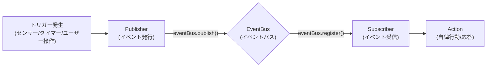

# 新イベント追加ガイド

## 1. 幹：イベントシステムの基本原理

本システムのイベント駆動アーキテクチャは、**Pub/Sub（パブリッシャー/サブスクライバー）モデル**を採用しています。
各コンポーネントは疎結合に保たれ、`EventBus` を介して情報のやり取りを行います。

### 1.1 フローの概要



### 1.2 コアコンポーネント

*   **EventType**: イベントの種類を識別する文字列リテラル型（例：`'system:idle'`, `'user:ignoring'`）。
*   **AgentEvent**: イベントデータの共通インターフェース。タイムスタンプや優先度（Priority）を持ちます。
*   **EventBus**: イベントを仲介するシングルトンインスタンス。
*   **AutonomousController**: 主なイベント受信者。イベントを受け取り、状況コンテキスト（SituationContext）を構築して LLM に判断を仰ぎます。

### 1.3 現在のイベント一覧

| イベント | 発火元 | 説明 |
|---------|--------|------|
| `system:idle` | IdleDetector | ユーザーがアイドル状態になった |
| `system:active` | IdleDetector | ユーザーがアクティブになった |
| `user:ignoring` | IgnoreDetector | AI の発話がユーザーに無視された |

---

## 2. 枝葉：詳細な実装手順

新しくイベントを追加する際は、データの流れに沿って型定義から実装していきます。

### Step 1: イベントの型定義

まず、システムが新しいイベントを認識できるように型を拡張します。

**編集ファイル**: `src/main/events/types.ts`

1.  `EventType` に新しいタイプを追加します。
2.  必要に応じてデータ構造（`SystemEvent` など）を拡張します。

```typescript
// src/main/events/types.ts

export type EventType =
    | 'system:idle'
    | 'system:active'
    | 'user:ignoring'
    | 'my:new_event'; // ← 新しいイベントタイプを追加

export interface SystemEvent extends BaseEvent {
    type: 'system:idle' | 'system:active' | 'user:ignoring' | 'my:new_event';
    data: {
        idleTime?: number;
        ignoreTime?: number;
        // 新しいイベントに必要なデータがあればここに追加
        newFeatureData?: string;
    };
}
```

### Step 2: イベントの発火（Publisher 実装）

イベントが発生する場所（検出器やハンドラ）でイベントを発行します。

**実装パターン**:

```typescript
import { eventBus, EventPriority } from '../events';

// ... どこかの処理の中 ...

// イベントデータの作成
const event: SystemEvent = {
    type: 'my:new_event',
    priority: EventPriority.NORMAL, // 重要度 (LOW, NORMAL, HIGH)
    timestamp: Date.now(),
    data: {
        newFeatureData: 'something happened'
    }
};

// イベント発行
eventBus.publish(event);
console.log('[Component] Published my:new_event');
```

※ **注意**: 頻繁に発生するイベント（毎秒など）は、システム負荷や LLM 呼び出しコストを考慮して間引き処理（スロットリング）を入れることを検討してください。

### Step 3: イベントの受信と自律行動（Subscriber 実装）

`AutonomousController` でイベントを受け取り、AI の行動に繋げます。

**編集ファイル**: `src/main/agent/autonomousController.ts`

#### 3.1 状況コンテキストの拡張

AI が「今の状況」を理解できるように、`SituationContext` の `trigger` に新しいイベントを追加します。

```typescript
// src/main/agent/autonomousController.ts

export interface SituationContext {
    // ...
    // トリガー一覧に追加
    trigger: 'idle' | 'active' | 'ignoring' | 'my:new_event';
    // ...
}
```

#### 3.2 イベントリスナーの登録

`setupEventListeners` メソッドでイベントを購読します。

```typescript
private setupEventListeners(): void {
    // ... 既存のリスナー ...

    // 新しいイベントの登録
    eventBus.register('my:new_event', (event) => {
        this.handleMyNewEvent(event);
    }, EventPriority.NORMAL);
}
```

#### 3.3 ハンドラメソッドの実装

イベントを受け取った際の処理を記述します。ここで `trySpeak` を呼び出すことで、AI が自律的に発話するかどうかを判断します。

```typescript
private handleMyNewEvent(event: AgentEvent): void {
    console.log('[Autonomous] Handling my:new_event');

    // 状況説明を構築
    const context = this.buildContext('my:new_event', {
        note: `新しいイベントが発生しました: ${event.data?.newFeatureData}`
    });

    // 発話を試みる
    this.trySpeak(context);
}
```

#### 3.4 プロンプト設定（AI への指示）

`buildSituationMessage` を更新し、LLM にこの状況をどう解釈してほしいかを伝えます。

```typescript
private buildSituationMessage(context: SituationContext): string {
    // ...
    switch (context.trigger) {
        // ...
        case 'my:new_event':
            parts.push('状況: 新しいイベントが発生しました。');
            parts.push('指示: これまでになかった事象に驚いた反応をしてください。');
            break;
    }
    // ...
}
```

### Step 4: フォールバックメッセージの追加

LLM がエラーで応答できなかった場合や、即座に応答が必要な場合のために、定型文を用意します。

```typescript
private getFallbackMessage(context: SituationContext): string {
    const messages: Record<SituationContext['trigger'], string[]> = {
        // ...
        'my:new_event': [
            'おや？何か起きたかな？',
            'これは新しいですね',
            'ふむふむ'
        ],
    };

    // ... ランダム選択ロジック ...
}
```

---

## 3. 実践例：IgnoreDetector の実装

「ユーザーに無視された」イベントの実際の実装を詳しく解説します。

### 3.1 設計思想

```
目的：
- AI が発話した後、ユーザーから一定時間反応がない場合を検出
- 「無視された」という状況を AI に伝え、適切な反応をさせる

仕組み：
- タイマーベースで無視状態をチェック
- 設定された閾値を超えたらイベントを発行
```

### 3.2 設定の定義

```typescript
// src/main/config/autonomous.ts

export interface IgnoreDetectorConfig {
    /** 無視と判定する閾値（秒） */
    ignoreThresholdSeconds: number;
    /** チェック間隔（ミリ秒） */
    checkIntervalMs: number;
}

export const productionIgnoreConfig: IgnoreDetectorConfig = {
    ignoreThresholdSeconds: 30,  // 30秒
    checkIntervalMs: 10000,      // 10秒ごとにチェック
};

export const testIgnoreConfig: IgnoreDetectorConfig = {
    ignoreThresholdSeconds: 10,  // 10秒
    checkIntervalMs: 5000,       // 5秒ごとにチェック
};
```

### 3.3 検出器クラスの実装

```typescript
// src/main/events/ignoreDetector.ts

import { eventBus } from "./eventBus.js";
import { EventPriority, SystemEvent } from "./types.js";

interface IgnoreConfig {
    ignoreThresholdSeconds: number;
    checkIntervalMs: number;
}

export class IgnoreDetector {
    private config: IgnoreConfig = {
        ignoreThresholdSeconds: 30,
        checkIntervalMs: 30000,
    };

    private checkInterval: NodeJS.Timeout | null = null;
    private isIgnoring: boolean = false;
    private lastIgnoreTime: number = 0;

    /**
     * 検出を開始
     */
    start(config?: Partial<IgnoreConfig>): void {
        if (config) {
            this.config = { ...this.config, ...config };
        }

        // 既存のインターバルをクリア
        this.stop();

        this.checkInterval = setInterval(() => {
            this.checkIgnoreState();
        }, this.config.checkIntervalMs);

        console.log(`[IgnoreDetector] Started (threshold: ${this.config.ignoreThresholdSeconds}s)`);
    }

    /**
     * 無視状態をチェック
     */
    private checkIgnoreState(): void {
        const ignoreTime = Date.now() - this.lastIgnoreTime;

        if (ignoreTime >= this.config.ignoreThresholdSeconds * 1000 && !this.isIgnoring) {
            this.isIgnoring = true;

            // イベントを発行
            const event: SystemEvent = {
                type: 'user:ignoring',
                priority: EventPriority.LOW,
                timestamp: Date.now(),
                data: {
                    ignoreTime,
                }
            };
            eventBus.publish(event);

            console.log(`[IgnoreDetector] User is ignoring (${ignoreTime}ms)`);
        }
    }

    /**
     * 最終アクティビティ時刻を更新（ユーザーが反応した時に呼ぶ）
     */
    notifyUserActive(): void {
        this.lastIgnoreTime = Date.now();
        this.isIgnoring = false;
    }

    /**
     * 現在の状態を取得
     */
    getState(): { isIgnoring: boolean; ignoreTime: number } {
        return {
            isIgnoring: this.isIgnoring,
            ignoreTime: this.lastIgnoreTime,
        };
    }

    /**
     * 検出を停止
     */
    stop(): void {
        if (this.checkInterval) {
            clearInterval(this.checkInterval);
            this.checkInterval = null;
        }
        this.isIgnoring = false;
        console.log('[IgnoreDetector] Stopped');
    }
}

// シングルトンインスタンス
export const ignoreDetector = new IgnoreDetector();
```

### 3.4 型定義への追加

```typescript
// src/main/events/types.ts

export type EventType =
    | 'system:idle'
    | 'system:active'
    | 'user:ignoring';  // ← 追加

export interface SystemEvent extends BaseEvent {
    type: EventType;
    data: {
        idleTime?: number;
        ignoreTime?: number;  // ← 追加
    };
}
```

### 3.5 エクスポートへの追加

```typescript
// src/main/events/index.ts

export { ignoreDetector, IgnoreDetector } from './ignoreDetector.js';
```

### 3.6 メインプロセスでの初期化

```typescript
// src/main/index.ts

import { ignoreDetector } from './events/index.js';
import { getIgnoreDetectorConfig } from './config/index.js';

// アプリ起動時
app.whenReady().then(async () => {
    // ... 他の初期化 ...

    // 無視検出器を開始
    const ignoreConfig = getIgnoreDetectorConfig();
    ignoreDetector.start(ignoreConfig);
});
```

### 3.7 自律行動コントローラでの購読

```typescript
// src/main/agent/autonomousController.ts

import { eventBus, EventPriority, AgentEvent } from '../events/index.js';

class AutonomousController {
    private setupEventListeners(): void {
        // 無視イベントを購読
        eventBus.register('user:ignoring', (event: AgentEvent) => {
            this.handleIgnoreEvent(event);
        }, EventPriority.NORMAL);
    }

    private handleIgnoreEvent(event: AgentEvent): void {
        console.log('[Autonomous] User is ignoring...');

        const context = this.buildContext('ignoring', {
            ignoreTime: event.data?.ignoreTime
        });

        this.trySpeak(context);
    }

    private buildSituationMessage(context: SituationContext): string {
        const parts: string[] = [];

        switch (context.trigger) {
            case 'ignoring':
                parts.push('状況: あなたの発言に対してユーザーからの反応がありません');
                parts.push('指示: 少し「いじけた」態度をとってください');
                break;
            // ... 他のケース
        }

        return parts.join('\n');
    }
}
```

---

## 4. 新しい検出器を追加するテンプレート

### 4.1 検出器クラスのテンプレート

```typescript
// src/main/events/myDetector.ts

import { eventBus } from "./eventBus.js";
import { EventPriority, SystemEvent } from "./types.js";

interface MyDetectorConfig {
    thresholdMs: number;
    checkIntervalMs: number;
}

export class MyDetector {
    private config: MyDetectorConfig;
    private checkInterval: NodeJS.Timeout | null = null;
    private isActive: boolean = false;

    constructor(config?: Partial<MyDetectorConfig>) {
        this.config = {
            thresholdMs: 30000,
            checkIntervalMs: 10000,
            ...config
        };
    }

    start(config?: Partial<MyDetectorConfig>): void {
        if (config) {
            this.config = { ...this.config, ...config };
        }

        this.stop();  // 既存のインターバルをクリア

        this.checkInterval = setInterval(() => {
            this.check();
        }, this.config.checkIntervalMs);

        console.log('[MyDetector] Started');
    }

    private check(): void {
        // 検出ロジック
        const shouldTrigger = /* 条件 */;

        if (shouldTrigger && !this.isActive) {
            this.isActive = true;

            eventBus.publish({
                type: 'my:event',
                priority: EventPriority.NORMAL,
                timestamp: Date.now(),
                data: { /* イベントデータ */ }
            });
        }
    }

    stop(): void {
        if (this.checkInterval) {
            clearInterval(this.checkInterval);
            this.checkInterval = null;
        }
        this.isActive = false;
    }
}

export const myDetector = new MyDetector();
```

### 4.2 チェックリスト

新しいイベントを追加する際の確認項目：

```
□ 型定義
  - src/main/events/types.ts に EventType を追加したか
  - SystemEvent の data に必要なフィールドを追加したか

□ 検出器（必要な場合）
  - src/main/events/ に検出器クラスを作成したか
  - シングルトンインスタンスをエクスポートしたか
  - index.ts に追加したか

□ 設定（必要な場合）
  - src/main/config/autonomous.ts に設定型を追加したか
  - 本番用とテスト用の値を定義したか
  - getter 関数を追加したか

□ 初期化
  - src/main/index.ts で検出器を start() しているか
  - 設定を渡しているか

□ 自律行動コントローラ
  - eventBus.register() でイベントを購読しているか
  - ハンドラメソッドを実装したか
  - buildSituationMessage() を更新したか
  - getFallbackMessage() を更新したか

□ テスト
  - AUTONOMOUS_TEST=true で動作確認したか
  - イベントが正しく発火するか確認したか
```

## 関連ドキュメント

- [01-architecture-overview.md](01-architecture-overview.md) - アーキテクチャ概要
- [02-adding-new-features.md](02-adding-new-features.md) - 新機能追加ガイド
## Troubleshooting

### Native Module Issues

音声処理のパフォーマンス問題（CPU使用率が高いなど）が発生した場合、ネイティブの Opus ライブラリが使用されていない可能性があります。
ログに `[DiscordVoice] @discordjs/opus not found` と表示されている場合は、以下のコマンドでネイティブモジュールをリビルドしてください：

```bash
npm rebuild @discordjs/opus
```
