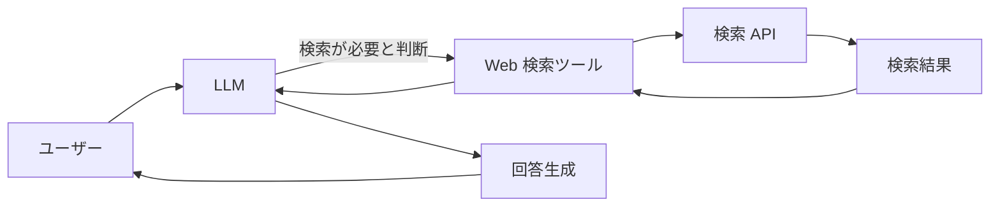

# Web 検索機能の追加ガイド

## 1. 幹：Web 検索統合の基本原理

AI アシスタントに Web 検索機能を追加することで、**リアルタイムの情報取得**が可能になります。
本ドキュメントでは、LLM のツール機能として Web 検索を実装する方法を解説します。

### 1.1 アーキテクチャ概要



### 1.2 設計の選択肢

Web 検索を実装する際、以下の選択肢があります：

| 方式 | メリット | デメリット |
|------|---------|-----------|
| **LLM ツール** | LLM が検索の必要性を判断 | ツール呼び出しのオーバーヘッド |
| **事前検索** | 常に最新情報を含む | 不要な検索コストが発生 |
| **ハイブリッド** | 柔軟性が高い | 実装が複雑 |

本プロジェクトでは、**LLM ツール方式**を推奨します。
これにより、LLM が会話の文脈から検索の必要性を判断し、適切なクエリを生成できます。

---

## 2. 枝葉：検索 API の選択

### 2.1 主要な検索 API

| API | 特徴 | 無料枠 | 必要なもの |
|-----|------|--------|-----------|
| **Google Custom Search** | 高品質、Google の検索結果 | 100回/日 | API キー + CSE ID |
| **Bing Web Search** | Microsoft 品質、日本語に強い | 1000回/月 | API キー |
| **DuckDuckGo Instant Answer** | プライバシー重視、無料 | 制限なし | 不要 |
| **SerpAPI** | Google 結果の代理取得 | 100回/月 | API キー |
| **Tavily** | AI 向けに最適化 | 1000回/月 | API キー |

### 2.2 推奨：DuckDuckGo（初期実装向け）

無料で制限がなく、実装が簡単なため、初期実装には DuckDuckGo を推奨します。

```typescript
// DuckDuckGo Instant Answer API
// 制限なし、API キー不要
const DDGO_API = 'https://api.duckduckgo.com/';
```

### 2.3 本格運用向け：Google Custom Search または Tavily

より高品質な検索結果が必要な場合は、Google Custom Search または AI 向けに最適化された Tavily を検討してください。

---

## 3. 実装手順

### Step 1: 型定義

```typescript
// src/main/llm/tools/types.ts に追加

export interface WebSearchParams {
    query: string;      // 検索クエリ
    maxResults?: number; // 最大結果数（デフォルト: 5）
    language?: string;   // 言語（デフォルト: 'ja'）
}

export interface SearchResult {
    title: string;      // ページタイトル
    url: string;        // URL
    snippet: string;    // 説明文
}

export interface WebSearchResult {
    success: boolean;
    results?: SearchResult[];
    error?: string;
}
```

### Step 2: 検索プロバイダの実装

```typescript
// src/main/llm/tools/webSearch.ts

import fetch from 'node-fetch';

interface SearchResult {
    title: string;
    url: string;
    snippet: string;
}

interface WebSearchParams {
    query: string;
    maxResults?: number;
    language?: string;
}

interface WebSearchResult {
    success: boolean;
    results?: SearchResult[];
    error?: string;
}

/**
 * DuckDuckGo を使用した Web 検索
 */
async function searchWithDuckDuckGo(
    query: string,
    maxResults: number = 5
): Promise<SearchResult[]> {
    const url = new URL('https://api.duckduckgo.com/');
    url.searchParams.set('q', query);
    url.searchParams.set('format', 'json');
    url.searchParams.set('no_redirect', '1');
    url.searchParams.set('no_html', '1');

    const response = await fetch(url.toString());
    const data = await response.json() as any;

    const results: SearchResult[] = [];

    // 抽象結果（Abstract）
    if (data.Abstract) {
        results.push({
            title: data.Heading || 'Search Result',
            url: data.AbstractURL || '',
            snippet: data.Abstract
        });
    }

    // 関連トピック
    if (data.RelatedTopics) {
        for (const topic of data.RelatedTopics.slice(0, maxResults - results.length)) {
            if (topic.Text && topic.FirstURL) {
                results.push({
                    title: topic.Text.split(' - ')[0] || 'Related',
                    url: topic.FirstURL,
                    snippet: topic.Text
                });
            }
        }
    }

    return results;
}

/**
 * Google Custom Search を使用した Web 検索
 * 環境変数: GOOGLE_API_KEY, GOOGLE_CSE_ID
 */
async function searchWithGoogle(
    query: string,
    maxResults: number = 5
): Promise<SearchResult[]> {
    const apiKey = process.env.GOOGLE_API_KEY;
    const cseId = process.env.GOOGLE_CSE_ID;

    if (!apiKey || !cseId) {
        throw new Error('Google API credentials not configured');
    }

    const url = new URL('https://www.googleapis.com/customsearch/v1');
    url.searchParams.set('key', apiKey);
    url.searchParams.set('cx', cseId);
    url.searchParams.set('q', query);
    url.searchParams.set('num', String(maxResults));
    url.searchParams.set('lr', 'lang_ja');

    const response = await fetch(url.toString());
    const data = await response.json() as any;

    if (!data.items) {
        return [];
    }

    return data.items.map((item: any) => ({
        title: item.title,
        url: item.link,
        snippet: item.snippet || ''
    }));
}

/**
 * Tavily AI Search API を使用した Web 検索
 * 環境変数: TAVILY_API_KEY
 */
async function searchWithTavily(
    query: string,
    maxResults: number = 5
): Promise<SearchResult[]> {
    const apiKey = process.env.TAVILY_API_KEY;

    if (!apiKey) {
        throw new Error('Tavily API key not configured');
    }

    const response = await fetch('https://api.tavily.com/search', {
        method: 'POST',
        headers: {
            'Content-Type': 'application/json',
        },
        body: JSON.stringify({
            api_key: apiKey,
            query,
            search_depth: 'basic',
            max_results: maxResults,
            include_answer: true
        })
    });

    const data = await response.json() as any;

    const results: SearchResult[] = [];

    // AI 生成の回答がある場合
    if (data.answer) {
        results.push({
            title: 'AI Summary',
            url: '',
            snippet: data.answer
        });
    }

    // 検索結果
    if (data.results) {
        for (const item of data.results) {
            results.push({
                title: item.title,
                url: item.url,
                snippet: item.content || ''
            });
        }
    }

    return results.slice(0, maxResults);
}

/**
 * Web 検索の実行（プロバイダ自動選択）
 */
export async function webSearch(params: WebSearchParams): Promise<WebSearchResult> {
    const { query, maxResults = 5, language = 'ja' } = params;

    console.log(`[WebSearch] Searching: "${query}"`);

    try {
        let results: SearchResult[];

        // 優先順位: Tavily > Google > DuckDuckGo
        if (process.env.TAVILY_API_KEY) {
            console.log('[WebSearch] Using Tavily');
            results = await searchWithTavily(query, maxResults);
        } else if (process.env.GOOGLE_API_KEY && process.env.GOOGLE_CSE_ID) {
            console.log('[WebSearch] Using Google Custom Search');
            results = await searchWithGoogle(query, maxResults);
        } else {
            console.log('[WebSearch] Using DuckDuckGo');
            results = await searchWithDuckDuckGo(query, maxResults);
        }

        console.log(`[WebSearch] Found ${results.length} results`);

        return {
            success: true,
            results
        };
    } catch (error) {
        console.error('[WebSearch] Error:', error);
        return {
            success: false,
            error: (error as Error).message
        };
    }
}

/**
 * LLM ツール定義
 */
export const webSearchTool = {
    name: 'web_search',
    description: 'インターネットで情報を検索します。最新のニュース、天気、イベント情報、技術情報などを調べる際に使用してください。',
    parameters: {
        type: 'object',
        properties: {
            query: {
                type: 'string',
                description: '検索クエリ。具体的で明確なキーワードを使用してください。'
            },
            maxResults: {
                type: 'number',
                description: '取得する結果の最大数（1-10）。デフォルトは5。'
            }
        },
        required: ['query']
    },
    execute: async (params: WebSearchParams): Promise<WebSearchResult> => {
        return webSearch(params);
    }
};
```

### Step 3: ツールのレジストリに登録

```typescript
// src/main/llm/tools/registry.ts に追加

import { webSearchTool } from './webSearch.js';

export const tools = [
    // 既存のツール...
    appLauncherTool,
    calculatorTool,
    currentTimeTool,
    // Web 検索ツールを追加
    webSearchTool
];
```

### Step 4: 設定の追加（オプション）

```typescript
// src/main/config/types.ts に追加

export interface WebSearchConfig {
    enabled: boolean;
    provider: 'auto' | 'duckduckgo' | 'google' | 'tavily';
    maxResultsDefault: number;
    cacheEnabled: boolean;
    cacheTTLSeconds: number;
}

// AppConfig に追加
export interface AppConfig {
    // ... 既存の設定
    webSearch: WebSearchConfig;
}
```

```json
// config/default.json に追加
{
    "webSearch": {
        "enabled": true,
        "provider": "auto",
        "maxResultsDefault": 5,
        "cacheEnabled": true,
        "cacheTTLSeconds": 300
    }
}
```

### Step 5: 環境変数の設定

```bash
# .env に追加（使用するプロバイダに応じて）

# Google Custom Search
GOOGLE_API_KEY=your_google_api_key
GOOGLE_CSE_ID=your_custom_search_engine_id

# Tavily AI Search
TAVILY_API_KEY=your_tavily_api_key
```

---

## 4. 検索結果の処理

### 4.1 LLM への結果フォーマット

検索結果を LLM が理解しやすい形式にフォーマットします。

```typescript
/**
 * 検索結果を LLM プロンプト用にフォーマット
 */
export function formatSearchResults(results: SearchResult[]): string {
    if (results.length === 0) {
        return '検索結果が見つかりませんでした。';
    }

    const formatted = results.map((result, index) => {
        return `[${index + 1}] ${result.title}
URL: ${result.url}
${result.snippet}`;
    }).join('\n\n');

    return `Web検索結果:\n\n${formatted}`;
}
```

### 4.2 キャッシュの実装

頻繁な検索を避けるため、キャッシュを実装します。

```typescript
// src/main/llm/tools/searchCache.ts

interface CacheEntry {
    results: SearchResult[];
    timestamp: number;
}

class SearchCache {
    private cache = new Map<string, CacheEntry>();
    private ttlMs: number;

    constructor(ttlSeconds: number = 300) {
        this.ttlMs = ttlSeconds * 1000;
    }

    private getCacheKey(query: string, maxResults: number): string {
        return `${query.toLowerCase().trim()}:${maxResults}`;
    }

    get(query: string, maxResults: number): SearchResult[] | null {
        const key = this.getCacheKey(query, maxResults);
        const entry = this.cache.get(key);

        if (!entry) {
            return null;
        }

        // 有効期限チェック
        if (Date.now() - entry.timestamp > this.ttlMs) {
            this.cache.delete(key);
            return null;
        }

        console.log('[SearchCache] Cache hit:', query);
        return entry.results;
    }

    set(query: string, maxResults: number, results: SearchResult[]): void {
        const key = this.getCacheKey(query, maxResults);
        this.cache.set(key, {
            results,
            timestamp: Date.now()
        });
    }

    clear(): void {
        this.cache.clear();
    }
}

export const searchCache = new SearchCache();
```

---

## 5. セキュリティ上の注意点

### 5.1 入力のサニタイズ

ユーザー入力をそのまま検索クエリに使用しないでください。

```typescript
function sanitizeQuery(query: string): string {
    // 制御文字を除去
    let sanitized = query.replace(/[\x00-\x1F\x7F]/g, '');

    // 過度に長いクエリを切り詰め
    if (sanitized.length > 200) {
        sanitized = sanitized.substring(0, 200);
    }

    return sanitized.trim();
}
```

### 5.2 レート制限

API の制限を超えないようにレート制限を実装します。

```typescript
class RateLimiter {
    private requests: number[] = [];
    private maxRequests: number;
    private windowMs: number;

    constructor(maxRequests: number, windowMs: number) {
        this.maxRequests = maxRequests;
        this.windowMs = windowMs;
    }

    canMakeRequest(): boolean {
        const now = Date.now();
        // ウィンドウ外のリクエストを削除
        this.requests = this.requests.filter(t => now - t < this.windowMs);

        return this.requests.length < this.maxRequests;
    }

    recordRequest(): void {
        this.requests.push(Date.now());
    }
}

// 1分間に10リクエストまで
export const searchRateLimiter = new RateLimiter(10, 60000);
```

### 5.3 API キーの管理

- API キーは `.env` ファイルに保存し、Git にコミットしない
- `.gitignore` に `.env` を追加
- 本番環境では環境変数または秘密管理サービスを使用

---

## 6. 拡張機能

### 6.1 特定サイトの検索

```typescript
// 特定サイト内のみ検索
function createSiteQuery(query: string, sites: string[]): string {
    const siteFilters = sites.map(s => `site:${s}`).join(' OR ');
    return `${query} (${siteFilters})`;
}

// 使用例
const query = createSiteQuery('TypeScript チュートリアル', [
    'developer.mozilla.org',
    'typescriptlang.org'
]);
```

### 6.2 ニュース検索

```typescript
// 最新ニュースのみ検索
function createNewsQuery(query: string): string {
    const today = new Date();
    const weekAgo = new Date(today.getTime() - 7 * 24 * 60 * 60 * 1000);
    const dateStr = weekAgo.toISOString().split('T')[0];

    return `${query} after:${dateStr}`;
}
```

### 6.3 画像検索（Google 限定）

```typescript
async function searchImages(query: string): Promise<SearchResult[]> {
    // Google Custom Search の searchType パラメータを使用
    url.searchParams.set('searchType', 'image');
    // ...
}
```

---

## 7. テスト

### 7.1 単体テスト

```typescript
// テスト用
async function testWebSearch() {
    console.log('=== Web Search Test ===');

    // 基本的な検索
    const result1 = await webSearch({ query: '今日の天気 東京' });
    console.log('Test 1 (Weather):', result1.success ? 'PASS' : 'FAIL');

    // 技術的な検索
    const result2 = await webSearch({ query: 'TypeScript async await' });
    console.log('Test 2 (Tech):', result2.success ? 'PASS' : 'FAIL');

    // 結果数の制限
    const result3 = await webSearch({ query: 'Node.js', maxResults: 3 });
    console.log('Test 3 (MaxResults):',
        result3.results && result3.results.length <= 3 ? 'PASS' : 'FAIL');
}
```

### 7.2 統合テスト

LLM にツールを使わせて検索が正しく動作するか確認します。

```typescript
// LLM にツールを使わせるテスト
const testMessages = [
    { role: 'user', content: '今日の東京の天気を教えて' }
];

// LLM がツールを呼び出し、結果を使って回答することを確認
```

---

## 8. チェックリスト

新しい Web 検索機能を追加する際の確認項目：

```
□ 型定義
  - WebSearchParams インターフェースを定義したか
  - SearchResult インターフェースを定義したか

□ プロバイダ実装
  - 少なくとも1つの検索プロバイダを実装したか
  - エラーハンドリングを入れたか
  - ログ出力を追加したか

□ ツール登録
  - registry.ts に追加したか
  - ツールの description が適切か

□ 設定（オプション）
  - config/types.ts に型を追加したか
  - config/default.json にデフォルト値を追加したか

□ 環境変数
  - .env.example を更新したか
  - .gitignore に .env が含まれているか

□ セキュリティ
  - 入力のサニタイズを実装したか
  - レート制限を考慮したか

□ テスト
  - 単体テストを実行したか
  - LLM との統合テストを実行したか
```

---

## 9. トラブルシューティング

### 9.1 検索結果が返ってこない

```typescript
// デバッグ用ログを追加
console.log('[WebSearch] Request URL:', url.toString());
console.log('[WebSearch] Response status:', response.status);
console.log('[WebSearch] Response body:', await response.text());
```

### 9.2 API エラー

| エラー | 原因 | 対処 |
|-------|------|------|
| 401 Unauthorized | API キーが無効 | キーを再確認・再生成 |
| 403 Forbidden | アクセス制限 | API の有効化を確認 |
| 429 Too Many Requests | レート制限超過 | 待機してリトライ |
| 500 Internal Error | サービス側の問題 | 別のプロバイダにフォールバック |

### 9.3 LLM がツールを使わない

- ツールの description を見直す
- より具体的な説明を追加
- システムプロンプトで検索ツールの使用を促す

```typescript
// システムプロンプトに追加
const systemPrompt = `
あなたは AI アシスタントです。
最新の情報が必要な場合は、web_search ツールを使用してください。
特に以下の場合は検索を行ってください：
- 今日の天気やニュース
- 最新の技術情報
- イベントや営業時間などのリアルタイム情報
`;
```

## 関連ドキュメント

- [01-architecture-overview.md](01-architecture-overview.md) - アーキテクチャ概要
- [02-adding-new-features.md](02-adding-new-features.md) - 新機能追加ガイド
- [05-configuration-system.md](05-configuration-system.md) - 設定システム
